# Sisteme Electronice Încorporate
## Indicații metodice pentru lucrări de laborator
**Autori:** Andrei Bragarenco, Valentina Astafi
**Universitatea Tehnică a Moldovei**
**Chișinău, 2025**
---
CZU 621.38(076.5)
Lucrarea de față reprezintă indicații metodice pentru efectuarea lucrărilor de laborator la cursul „Sisteme Electronice Încorporate" și este destinată tuturor studenților Facultății Calculatoare, Informatică și Microelectronică. Acest îndrumar este dedicat studierii principiilor de bază ale funcționării sistemelor electronice încorporate, oferă pe scurt informațiile teoretice necesare, stabilește ordinea efectuării lucrărilor de laborator și cerințele pentru elaborarea raportului.
**Autori:** lect. univ., dr. în științe informatice Andrei Bragarenco; asist. univ. Valentina Astafi
**Redactor responsabil:** prof. univ., dr. hab. Oleg Lupan
**Recenzent:** conf. univ., dr. Ion Pocaznoi
ISBN 978-9975-45-642-5 · © UTM, 2025
---
## Instrucțiuni generale
Instrucțiuni generale privind efectuarea lucrărilor de laborator și elaborarea rapoartelor pentru disciplina „Sisteme Electronice Încorporate":
1. Lucrările de laborator se desfășoară în paralel cu partea teoretică, astfel încât materialul teoretic necesar înțelegerii unei lucrări să fie predat înainte de efectuarea acesteia. Studenții sunt obligați să cunoască materialul teoretic și procedura lucrării de laborator pe care o prezintă. În acest scop, vor citi în prealabil textul lucrării din îndrumar și temele corespunzătoare din curs sau din manualele recomandate.
2. Toți studenții prezenți la laborator efectuează aceeași lucrare, fiecare având propria variantă a sarcinii individuale. Studenții identifică montajul experimental și asamblează schema completă. Punerea în funcțiune a circuitului se face numai după ce acesta a fost verificat de către cadrul didactic care conduce lucrarea de laborator. Orice defecțiune, abatere sau anomalie apărută pe parcursul lucrării va fi raportată imediat cadrului didactic.
3. Rezultatele lucrării de laborator se prezintă în raport. Raportul trebuie să corespundă complet și concis cerințelor din paragraful „Conținutul raportului" și titlului lucrării. Schemele electrice se vor prezenta conform cerințelor STAS și SUDC în vigoare. Nu se va scrie în raport teoria lucrării, descrierea manipulărilor sau concluzii care nu au legătură cu rezultatele obținute. Raportul se predă la începutul următoarei lucrări de laborator.

# Lucrarea de laborator nr. 1: Inițiere în dezvoltarea sistemelor electronice încorporate
**Scopul lucrării**
Familiarizarea studenților cu mediul de dezvoltare pentru sisteme electronice încorporate, incluzând instalarea și configurarea IDE-ului, utilizarea bibliotecilor standard și a instrumentelor de simulare, prin realizarea unei aplicații simple care controlează un LED prin intermediul unui buton.
**Obiectivele lucrării**
- Familiarizarea cu principiile de proiectare ale sistemelor electronice încorporate, incluzând interacțiunea hardware-software și modele arhitecturale.
- Dezvoltarea competențelor de programare pentru microcontrolere (MCU) utilizând un mediu de dezvoltare specializat.
- Structurarea proiectului în module și organizarea fișierelor sursă pentru o dezvoltare eficientă.
- Crearea componentelor modulare reutilizabile pentru utilizare în lucrările viitoare.
- Proiectarea și simularea circuitului hardware, incluzând realizarea unei scheme funcționale.
- Validarea funcționalității aplicației prin testare și depanare în mediul de dezvoltare.

## 1.1 Analiza domeniului de aplicare
### 1.1.1 Componentele sistemelor electronice încorporate
Sistemele electronice încorporate sunt dispozitive electronice specializate ce combină hardware și software pentru funcții specifice în sisteme complexe. Acestea sunt eficiente, fiabile și integrate în aplicații diverse, precum automobile, electrocasnice, dispozitive medicale și sisteme industriale.

Microcontroler (MCU) este un circuit integrat compact utilizat pentru a controla o funcție specifică într-un sistem încorporat [24]. Acesta funcționează conform instrucțiunilor unui program stocat în memoria sa. Microcontrolerul include un procesor, memorie și periferice de intrare/ieșire (I/O) integrate pe un singur cip. Figura 1.1 prezintă arhitectura unui Arduino UNO, care utilizează un microcontroler AVR.

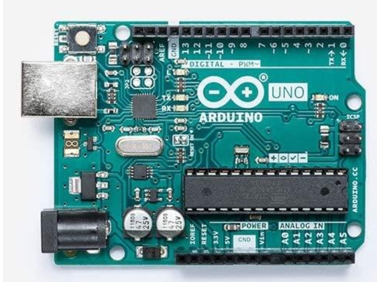

*Figura 1.1: Arduino UNO cu arhitectura AVR*

Un microcontroler este încorporat în interiorul unui sistem pentru a controla o funcție singulară într-un dispozitiv. Face acest lucru interpretând datele pe care le primește de la perifericele sale I/O folosind procesorul său central. Informațiile temporare pe care le primește microcontrolerul sunt stocate în memoria sa de date, unde procesorul o accesează și folosește instrucțiunile stocate în memoria programului său pentru a descifra și aplica, datele primite. Apoi își folosește perifericele I/O pentru a comunica și a pune în aplicare acțiunea corespunzătoare.

Buton - dispozitiv electric de tip comutator (switch) care permite sau întrerupe trecerea curentului electric într-un circuit. Când butonul este apăsat, circuitul se închide și permite curentului să circule. Când butonul este eliberat, circuitul se deschide și, curentul este întrerupt. Butoanele sunt utilizate frecvent în aplicații electronice pentru a oferi o interfață simplă de utilizator, fiind disponibile în diverse forme, dimensiuni și culori.

![Figura 1.2: Exemplu de buton utilizat în circuite electronice [2]](figures/figura_1_2.png)

*Figura 1.2: Exemplu de buton utilizat în circuite electronice [2]*

Conectare la un microcontroler: pentru a conecta un buton la un microcontroler, este necesar să se asigure o conexiune stabilă și să se evite stările flotante ale pinului de intrare. Acest lucru se realizează prin utilizarea unui rezistor pull-down sau pull-up, în funcție de cerințele aplicației. Mai jos sunt pașii pentru conectarea unui buton la un microcontroler:
- Un capăt al butonului este conectat la un pin digital al MCU, care va citi starea butonului (HIGH sau LOW).
- Celălalt capăt este conectat la masa (GND) pentru a închide circuitul atunci când butonul este apăsat.
- Pentru stabilizarea semnalului, se utilizează un rezistor pull-down (10k Ω), astfel încât pinul să nu rămână „plutitor” (floating) atunci când butonul este eliberat.
- Alternativ, se poate utiliza un rezistor pull-up conectat la Vcc, caz în care starea butonului va fi inversată (LOW când este apăsat și HIGH când este eliberat).

![Figura 1.3: Circuit electric pentru conectarea unui buton la microcontroler [2]](figures/figura_1_3.png)

*Figura 1.3: Circuit electric pentru conectarea unui buton la microcontroler [2]*

Acest circuit permite citirea stabilă a stării butonului de către microcontroler, prevenind fluctuațiile semnalului cauzate de zgomotul electric sau de stările flotante ale pinului de intrare.

LED (Light Emitting Diode) este un dispozitiv semiconductor care emite lumină atunci când este traversat de curent electric. Este utilizat frecvent în aplicații electronice pentru semnalizare, iluminare și afișare, datorită eficienței energetice și durabilității sale.

Conectarea LED-ului la microcontroler se realizează prin utilizarea unui rezistor limitator de curent pentru protecția LED-ului.

LED-ul poate fi conectat la microcontroler în două moduri principale: la anod sau la catod. În cazul conexiunii la anod, anodul LED-ului este legat la un pin digital configurat ca ieșire (OUTPUT) al microcontrolerului, iar catodul la masă (GND). În cazul conexiunii la catod, catodul LED-ului este legat la un pin digital configurat ca ieșire (OUTPUT) al microcontrolerului, iar anodul la tensiunea de alimentare (Vcc ). Indiferent de tipul de conectare, un rezistor limitator de curent este plasat în serie cu LED-ul pentru protecție.

Rezistorul limitator de curent este necesar pentru a proteja LED-ul de un curent excesiv, care poate duce la deteriorarea acestuia. Rezistorul poate fi conectat fie la anod, fie la catodul LED-ului, prevenind deteriorarea acestuia prin limitarea curentului care circulă prin circuit [14]. Figura 1.4 ilustrează circuitul de conectare electrică a LED-ului cu rezistorul la anod.

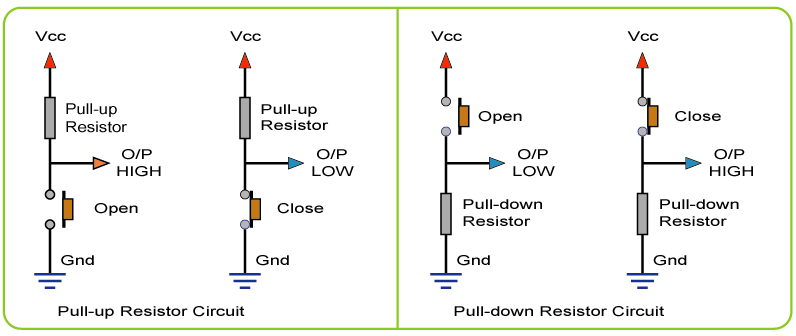

*Figura 1.4: Circuit de conexiune electrică a LED-ului la microcontroler*

Valoarea rezistorului este calculată folosind formula:
$$R = \frac{V_{cc} - V_f}{I}$$
unde:
- **Vcc** — tensiunea de alimentare a microcontrolerului (ex.: 5V pentru Arduino Uno),
- **Vf** — tensiunea de prag a LED-ului (ex.: 1.7V pentru LED-uri roșii),
- **I** — curentul dorit prin LED (ex.: 10 mA = 0.01 A).

De exemplu, pentru o tensiune de alimentare de 5V și un LED roșu, valoarea rezistorului este aproximativ:
$$R = \frac{5 - 1.7}{0.01} = 330\ \Omega$$
**Avantajele conexiunii la catod:** conexiunea la catod permite utilizarea logicii inverse pentru controlul LED-ului, oferă flexibilitate în alegerea tensiunii de alimentare independentă de microcontroler, evită consumul de curent de la microcontroler și reduce riscul de deteriorare accidentală a LED-ului în cazul unei erori de configurare.
Controlul LED-ului prin software se realizează utilizând funcția digitalWrite din biblioteca Arduino, după configurarea pinului ca OUTPUT prin pinMode. În cazul conexiunii la anod, starea HIGH aprinde LED-ul, iar LOW îl stinge. Pentru conexiunea la catod, logica este inversată. Un exemplu de configurare și control al LED-ului este prezentat in listingul 1.1:

**Listing 1.1: Exemplu de cod pentru controlul unui LED**
```c
// Pinul la care este conectat LED-ul
#define LED_PIN 13

void setup() {
  // Configurarea pinului LED ca ieșire
  pinMode(LED_PIN, OUTPUT);
}

void loop() {
  // Aprinderea LED-ului
  digitalWrite(LED_PIN, HIGH);
  // Așteptare 1 secunda
  delay(1000);
  // Stingerea LED-ului
  digitalWrite(LED_PIN, LOW);
  // Așteptare 1 secunda
  delay(1000);
}
```
### 1.1.2 Mediul integrat de dezvoltare a aplicațiilor cu sisteme electronice încorporate
Pentru dezvoltarea aplicațiilor cu sisteme electronice încorporate, se recomandă utilizarea PlatformIO IDE, un mediu de dezvoltare integrat (IDE) care oferă suport pentru o gamă largă de microcontrolere și plăci de dezvoltare. PlatformIO IDE este construit pe baza Visual Studio Code și oferă un set complet de instrumente pentru dezvoltarea, testarea și depanarea aplicațiilor pentru sisteme electronice încorporate. Acesta include un editor, de cod avansațun manager de pachete pentru biblioteci și dependențe, instrumente de simulare și depanare, precum și integrare cu Git și alte instrumente de versionare.

PlatformIO IDE facilitează dezvoltarea aplicațiilor printr-o interfață prietenoasă și un flux de lucru eficiențpermițând dezvoltatorilor să se concentreze pe scrierea codului și testarea acestuia, fără a se preocupa de configurarea mediului de dezvoltare sau a instrumentelor necesare.
**Caracteristici principale ale PlatformIO IDE**
- Suport multi-platformă: permite dezvoltarea aplicațiilor pentru diverse microcontrolere și plăci de dezvoltare, utilizând un singur mediu.
- Manager de pachete: integrează un sistem de gestionare a bibliotecilor și dependențelor, facilitând utilizarea și actualizarea acestora.
- Instrumente de simulare și depanare: include suport pentru simularea hardware și depanarea codului sursă.
- Integrare cu Git și alte instrumente de versionare: permite gestionarea eficientă a proiectelor și colaborarea între dezvoltatori.
- Compatibilitate cu diverse sisteme de operare: funcționează pe Windows, macOS și Linux.
**Fluxul de lucru în PlatformIO IDE**
1. Crearea unui proiect nou: utilizatorul selectează placa de dezvoltare și cadrul de lucru (framework) dorit, configurând structura proiectului.
2. Scrierea codului: codul sursă este organizat în fișiere modulare, iar editorul oferă suport pentru evidențierea sintaxei și completarea automată.
3. Compilarea și încărcarea: platformIO IDE compilează codul și îl încarcă pe microcontroler, utilizând driverele și instrumentele necesare.
4. Testarea și depanarea: utilizatorul poate testa aplicația și depana eventualele erori, utilizând monitorul serial și instrumentele de analiză.

PlatformIO IDE este ideal pentru dezvoltatorii care doresc să creeze aplicații robuste și eficiente pentru sisteme electronice încorporate, oferind un mediu de lucru intuitiv și, puternic.
**Instalarea Visual Studio Code Visual Studio Code este un editor de cod sursă puternic, utilizat pentru o gamă largă de platforme de dezvoltare. Acesta oferă suport pentru**
extensii și funcționalități avansate, facilitând scrierea, testarea și depanarea codului sursă.

Pentru instalare, urmați pașii de mai jos:
1. Accesați pagina oficială Visual Studio Code (https://code.visualstudio.com/ download) [20].
2. Apăsați pe butonul Download corespunzător sistemului de operare utilizat (Windows, macOS sau Linux), așa cum este ilustrat în Figura 1.5.
3. Rulați fișierul descărcat și urmați pașii de instalare. Acceptați licența și selectați opțiunile dorite, apoi apăsați Install.

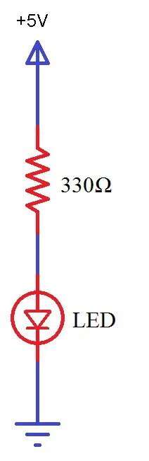

*Figura 1.5: Pagina de descărcare Visual Studio Code*

**Instalarea extensiei PlatformIO. După instalarea Visual Studio Code, deschideți**
Managerul de Pachete (Ctrl + Shift + X), căutați extensia "PlatformIO IDE" și instalațio. PlatformIO oferă suport pentru diverse microcontrolere și plăci de dezvoltare, fiind ideal pentru proiectele cu sisteme electronice încorporate. Pentru instalarea extensiei PlatformIO, urmați pașii de mai jos:
1. Lansați Visual Studio Code.
2. Apăsați pe butonul Extensions din bara laterală stângă sau utilizați combinația de taste Ctrl + Shift + X pentru a deschide Managerul de Pachete.
3. În câmpul de căutare, introduceți "PlatformIO IDE" și apăsați Enter.
4. Selectați extensia oficială PlatformIO IDE din lista afișată.
5. Apăsați pe butonul Install pentru a începe instalarea.

Figura 1.6 ilustrează procesul de instalare al extensiei PlatformIO IDE.

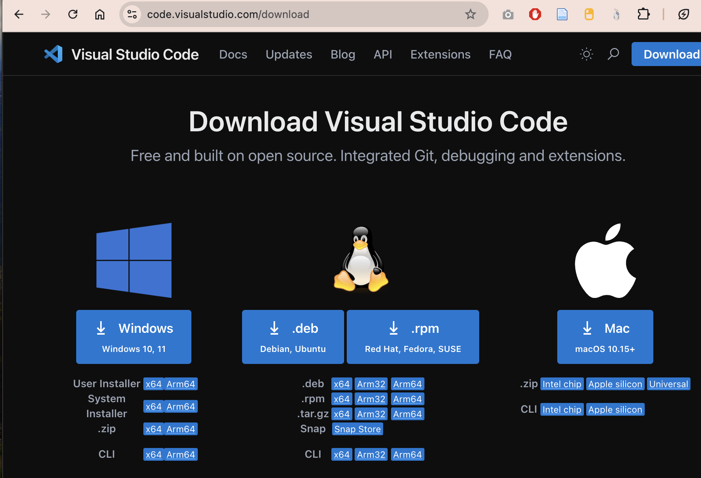

*Figura 1.6: Instalarea extensiei PlatformIO IDE în Visual Studio Code*

**Configurarea generală a proiectului. După instalarea extensiei PlatformIO, va apărea**
un tab nou în bara laterală stângă, numit PlatformIO Home. Acesta oferă acces la funcționalități precum crearea de proiecte noi, gestionarea bibliotecilor și configurarea plăcilor de dezvoltare. Pentru a deschide PlatformIO Home, apăsați pe logo-ul PlatformIO din bara de activități din partea de jos a Visual Studio Code, așa cum se arată în Figura 1.7.

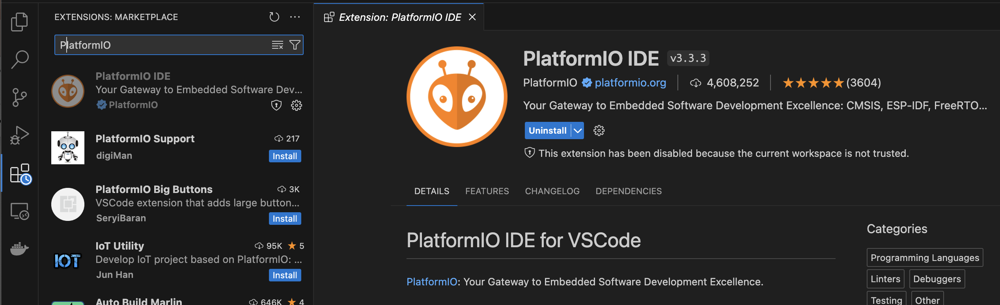

*Figura 1.7: PlatformIO Home în Visual Studio Code*

Pentru a crea un nou proiecțaccesați PlatformIO Home, care poate fi deschis prin apăsarea logo-ului PlatformIO din bara de activități din partea de jos a Visual Studio Code. În PlatformIO Home, apăsați pe butonul New Project. Se va deschide o fereastră unde puteți introduce detaliile proiectului, cum ar fi numele acestuia, placa de dezvoltare utilizată (ex.: Arduino Uno, ESP32) și cadrul de lucru (framework) dorit (ex.: Arduino, ESP-IDF). După completarea acestor informații, apăsați pe butonul Finish pentru a finaliza procesul de creare a proiectului. Figura 1.8 ilustrează acest proces.

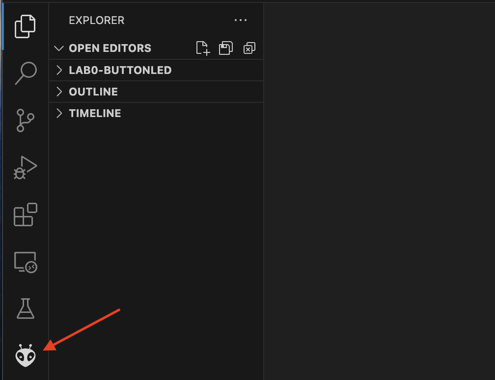

*Figura 1.8: Crearea unui nou proiect în PlatformIO Home*

**Selectarea plăcii de dezvoltare. În fereastra New Projecțintroduceți un nume pentru proiect (ex: "Lab0-ButtonLed"), așa cum este ilustrat în Figura 1.9.**

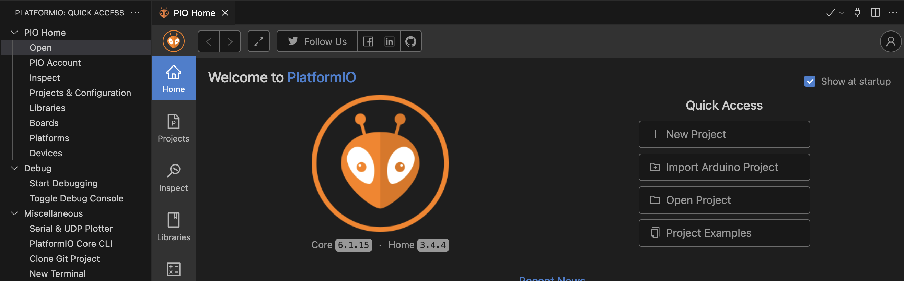

*Figura 1.9: Fereastra pentru crearea unui proiect nou*

Alegeți placa de dezvoltare pe care o utilizați, cum ar fi Arduino Uno sau ESP32, din meniul derulant Board, așa cum este ilustrat în Figura 1.10.

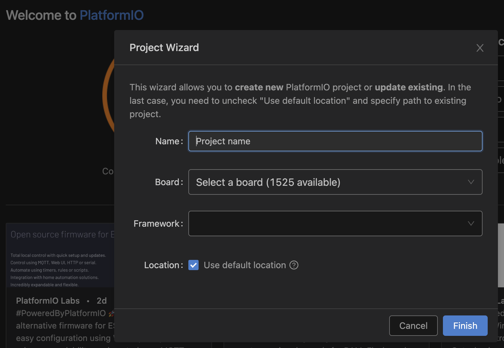

*Figura 1.10: Selectarea plăcii de dezvoltare în PlatformIO*

Selectați cadrul de dezvoltare (Arduino sau ESP-IDF pentru ESP32). Configurați locația proiectului, specificând folderul unde doriți să fie creat. Apăsați Finish pentru a finaliza crearea proiectului.
**Deschiderea și configurarea proiectului. După crearea proiectului, structura acestuia va fi vizibilă în secțiunea Explorer din bara laterală (Figura 1.11).**

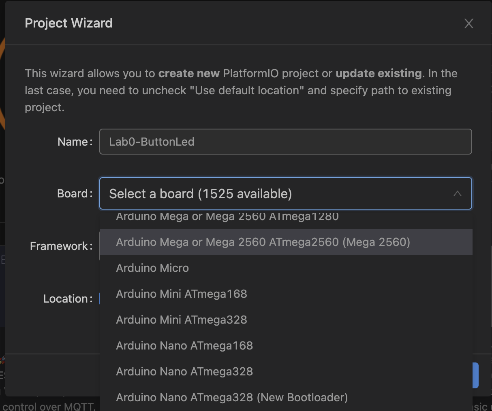

*Figura 1.11: Structura proiectului în PlatformIO Explorer*

Accesați folderul src și deschideți fișierul main.cpp pentru a începe implementarea aplicației (Figura 1.12).

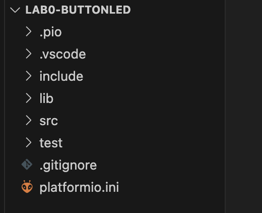

*Figura 1.12: Fișierul main.cpp deschis pentru editare*

Configurația plăcii selectate poate fi verificată în fișierul platformio.ini (Figura 1.13).

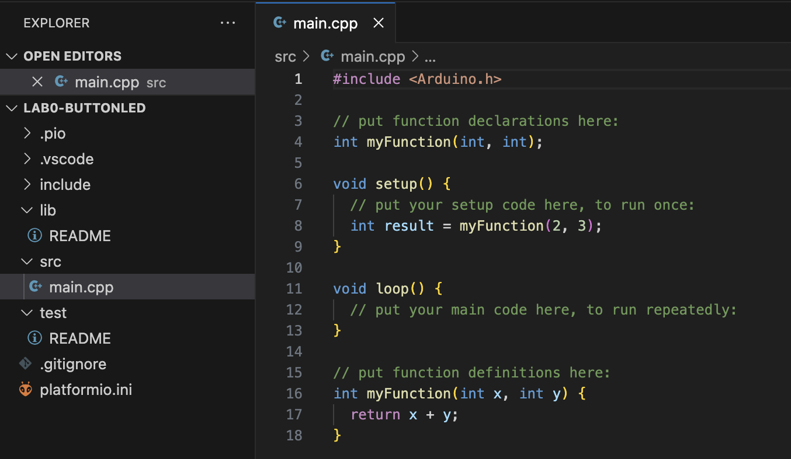

*Figura 1.13: Fișierul platformio.ini cu configurația plăcii*

### 1.1.3 Mediul de simulare și testare a aplicației
Pentru simularea și testarea aplicației, se poate utiliza un simulator hardware precum Wokwi sau Tinkercad. Aceste platforme permit simularea circuitelor electronice și testarea codului sursă fără a necesita hardware fizic. Acest lucru este util pentru verificarea funcționalității aplicației înainte de implementarea pe hardware real. În această lucrare, vom utiliza Wokwi pentru simularea circuitului și testarea aplicației.
**Wokwi - simulator hardware**
Wokwi este o platformă online care permite simularea circuitelor electronice și testarea codului pentru microcontrolere. Aceasta oferă o interfață prietenoasă și un set variat de componente electronice, inclusiv microcontrolere, LED-uri, butoane și senzori. Wokwi permite dezvoltatorilor să creeze și să testeze circuitul și codul sursă într-un mediu virtual, fără a necesita hardware fizic [30].

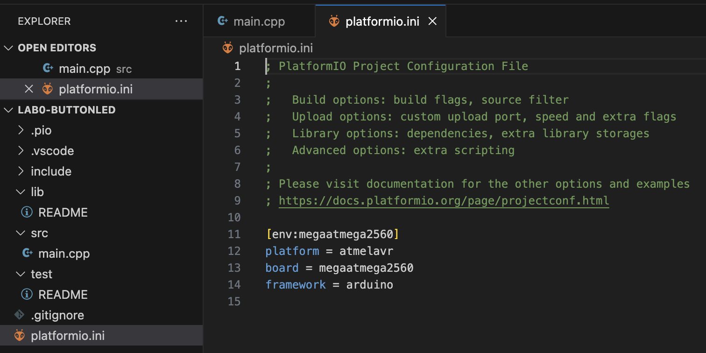

*Figura 1.14: Exemplu de simulare a circuitului în Wokwi*

Instalarea și configurarea Wokwi în PlatformIO. Wokwi poate fi integrat cu PlatformIO pentru a permite simularea și testarea aplicațiilor direct din mediul de dezvoltare.

Pentru a utiliza Wokwi în PlatformIO, urmați pașii de mai jos:
1. Deschideți PlatformIO IDE în Visual Studio Code.
2. Accesați secțiunea PlatformIO Home și selectați Libraries.
3. Căutați biblioteca Wokwi și instalați-o.
4. După instalare, puteți utiliza Wokwi pentru a crea simulări și a testa aplicațiile.
**Configurarea Wokwi pentru simularea circuitului.** Pentru a configura Wokwi pentru simularea circuitului, este necesar să creați un fișier de configurare JSON `diagram.json`

"care să definească componentele hardware și conexiunile dintre acestea. Un exemplu de fișier de configurare pentru un circuit este prezentat mai jos în listingul 1.2 :

**Listing 1.2: Configurația hardware în Wokwi**
```json
{
 "version": 1,
 "author": "Uri Shaked",
 "editor": "wokwi",
 "parts": [
  {
   "type": "wokwi-arduino-uno",
   "id": "uno",
   "top": 20,
   "left": 50,
   "attrs": {}
  },
  {
   "type": "wokwi-lcd1602",
   "id": "lcd",
   "top": 252,
   "left": 50,
   "attrs": {
    "pins": "i2c"
   }
  }
 ],
 "connections": [
  [ "uno:GND.2", "lcd:GND", "black", [ "v24", "*", "h-20" ] ],
  [ "uno:5V", "lcd:VCC", "red", [ "v28", "*", "h-16" ] ],
  [ "uno:A4", "lcd:SDA", "green", [ "v32", "*", "h-12" ] ],
  [ "uno:A5", "lcd:SCL", "blue", [ "v36", "*", "h-8" ] ]
 ]
}
```
Aceasta configurație defineste un circuit cu un microcontroler Arduino Uno și un LCD
1602 conectat prin I2 C. Puteți adăuga și alte componente, cum ar fi LED-uri și butoane,
în funcție de cerințele aplicației.

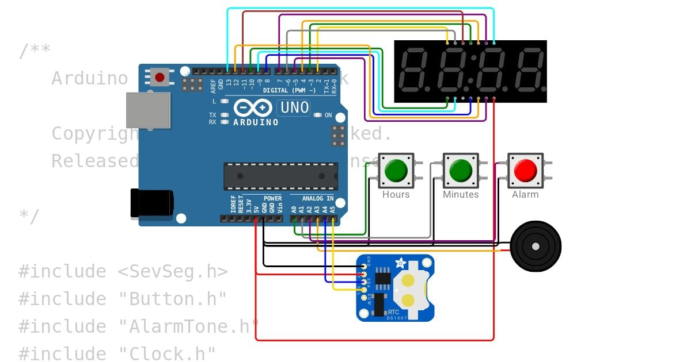

*Figura 1.15: Exemplu de simulare a circuitului cu LCD 1602 în Wokwi*

In versiunea gratuită a extensiei PlatformIO Wokwi, este posibil să aveți anumite limitări în ceea ce privește editarea vizuală a schiței electrice în PlatformIO. Pentru a depăși aceste limitări, puteți utiliza Wokwi pentru a crea și edita schița electrică, apoi exportați proiectul și îl importați în PlatformIO. Acest lucru vă va permite să utilizați toate funcționalitățile Wokwi fără restricții. În astfel de cazuri, se poate crea un proiect pe site-ul Wokwi [31], se poate edita schița electrică și apoi se poate prelua configurația schemei în format JSON.
1. Accesați site-ul Wokwi (https://wokwi.com) [31].
2. Apăsați pe butonul New Project pentru a crea un proiect nou.
3. Selectați placa de dezvoltare dorită (ex.: Arduino Uno) și adăugați componentele necesare (LED, buton, rezistori) din biblioteca de componente.
4. Conectați componentele conform schemei electrice proiectate.
5. Copiați configurația schemei electrice din wokwi în fișierul diagram.json din directorul proiectului creat în PlatformIO.
**Configurarea fișierului toml.** Pentru a putea utiliza Wokwi în PlatformIO, este necesar să configurați un fișier `wokwi.toml` care să definească setările proiectului pentru localizarea executabilului aplicației și a fișierului de configurare Wokwi. Un exemplu de fișier wokwi.toml este prezentat mai jos:

**Listing 1.3: Configurarea Wokwi în PlatformIO**
```toml
[wokwi]
version = 1
firmware = 'build/arduino-lcd-helloworld.ino.hex'
elf = 'build/arduino-lcd-helloworld.ino.elf'
```
Simularea unui proiect în Wokwi se poate realiza dupa pașii de mai jos:
1. Pentru a crea o simulare, deschideți un proiect existent sau creați unul nou și adăugați
componentele necesare din biblioteca Wokwi în fișierul de configurare a schemei electrice. .
2. Deschideți fișierul main.cpp și scrieți codul sursă pentru aplicație.
3. După ce ați terminat de scris codul, apăsați pe butonul Start Simulation pentru a
rula simularea.
4. Verificați funcționalitatea aplicației și efectuați modificările necesare.

### 1.1.4 Instrumente de modelare arhitecturală
Modelarea arhitecturală a aplicației reprezintă o etapă importantă în procesul de dezvoltare a sistemelor electronice încorporate. Aceasta presupune definirea structurii generale a aplicației și a modului în care componentele hardware și software interacționează.

Prin modelarea arhitecturală se facilitează vizualizarea, organizarea și înțelegerea funcționalității și a fluxului de date în cadrul sistemului.

Pentru sistemele electronice încorporate, modelarea arhitecturală este realizată prin utilizarea unor diagrame specifice, cum ar fi:
- Diagrama structurală de sistem a aplicației care prezintă componentele aplicației la nivel de subsisteme, module și interacțiunile între acestea, făcând abstracție de domeniul de implementare.
- Interfața hardware-software, interacționează cu mediul exterior prin intermediul driverelor și al bibliotecilor de lucru cu componentele electronice. Ca regulă, este prezentată în forma de arhitectură pe nivele de abstractizare ce cuprinde nivelul de microcontroller (MCAL), nivelul de drivere pentru componente electronice (ECAL), și nivelul de servicii (SRV) puse la dispoziție nivelului de aplicație.
- Diagrama de flux a componentelor aplicației software ce detaliază logica programului, inclusiv condițiile și ramificațiile care determină comportamentul aplicației.

In calitate de instrument de modelare a arhitecturii aplicației, se poate utiliza un software de proiectare asistată de calculator (CAD) sau un editor de diagrame. O variantă populară este utilizarea diagramelor UML (Unified Modeling Language), care oferă un set standardizat de simboluri și convenții pentru reprezentare. Lista instrumentelor de modelare a arhitecturii software include cele mai populare:
- Lucidchart: un instrument online pentru crearea de diagrame și vizualizări, inclusiv diagrame UML și arhitecturale.
- Draw.io: o aplicație web gratuită pentru crearea de diagrame, care suportă diverse formate, inclusiv UML.
- Microsoft Visio: un software de diagramare profesional, care oferă funcționalități avansate pentru modelarea arhitecturală.
- Enterprise Architect: un instrument de modelare UML care permite crearea de diagrame complexe și gestionarea proiectelor software.
- Rapsody: un instrument de modelare și proiectare software care suportă diverse tipuri de diagrame, inclusiv arhitecturale.

Vom utiliza Draw.io în exemplele prezentate în acest îndrumar, deoarece este un instrument gratuit și ușor de utilizațdar, în funcție de preferințe, se poate folosi orice alt instrument de modelare pentru a crea diagramele necesare. Editoarele clasice de text oferă, de asemenea, posibilitatea de a crea diagrame prin utilizarea unor sintaxe specifice, cum ar fi Markdown sau AsciiDoc, care permit integrarea de diagrame direct în documentație. Aceste sintaxe sunt utile pentru a crea diagrame simple și rapide, fără a necesita un software dedicat.
### 1.1.5 Documentarea proiectului
După testare, aplicația este optimizată pentru a îmbunătăți performanța și eficiența.

Documentarea proiectului este la fel de importantă, incluzând diagramele, codul sursă și rezultatele testelor. O documentație bine realizată facilitează înțelegerea și utilizarea, proiectului de către alți dezvoltatori.

Documentare proiectului presupune crearea unui raport detaliat care să cuprinda toate etapele de dezvoltare, testare și validare a aplicației, similar cu ceea ce este prezentat în acest ghid. Raportul ar trebui să includă:
- Analiza situației în domeniu cu referințe la surse externe.
- Detalii despre componentele hardware și tehnologii software utilizate.
- Definiția problemei propuse spre rezolvare
- Extragerea și definirea cerințelor tehnice
- Proiectarea arhitecturală a sistemului cu diagrame structurale și explicații.
- Proiectare în detaliu și descrierea fluxului funcționalităților, cu explicații.
- Definirea criteriilor de validare a aplicației.
- Elaborarea schiței electrice a circuitului.
- Secțiunile critice ale software-ului elaborat cu explicații.
- Scenariile de testare și rezultatele acestora, inclusiv observații și recomandări.
- Probe de funcționare: capturi de ecran, poze ale montajului hardware, link video.
- Concluzii generale și posibile îmbunătățiri.

O documentație bine realizată nu doar că ajută la înțelegerea proiectului, dar și facilitează colaborarea cu alți dezvoltatori și permite reutilizarea componentelor în proiecte viitoare.
**Cerințe pentru raportul lucrării de laborator**
Raportul lucrării de laborator trebuie să fie detaliat și să reflecte toate etapele realizării aplicației, incluzând analiza, proiectarea, implementarea și testarea soluției. Structura raportului trebuie să respecte următoarele cerințe:
**Structura raportului lucrării de laborator**
- Foaie de titlu conform cerințelor UTM în care să fie menționate, titlul lucrării, numele studentului și al profesorului coordonator.
- Sarcina tehnică referințe la scopul lucrării, obiective și sarcina individuală.
- 1. Analiza situației în domeniu: contextul tehnologic și aplicația dezvoltată.

Descrierea componentelor și tehnologiilor utilizate. Analiza soluțiilor existente și studiu de caz.
- 2. Conceptualizare și proiectare:
  - Definirea cerințelor tehnice: organizate în tabel pe categorii, și asociere identificator.
  - Proiectarea arhitecturală structurală: de sistem și interfața HW/SW, evidențierea interconectării componentelor, cu explicații aferente pentru rolul fiecărei componente și interfețe.
  - Modelare comportamentală: pentru toate funcțiile din aplicație, librării, servicii și drivere (flowchart, FSM).
  - Scenarii de testare și criterii de validare: organizate în tabel pe categorii și asociere identificator., – Toate secțiunile menționate descrise cu motivare la început și concluzie pe final.
  - Concluzii etapa de proiectare: rezultatele obținute, lecțiile învățate și posibile îmbunătățiri.
- 3. Implementarea Hardware și Software
  - Prezentare schiță electrică în mediul de simulare.
  - Implementarea software conform diagramelor arhitecturale cu componente organizate în directorii și fișiere .h și .cpp explicarea metodelor de dezvoltare aplicate și detalii de implementare pentru zonele critice (se prezintă doar secvențe de cod, codul integral se prezintă în anexe)
  - Concluzii etapa de implementare: rezultatele obținute, lecțiile învățate și posibile îmbunătățiri.
- 4. Testare și validare:
  - Testarea și validarea aplicației: prezentarea raportului de testare rezultatele obținute și observațiile aferente în urma scenariilor de testare.
  - Probe de funcționare: capturi de ecran relevante ale interacțiunii cu sistemul, datele procesate, poze ale montajului hardware, dacă lucrarea implică echipamente fizice. Demonstrarea funcționării printr-un video, dacă este cazul (link către sursa video).
  - Rezultatele simulării: dacă sistemul a fost testat într-un simulator precum
Wokwi, se vor prezenta rezultatele simulării și observațiile aferente.
- Concluzii etapa de testare: analiza performanței sistemului, identificarea eventualelor limitări și propuneri de îmbunătățire.
- Concluzii generale: rezultatele obținute, lecțiile învățate și posibile îmbunătățiri.
- Notă privind utilizarea instrumentelor AI: dacă în redactarea raportului au
fost utilizate instrumente AI, acest lucru trebuie menționat.
- Exemplu: "În timpul redactării acestui raporțautorul a utilizat [NUME INSTRUMENT AI] pentru generarea/consolidarea conținutului. Informațiile rezultate au fost revizuite, validate și ajustate conform cerințelor lucrării."
- Bibliografie: referințe la resursele utilizate în realizarea lucrării.
- Anexe: codul sursă complet, diagramele și alte materiale relevante.

### 1.1.6 Importanța unei abordări metodice
Proiectarea aplicațiilor cu sisteme electronice încorporate necesită o abordare metodică, care să integreze toate etapele menționate anterior. Fiecare etapă contribuie la realizarea unui sistem robust și eficient, capabil să îndeplinească cerințele utilizatorului. Prin urmare, este necesar ca dezvoltatorii să urmeze aceste etape într-un mod structurat, pentru a asigura succesul proiectului.
### 1.1.7 Rezultate în urma realizării lucrării
În această lucrare de laborator, am explorat procesul de proiectare și implementare a unei aplicații simple care utilizează un buton și un LED pentru a demonstra interacțiunea dintre componentele hardware și software. Am învățat cum să configurăm microcontrolerul, să citim semnalele de la buton și să controlăm LED-ul în funcție de starea acestuia.

De asemenea, am realizat teste pentru a verifica funcționalitatea aplicației și am discutat despre posibilele îmbunătățiri. Prin această experiență, am dobândit o înțelegere mai profundă a modului în care funcționează sistemele electronice încorporate și a importanței unei abordări metodice în proiectarea acestora.
## 1.2 Sarcina lucrării de laborator
### 1.2.1 Problema - Aplicatie Buton-LED
Sarcina acestei lucrari de laborator introductive este de a urma pașii de proiectare și implementare prezentate in problema Proiect - Aplicatie Buton-LED din A.1. Scopul este de a dezvolta o aplicație simplă care să controleze un LED folosind un buton, urmând toate etapele metodice descrise in aceasta lucrare și documentarea corespunzătoare pentru a reflecta aspectele tehnice și metodologice ale dezvoltării aplicației.
### Mersul lucrării
1. Sa se analizeze și sa se inteleaga Sarcina lucrarii de laboratorși anume Analiza situației în domeniu și Contextul tehnologic al aplicației dezvoltate conform sectiunii
1.1.
2. sa se falmiliarizeze cu problema propusa spre elaborareși sa se identifice obiectivele și sarcina individuala vezi A.1.1.
3. Sa se analizeze componentgele și resursele untilizate in realizarea aplicatiei din cadrul lucrarii de laborator.
4. In urma analizei sarcinii lucrarii și definitiei problemei propuse, sa se defineasca un set de cerinte tehnice acoperind aspectele funcitionale și nefunctionale ale problemei, vezi A.1.2
5. In urma analizei cerintelor tehnice elaborate sa se defineasca scenarii de testare și criteriilor de validare cu minim 1 test per cerinta care sa raspunda la intrebarea cum ma asigur ca cerinta se satidface, vezi A.1.3
6. sa se identifice componentele ce compun sistemul aplicatiei, sa se organizeze intr-o lista cu descrierea rolului acerstora in aplicatie.
7. Sa se realizeze diagrama structurala cu reprezentarea componentelor și interactiunii intre acestea asa cum este prezentat in sectiunea A.1.4
8. Sa se realizeze arhitectura pe nivele pentru interfata hardware-software pentru fiecare dintre interfete vezi A.1.4.
9. Sa se realizeze diagramele de comportament pentru functionalitatile Componentelor cu diagrame de de flux stari sau de secvență, dupa caz, ca in A.1.5
10. sa se elaboreze schita electrica a aplicatiei intr-un mediu de simulare, vezi A.1.6.
11. sa se creeze structura de directoare și fisiere pentru implementarea aplicatiei care va reflecta arhitectura definita de sistemși de interfata hardware Software vezi A.1.7.
12. Sa se implementeze driverele de interfata hardware-software pentru fiecare componenta electronica utilizata in aplicatie acoperind nivelele ECAL și SRV dupa cazA.1.7.
13. Sa se implementeze comportamentul aplicatiei urmand diagrama de flux definita,
A.1.7.
14. Sa se simuleze functionare aplicatia in medii precum Wokwi sau PlatformIO. cu o eventuala rulare pe hardware real.
15. Sa se testeze și valideze aplicatia conform scenariilor de testare și criteriilor de validare definite anterior, vezi exemplu in A.1.8.
16. sa se documenteze rezultatele testarii cu observatii și recomandari pentru imbunatatiri,
A.1.8.
17. Sa se optimizeze aplicatia pe baza rezultatelor testarii și validarii
18. sa se documenteze toate etapele realizate in cadrul lucrarii de laborator conform cerintelor pentru raportul lucrarii de laborator expuse in 1.1.5.

Acest proces va fi urmat in cadrul tuturor lucrărilor de laborator din cadrul cursului, asigurându-se astfel o înțelegere profundă a modului în care funcționează sistemele electronice incorporate și a importanței unei abordări metodice în proiectarea acestora.
### Întrebări de control
1. Care sunt componentele principale ale unui sistem electronic încorporat și cum interacționează acestea între ele? Exemplificați cu componente din aplicația ButtonLED.
2. Explicați diferența între cerințele funcționale și non-funcționale. Dați exemple pentru fiecare tip din aplicația de control LED prin buton.
3. Descrieți cele trei tipuri de diagrame arhitecturale necesare pentru modelarea unui sistem electronic încorporat și rolul fiecăreia.
4. Cum se definesc scenariile de testare și criteriile de validare pentru o aplicație? Care este relația dintre acestea și cerințele tehnice?
5. Explicați conceptul de interfață hardware-software și importanța separării în nivele de abstractizare (MCAL, ECAL, SRV).
6. Descrieți structura unui driver de componentă electronică. Care sunt funcțiile minime necesare pentru un driver de LED și unul de buton?
7. Ce este debouncing-ul butonului și de ce este necesar în aplicațiile cu sisteme electronice încorporate? Cum se poate implementa?
8. Explicați procesul de configurare și utilizare a mediului PlatformIO cu Wokwi pentru simularea circuitelor electronice.
9. Cum se realizează validarea unei aplicații prin testare? Descrieți pașii pentru testarea funcționalității RF02_T01 din tabelul de scenarii.
10. Care sunt elementele importante care trebuie incluse în documentația tehnică a unui proiect cu sisteme electronice încorporate?

## 1.5 Grila de evaluare a lucrării de laborator
1. Analiza sarcinii și contextului tehnologic (12p)
  a. Analiza situației în domeniu și contextul tehnologic (1.1) (4p)
  b. Identificarea resurselor externe și referințe în bibliografie (4p)
  c. Analiza componentelor și resurselor utilizate (4p)
2. Definirea cerințelor tehnice și scenariilor de testare (13p)
  a. Identificarea obiectivelor și sarcinii individuale (A.1.1) (3p)
  b. Formularea cerințelor funcționale și non-funcționale (A.1.2) (5p)
  c. Definirea scenariilor de testare și criteriilor de validare (A.1.3) (5p)
3. Proiectarea arhitecturală și modelare comportamentală (18p)
  a. Listarea componentelor și descrierea rolului fiecăreia (3p)
  b. Diagrama structurală cu componente și interacțiuni (A.1.4) (4p)
  c. Arhitectura pe nivele pentru interfața hardware-software (4p)
  d. Diagrame comportament pentru funcționalități (flux, stări, secvență) (A.1.5) (7p)
4. Proiectarea și simularea schiței electrice (13p)
  a. Elaborarea schiței electrice în mediu de simulare (A.1.6) (4p)
  b. Reprezentarea corectă a conexiunilor și dimensionarea componentelor (2p)
  c. Simularea funcționării aplicației în medii precum Wokwi/PlatformIO (3p)
  d. Rularea aplicației pe HW real (10p)
5. Implementarea software modulară (18p)
  a. Structura de directoare și fișiere conform arhitecturii (A.1.7) (4p)
  b. Implementarea de interfață HW-SW conform proiectării în detaliu (6p)
  c. Implementarea comportamentului aplicației conform proiectării în detaliu (6p)
  d. Comentarii explicative și documentare în cod (2p)
6. Simulare, testare și validare (16p)
  a. Testarea și validarea conform scenariilor definite (A.1.8) (8p)
  b. Documentarea rezultatelor testării, observații și recomandări (5p)
  c. Optimizarea aplicației pe baza rezultatelor testării și validării (3p)
7. Documentare finală (10p)
  a. Documentarea etapelor realizate conform cerințelor raportului (1.1.5) (5p)
  b. Observații, recomandări, concluzii generale (5p)
Total: 100p
---
# Lucrarea de laborator nr. 2: Interacțiunea cu utilizatorul prin STDIO
**Scopul lucrării**
Familiarizarea cu principiile de dezvoltare a interfeței cu utilizatorul (HMI) tip terminal pentru microcontrolere, prin utilizarea bibliotecii STDIO și configurarea acesteia pentru diverse componente electronice. Lucrarea se concentrează pe metodele de colectare a datelor de intrare de la utilizator și tehnicile de prezentare a informațiilor către acesta.
**Obiectivele lucrării**
- Familiarizarea cu biblioteca STDIO pentru interacțiunea cu utilizatorul.
- Înțelegerea principiilor de bază ale perifericelor pentru interacțiunea cu utilizatorul.
- Familiarizarea cu modalitatea de configurare STDIO pentru interacțiunea cu perifericele.
- Dezvoltarea componentei de interpretare a comenzilor de la utilizator.
- Proiectarea unei aplicații care acceptă comenzi de la terminal.
- Crearea componentelor fluxurilor de intrare și ieșire destinate interacțiunii cu utilizatorul.
- Proiectarea și simularea circuitului hardware, incluzând realizarea unei scheme funcționale.
- Validarea funcționalității aplicației prin testare și depanare în mediul de dezvoltare.

## 2.1 Analiza domeniului de aplicare
### 2.1.1 Interfața serială USART
Interfața serială USART (Universal Synchronous/Asynchronous Receiver/Transmitter) este un protocol de comunicație care permite schimbul de date între microcontroler și alte dispozitive. USART poate funcționa în două moduri principale:
- Sincron - transmisia datelor este coordonată printr-un semnal de ceas comun.
- Asincron - transmisia datelor se realizează fără semnal de ceașutilizând biți de start/stop pentru sincronizare.

Din perspectiva fizică, USART utilizează minim două linii de semnal:
- TX - linia pentru transmiterea datelor.
- RX - linia pentru recepția datelor.

Această interfață permite comunicație full-duplex (transmitere și recepție simultană) și este fundamentală pentru conectarea microcontrolerelor la computere, sisteme de monitorizare sau alte dispozitive periferice.

Transmisia asincronă de date se face la nivel de cadre (frames), fiecare având o structură specifică:

![Figura 2.1: Structura unui cadru de transmisie serială UART [23]](figures/figura_2_1.png)

*Figura 2.1: Structura unui cadru de transmisie serială UART [23]*

La nivel de protocol, USART defineste mai mulți parametri de comunicație:
- Viteza de transfer (baud rate) - valori uzuale: 9600, 19200, 38400, 57600, 115200.
- Numărul de biți de date (de obicei 8).
- Paritatea (none, even, odd) - pentru verificarea simplă a corectitudinii datelor.
- Numărul de biți de stop (1 sau 2).

Configurația standard întâlnită frecvent este 9600 baud, 8 biți de date, fără paritate și 1 bit de stop (notată pe scurt ca 9600 8N1). Nivelele de tensiune utilizate pentru semnalele TX și RX sunt tipice TTL de 3.3V sau 5V, în funcție de microcontrolerul utilizat.

Interfața USART este utilizată pentru comunicarea cu terminale seriale, module Bluetooth, module Wi-Fi și alte dispozitive periferice ce necesită o comunicare serială simplă și robustă., Suportul software pentru comunicația serială în platforma Arduino
În platforma Arduino, comunicarea prin interfața serială este facilitată de un set de funcții integrate în librăria Arduino.h, care oferă o abstractizare simplă pentru comunicarea cu dispozitivele externe fără a fi necesară cunoașterea detaliată a implementării protocolului USART. Principalele funcții [1] disponibile sunt :
- Serial.begin(baud_rate) - inițializează comunicația serială la viteza specificată (de exemplu, 9600 sau 115200 bps).
- Serial.print(data) - transmite datele specificate prin portul serial.
- Serial.println(data) - transmite datele urmate de un caracter de sfârșit de linie.
- Serial.read() - citeste un byte de date de la portul serial.
- Serial.write() - scrie un byte de date la portul serial.
- Serial.available() - returnează numărul de octeți disponibili pentru citire.

Aceste funcții pot fi utilizate pentru a implementa o interfață de utilizator bazată pe text, permițând aplicației să schimbe informații prin interfața serială în format text sau binar. În cazul comunicației text, sistemul poate interpreta comenzi primite de la utilizator și poate trimite răspunsuri formatate, facilitând astfel interacțiunea de tip comandă-răspuns necesară pentru controlul dispozitivului.

Un exemplu tipic de comunicare prin interfața serială în Arduino ar putea arăta astfel:

**Listing 2.1: Exemplu de comunicare serială în Arduino**
```c
#include <Arduino.h>

void setup() {
  Serial.begin(9600);
}

void loop() {
  if (Serial.available() > 0) {
    // Creează un buffer pentru stocarea caracterelor
    char buffer[64] = {0};
    int i = 0;
    
    while (Serial.available() > 0 && i < 63) {
      char c = Serial.read();
      if (c == '\n') {
        break;
      }
      buffer[i++] = c;
    }
    
    buffer[i] = '\0'; // Null termină șirul
    
    // Afișează răspunsul folosind doar print
    Serial.print("Am primit: ");
    Serial.print(buffer);
    Serial.print("\n");
  }
}
```
### 2.1.2 Interacțiunea cu utilizatorul prin STDIO
Interacțiunea cu utilizatorul prin STDIO (Standard Input/Output) este importantă pentru dezvoltare, ea asigură o abordare standardizată și portabilă pentru comunicarea cu utilizatorul. STDIO permite citirea și scrierea de date într-un mod simplu și eficiențfacilitând astfel interacțiunea cu utilizatorul.

Prin utilizarea funcțiilor standard de citire și scriere formatată, precum printf și scanf, dezvoltatorii pot citi date de la utilizator și pot afișa informații pe ecran. Acest model de comunicare este ușor de utilizat și permite crearea rapidă de prototipuri pentru aplicații.

În calculatoarele personale, biblioteca STDIO este configurată implicit pentru a utiliza interfața terminalului în care a fost rulată aplicația, dar în cazul microcontrolerelor, STDIO nu are configurată informația privind perifericul utilizat și modul de interacțiune cu acesta. Pentru a configura STDIO pe microcontrolere, este necesar să se definească un driver care să gestioneze comunicația cu perifericul dorit.
**Configurarea STDIO pentru comunicare prin interfața serială**
Pentru a configura STDIO pentru a utiliza interfața serială pe microcontrolere, este necesar să se implementeze funcții de citire și scriere care să interacționeze cu portul serial.

Acest lucru poate fi realizat prin definirea unor funcții personalizate care să utilizeze funcțiile existente în librăria Arduino, după care se configurează STDIO să utilizeze aceste funcții. Aceste funcții vor fi apelate de către STDIO atunci când se efectuează operațiuni de intrare/ieșire [17]. De exemplu, pentru a utiliza funcțiile printf și scanf, trebuie să se implementeze funcțiile putchar și getchar, care vor fi apelate de STDIO pentru a scrie și citi caractere. Aceste funcții pot fi implementate astfel încât să utilizeze funcțiile, Serial.write() și Serial.read() din librăria Arduino pentru a transmite și primi date prin portul serial. Acest lucru permite utilizarea funcțiilor standard de intrare/ieșire în aplicațiile microcontrolerelor, facilitând astfel interacțiunea cu utilizatorul prin terminalul serial.

Un exemplu de implementare a funcțiilor ‘putchar‘ și ‘getchar‘ pentru a permite utilizarea funcțiilor standard de intrare/ieșire ar putea arăta astfel:

**Listing 2.2: Exemplu de configurare STDIO pentru interfața serială**
```c
// 1. Includere Libraria STDIO
#include <stdio.h>
#include <Arduino.h>

// 2. Definire funcție scriere caracter
void my_putChar(char ch, FILE *f) {
  return Serial.write(ch);
}

// 3. Definire funcție citire caracter
char my_GetChar(FILE *f) {
  while (!Serial.available());
  return Serial.read();
}

void serial_stdio_setup(void) {
  // 4. Inițializare periferii
  Serial.begin(9600);
  
  // 5. Definire stream
  FILE *my_stream = fdevopen(my_putChar, my_GetChar);
  
  // 6. Înlocuire intrarea/ieșirea standard
  // (optional pentru prima initializare)
  stdin = stdout = my_stream;
  
  // 7. Utilizare STDIO
  printf("Hello World");
}
```
O aplicație tip terminal considerând configurațiile de mai sus ar putea arăta astfel:

**Listing 2.3: Exemplu de aplicație cu STDIO**
```c
void loop() {
  // citirea comenzii din serial
  char command[20];
  scanf("%s", command); // citire comandă de la utilizator
  
  // procesarea comenzii
  if (strcmp(command, "led on") == 0) {
    digitalWrite(LED_BUILTIN, HIGH); // Aprindere LED
    printf("LED aprins\n");
  } else if (strcmp(command, "led off") == 0) {
    digitalWrite(LED_BUILTIN, LOW); // Stingere LED
    printf("LED stins\n");
  } else {
    printf("Comandă necunoscută: %s\n", command);
  }
  
  delay(1000); // Așteptare 1 secundă
}
```
## 2.2 Sarcina de laborator
Proiectați și implementați un sistem de control al accesului pentru un încuietoare electronică, bazat pe autentificare prin cod numeric. Sistemul va utiliza o tastatură matricială 4x4 pentru introducerea codului, un afișaj LCD 2x16 pentru prezentarea stării și feedbackului, precum și indicatori luminoși (LED-uri) pentru semnalizarea vizuală a stării sistemului (roșu pentru blocat, verde pentru deblocat sau, opțional, un LED RGB).

Interacțiunea cu dispozitivele de intrare/ieșire va fi implementată utilizând biblioteca standard STDIO, pentru a asigura o abordare standardizată a comunicației.

Această lucrare de laborator se va realiza în 2 Parti, urmând abordarea exemplificată în materialul introductiv privind utilizarea STDIO în microcontrolere.
### 2.2.1 Partea 1: Interactiunea prin Interfata Seriala:
Implementați sistemul cu următoarele funcționalități:
- Utilizatorul introduce un cod numeric urmat de tasta #
- Sistemul verifică codul introdus cu o valoare predefinită în program
- Dacă codul este corect, sistemul deblochează încuietoarea și aprinde LED-ul verde
- Dacă codul este incorect, sistemul afișează un mesaj de eroare și menține LED-ul roșu aprins
- Afișajul LCD prezintă starea curentă și instrucțiuni pentru utilizator

### 2.2.2 Partea 2: Interfața de tip meniu keypad + LCD:
Implementați un sistem avansat cu interfață de tip meniu, având următoarele caracteristici:
- Utilizarea caracterului * ca delimitator între operanzi
- Utilizarea caracterului # pentru finalizarea și executarea comenzii
- Implementarea următoarelor comenzi:
  - * 0 # - Blocare necondiționată a încuietorii
  - * 1 * 1234 # - Deblocare cu parolă (unde 1234 este exemplu de cod valid)
  - * 2 * 1234 * 5678 # - Schimbarea parolei (de la 1234 la 5678)
  - * 3 # - Afișarea stării curente a încuietorii
- La fiecare apăsare a caracterului *, LCD-ul va afișa opțiunile disponibile pentru comanda curentă
- La apăsarea caracterului #, sistemul va executa comanda și va afișa un mesaj de confirmare
- Interfața va oferi feedback vizual clar prin LED-uri și mesaje descriptive pe LCD
Sarcina principală este de a aplica pașii metodici de proiectare și implementare prezentați anterior, cu documentarea corespunzătoare a aspectelor tehnice și metodologice ale dezvoltării aplicației.

**Cerințe suplimentare:** Pentru lucrările de laborator cu interfață STDIO și automate finite (FSM) în sisteme electronice încorporate, respectați următoarele recomandări pentru structură, modularitate și validare:
- Structurați aplicația modular, separând logica FSM într-un modul software dedicat, distinct de modulele pentru butoane, LED-uri și interfața STDIO/LCD.
- Utilizați diagrame de stare pentru a descrie stările și tranzițiile automatului, cu evenimentele asociate.
- Implementați debouncing software pentru butoane sau senzori digitali, pentru a evita tranzițiile false.
- Afișați starea curentă și evenimentele relevante pe interfața STDIO (serială) sau
LCD, pentru feedback clar către utilizator.
- Reutilizați modulele pentru butoane, LED-uri și interfața de afișare, cu separare clară între nivelurile HW/SW (MCAL/ECAL/SRV).
- Testați fiecare tranziție de stare și funcționalitate conform scenariilor de validare definite.
- Documentați clar arhitectura software, diagramele de stare, interfețele HW/SW și scenariile de testare.
- Sistemul trebuie să răspundă la schimbarea semnalului cu o latență sub 100ms.
- Consultați resursele teoretice despre automate finite și proiectare modulară.

**Materiale și resurse necesare pentru realizarea lucrării:**
- Componente hardware: microcontroler (Arduino Uno sau echivalent), tastatură matricială 4x4, afișaj LCD 2x16 cu interfață I2C, LED-uri (roșu, verde sau RGB), rezistențe de limitare a curentului pentru LED-uri.
- Resurse software: PlatformIO cu extensia Wokwi pentru simulare și testare, biblioteci software (STDIO, LiquidCrystal_I2C, Keypad), instrument de construire a diagramelor (ex.: draw.io, Lucidchart).

**NOTĂ:** Realizarea sarcinii se va desfășura în două etape distincte, definite ca două probleme în cadrul lucrării de laborator. Aceste probleme vor fi realizate conform metodologiei prezentate în anexa de problemă rezolvată. Fiecare etapă va fi documentată conform cerințelor metodologice, incluzând cerințe, schițe arhitecturale, diagrame de flux, scenarii de testare și rezultatele obținute. Fiecare parte a lucrării (problema) este planificată pentru o ședință de 2 ore academice.

### Mersul lucrării
1. Sa se analizeze și sa se inteleaga Sarcina lucrarii de laboratorși anume Analiza situației în domeniu și Contextul tehnologic al aplicației dezvoltate conform sectiunii
1.1.
2. sa se falmiliarizeze cu problema propusa spre elaborareși sa se identifice obiectivele și sarcina individuala vezi A.1.1.
3. Sa se analizeze componentgele și resursele untilizate in realizarea aplicatiei din cadrul lucrarii de laborator.
4. In urma analizei sarcinii lucrarii și definitiei problemei propuse, sa se defineasca un set de cerinte tehnice acoperind aspectele funcitionale și nefunctionale ale problemei, vezi A.1.2
5. In urma analizei cerintelor tehnice elaborate sa se defineasca scenarii de testare și criteriilor de validare cu minim 1 test per cerinta care sa raspunda la intrebarea cum ma asigur ca cerinta se satidface, vezi A.1.3
6. sa se identifice componentele ce compun sistemul aplicatiei, sa se organizeze intr-o lista cu descrierea rolului acerstora in aplicatie.
7. Sa se realizeze diagrama structurala cu reprezentarea componentelor și interactiunii intre acestea asa cum este prezentat in sectiunea A.1.4
8. Sa se realizeze arhitectura pe nivele pentru interfata hardware-software pentru fiecare dintre interfete vezi A.1.4.
9. Sa se realizeze diagramele de comportament pentru functionalitatile Componentelor cu diagrame de de flux stari sau de secvență, dupa caz, ca in A.1.5
10. sa se elaboreze schita electrica a aplicatiei intr-un mediu de simulare, vezi A.1.6.
11. sa se creeze structura de directoare și fisiere pentru implementarea aplicatiei care va reflecta arhitectura definita de sistemși de interfata hardware Software vezi A.1.7.
12. Sa se implementeze driverele de interfata hardware-software pentru fiecare componenta electronica utilizata in aplicatie acoperind nivelele ECAL și SRV dupa cazA.1.7.
13. Sa se implementeze comportamentul aplicatiei urmand diagrama de flux definita,
A.1.7.
14. Sa se simuleze functionare aplicatia in medii precum Wokwi sau PlatformIO. cu o eventuala rulare pe hardware real.
15. Sa se testeze și valideze aplicatia conform scenariilor de testare și criteriilor de validare definite anterior, vezi exemplu in A.1.8.
16. sa se documenteze rezultatele testarii cu observatii și recomandari pentru imbunatatiri,
A.1.8.
17. Sa se optimizeze aplicatia pe baza rezultatelor testarii și validarii
18. sa se documenteze toate etapele realizate in cadrul lucrarii de laborator conform cerintelor pentru raportul lucrarii de laborator expuse in 1.1.5.

### Întrebări de control
1. Explicați diferențele între interfețele de comunicare cu LCD-urile (paralele cu 4/8 biți vs. I2 C vs. SPI). Care este mai adecvată pentru sistemele de control al accesului?
2. Care sunt componentele principale ale unei tastaturi matriciale? Explicați cum se realizează scanarea unei tastaturi matriciale 4x4.
3. Descrieți procesul de configurare a bibliotecii STDIO pentru a utiliza un LCD ca dispozitiv de ieșire și o tastatură matricială ca dispozitiv de intrare. Care sunt funcțiile principale ce trebuie implementate?
4. Care este rolul funcțiilor putchar() și getchar() în redirecționarea STDIO către un LCD și o tastatură matricială? Cum diferă implementarea acestora față de cazul comunicației seriale?
5. Explicați conceptul de arhitectură stratificată în contextul aplicației de control al accesului cu LCD și tastatură. Ce avantaje oferă această abordare pentru sistemele de autentificare?
6. Descrieți fluxul de date într-un sistem de control al accesului, de la apăsarea tastelor pentru introducerea unui cod PIN până la afișarea rezultatului pe LCD și activarea încuietorii.
7. Care sunt metodele de gestionare eficientă a comenzilor de la tastatură într-un sistem de meniu? Cum se poate implementa o navigare intuitivă prin meniu folosind tastele disponibile?
8. Comparați utilizarea funcțiilor directe pentru controlul LCD-ului și tastaturii cu abordarea bazată pe STDIO. Care sunt avantajele și dezavantajele fiecăreia în contextul unui sistem de securitate?
9. Ce tehnici pot fi utilizate pentru a asigura portabilitatea codului pentru interfața
LCD și tastatură între diferite platforme hardware? Cum se poate abstractiza interacțiunea cu aceste componente?
10. Descrieți metodologia de testare pentru un sistem de control al accesului bazat pe
LCD și tastatură. Ce scenarii de testare sunt importante pentru validarea securității și funcționalității sistemului?, 2.5
### Grila de evaluare a lucrării de laborator
1. Analiza sarcinii și contextului tehnologic (12p)
  a. Analiza situației în domeniu și contextul tehnologic (1.1) (4p)
  b. Identificarea resurselor externe și referințe în bibliografie (4p)
  c. Analiza componentelor și resurselor utilizate (4p)
2. Definirea cerințelor tehnice și scenariilor de testare (13p)
  a. Identificarea obiectivelor și sarcinii individuale (A.1.1) (3p)
  b. Formularea cerințelor funcționale și non-funcționale (A.1.2) (5p)
  c. Definirea scenariilor de testare și criteriilor de validare (A.1.3) (5p)
3. Proiectarea arhitecturală și modelare comportamentală (18p)
  a. Listarea componentelor și descrierea rolului fiecăreia (3p)
  b. Diagrama structurală cu componente și interacțiuni (A.1.4) (4p)
  c. Arhitectura pe nivele pentru interfața hardware-software (4p)
  d. Diagrame comportament pentru funcționalități (flux, stări, secvență) (A.1.5) (7p)
4. Proiectarea și simularea schiței electrice (13p)
  a. Elaborarea schiței electrice în mediu de simulare (A.1.6) (4p)
  b. Reprezentarea corectă a conexiunilor și dimensionarea componentelor (2p)
  c. Simularea funcționării aplicației în medii precum Wokwi/PlatformIO (3p)
  d. Rularea aplicației pe HW real (10p)
5. Implementarea software modulară (18p)
  a. Structura de directoare și fișiere conform arhitecturii (A.1.7) (4p)
  b. Implementarea de interfață HW-SW conform proiectării în detaliu (6p)
  c. Implementarea comportamentului aplicației conform proiectării în detaliu (6p)
  d. Comentarii explicative și documentare în cod (2p)
6. Simulare, testare și validare (16p)
  a. Testarea și validarea conform scenariilor definite (A.1.8) (8p)
  b. Documentarea rezultatelor testării, observații și recomandări (5p)
  c. Optimizarea aplicației pe baza rezultatelor testării și validării (3p)
7. Documentare finală (10p)
  a. Documentarea etapelor realizate conform cerințelor raportului (1.1.5) (5p)
  b. Observații, recomandări, concluzii generale (5p)
Total: 100p
---
# Lucrarea de laborator nr. 3: Sisteme de operare pentru sisteme încorporate
**Scopul lucrării**
Familiarizarea cu conceptele fundamentale ale sistemelor de operare pentru sisteme electronice încorporate, precum și cu implementarea și utilizarea acestora în dezvoltarea aplicațiilor pentru microcontrolere (MCU). Lucrarea urmărește realizarea unei aplicații care să ruleze secvențial sau concurent mai multe task-uri, utilizând fie programare baremetal, fie un sistem de operare în timp real (RTOS, ex. FreeRTOS). Aplicația trebuie să evidențieze metodologia de planificare, sincronizare (model provider/consumer) și execuție (preemptivă sau non-preemptivă) a task-urilor, cu documentarea clară a arhitecturii software și a fluxului de date între task-uri.
**Obiectivele lucrării**
- Familiarizarea cu principiile de planificare și execuție a task-urilor într-un sistem embedded, atât în regim secvențial (bare-metal), cât și concurent (RTOS/FreeRTOS).
- Înțelegerea și aplicarea recurentei și offset-urilor pentru optimizarea utilizării procesorului.
- Implementarea mecanismelor de sincronizare și comunicare între task-uri, inclusiv modelul provider/consumer și utilizarea bufferelor.
- Analiza avantajelor și limitărilor execuției secvențiale versus multitasking preemptiv.
- Documentarea arhitecturii software, prezentarea schemelor bloc și a schemelor electrice ca parte a metodologiei de proiectare.

## 3.1 Analiza domeniului de aplicare
Sistemele de operare pentru sisteme electronice încorporate (embedded) sunt proiectate pentru a gestiona resursele hardware limitate și pentru a permite executarea eficientă a aplicațiilor în timp real. Acestea trebuie să răspundă rapid la evenimente externe și să asigure o utilizare optimă a procesorului și a memoriei. Sistemele de operare în timp real (RTOS) oferă funcționalități avansate de planificare și sincronizare a task-urilor, permițând dezvoltatorilor să gestioneze eficient execuția acestora. Sistemele bare-metal, pe de altă parte, implică programarea directă a hardware-ului fără un sistem de operare intermediar, oferind un control mai mare asupra resurselor, dar necesitând o gestionare manuală a task-urilor și a sincronizării. În această lucrare, vom explora ambele abordări, comparând avantajele și dezavantajele fiecărei metode.
### 3.1.1 Sisteme secvențiale bare-metal
Bare-metal reprezintă programarea directă a hardware-ului, fără suportul unui sistem de operare, oferind control total asupra resurselor microcontrolerului. Această abordare implică gestionarea manuală a execuției și sincronizării task-urilor. Acest termen mai poate fi exprimat ca "programare directă pe microcontroller" sau "execuție fără sistem de operare".

În sistemele secvențiale bare-metal, se pot realiza prin utilizarea unui timer al microcontrollerului configurat pentru a genera întreruperi periodice (de exemplu, la fiecare 1 ms) figura 3.1.

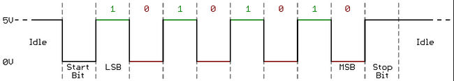

*Figura 3.1: Diagrama flux: rutina de întrerupere pentru cu recurenta sys-tick*

Planificatorul de task-uri este invocat în rutina de întrerupere, care implementează un mecanism simplu ce verifică și execută funcțiile principale ale task-urilor, conform unei recurențe configurate pentru fiecare task. Recurența reprezintă intervalul de timp (în tick-uri de timer) la care un task trebuie să fie executat.

Recurența este realizată prin intermediul unui contor asociat fiecărui task, care este decrementat la fiecare întrerupere. Când contorul ajunge la zero, task-ul este activat și executat, după care contorul este resetat la valoarea inițială specificată pentru recurență.

Offsetul reprezintă un decalaj în timp față de pornirea sistemului. Offset-ul se folosește pentru planificarea primei iterații de execuție a taskului, reprezentând un decalaj în timp față de pornirea sistemului. Offset-ul se realizează prin inițializarea contorului de recurență cu această valoare la starțiar ulterior, la resetare, acesta preia valoarea configurată ca recurență. Astfel, fiecare task va fi activat la un moment specific în cadrul execuției.

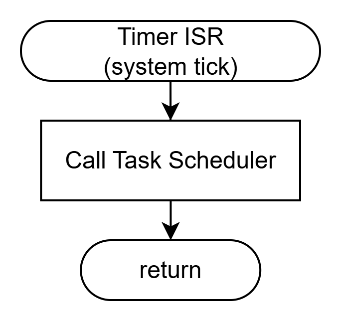

*Figura 3.2: Inițializarea offset-ului pentru fiecare task în planificatorul secvențial*

Ordinea executiei sau prioritatea task-urilor este determinată de ordinea în care sunt verificate în planificator. Task-urile cu prioritate mai mare (verificate primele) vor fi executate înaintea celor cu prioritate mai mică. De exemplu, în cazul producator-consumator, producatorul de informație trebuie apelat înaintea consumatorului, respectiv producătorul va avea prioritate mai mare în cadrul aceluiași sistem tick.

O implementare simplificată a planificatorului secvențial de task-uri este ilustrată în figura 3.3.

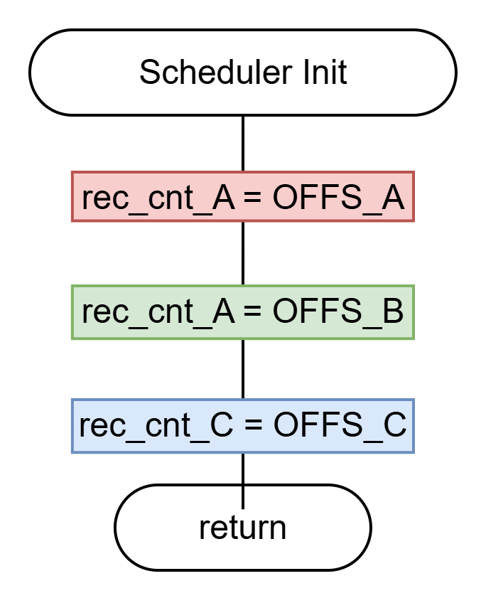

*Figura 3.3: Diagrama flux: planificator secvențial de task-uri*

Taskurile aplicației au asociate câte o funcție principală, o variabilă de stare care indică dacă task-ul este activ și un contor de recurență. Ordinea și frecvența apelării task-urilor sunt controlate exclusiv de logica din rutina de planificator. Această metodă permite multitasking simplu, fără complexitatea unui RTOS, fiind potrivită pentru aplicații cu cerințe predictibile de timp și resurse limitate.

Implementarea planificatorului poate arăta ca în exemplul de cod din listingul 3.3.

**Listing 3.1: Declarații și incluziuni pentru planificatorul secvențial de task-uri**
```c
#define REC_A 3 // recurența task A în ms
#define REC_B 2 // recurența task B în ms
#define REC_C 4 // recurența task C în ms

#define OFFS_A 3 // offset-ul task A în ms
#define OFFS_B 1 // offset-ul task B în ms
#define OFFS_C 0 // offset-ul task C în ms

int rec_cnt_A = 0;
int rec_cnt_B = 0;
int rec_cnt_C = 0;

// Prototipuri funcții task
void Task_A(void);
void Task_B(void);
void Task_C(void);
```

**Listing 3.2: Funcția de setup pentru planificatorul secvențial de task-uri**
```c
/**
 * Inițializează offset-ul pentru fiecare task.
 */
void os_seq_scheduler_setup(void) {
  rec_cnt_A = OFFS_A; // initializeaza offset-ul pentru task A
  rec_cnt_B = OFFS_B; // initializeaza offset-ul pentru task B
  rec_cnt_C = OFFS_C; // initializeaza offset-ul pentru task C
}
```

**Listing 3.3: Funcția principală de planificare și execuție a task-urilor**
```c
/**
 * Planificatorul secvențial: verifică și execută fiecare task conform recurenței.
 */
void os_seq_scheduler_loop(void) {
  // Task A
  if (--rec_cnt_A <= 0) {
    rec_cnt_A = REC_A; // reinițializează contorul de recurență
    Task_A();     // execută task A
  }
  
  // Task B
  if (--rec_cnt_B <= 0) {
    rec_cnt_B = REC_B; // reinițializează contorul de recurență
    Task_B();     // execută task B
  }
  
  // Task C
  if (--rec_cnt_C <= 0) {
    rec_cnt_C = REC_C; // reinițializează contorul de recurență
    Task_C();     // execută task C
  }
}
```
Se poate realiza o varianta mai compactă folosind structuri de context pentru fiecare
task, și organizarea a unor tablouri de structuri de context. vezi varianta optimizata mai
jos în listingul 3.4, 3.6 si 3.7.

**Listing 3.4: Declarații și incluziuni pentru planificatorul secvențial de task-uri (varianta optimizată)**
```c
#include <avr/io.h>
#include <avr/interrupt.h>

// Definirea structurii pentru contextul unui task
typedef struct {
  void (*task_func)(void); // pointer către funcția task-ului
  int rec;         // recurența task-ului în ms
  int offset;       // offset-ul task-ului în ms
  int rec_cnt;       // contorul de recurență
} Task_t;

// Definirea ID-urilor pentru fiecare task
enum {
  TASK_A_ID = 0, TASK_B_ID, TASK_C_ID, MAX_OF_TASKS
};

#define REC_A 3 // recurența task A în ms
#define REC_B 2 // recurența task B în ms
#define REC_C 4 // recurența task C în ms

#define OFFS_A 3 // offset-ul task A în ms
#define OFFS_B 1 // offset-ul task B în ms
#define OFFS_C 0 // offset-ul task C în ms

// Prototipuri funcții task (implementate separat)
void Task_A(void);
void Task_B(void);
void Task_C(void);

// Definirea task-urilor cu recurență și offset (cu initializare implicită)
Task_t tasks[MAX_OF_TASKS] = {
  { Task_A, REC_A, OFFS_A, 0 }, // Task A cu recurența de 3 ms și offset 3 ms
  { Task_B, REC_B, OFFS_B, 0 }, // Task B cu recurența de 2 ms și offset 1 ms
  { Task_C, REC_C, OFFS_C, 0 } // Task C cu recurența de 4 ms și offset 0 ms
};
```

**Listing 3.5: Funcție de inițializare a unui task**
```c
/**
 * Inițializează structura descriptor al task-ului cu funcția, recurența și
 * offset-ul specificate.
 */
void os_seq_scheduler_task_init(Task_t *task, void (*task_func)(void), int rec, int offset) {
  task->task_func = task_func; // asociază funcția task-ului
  task->rec = rec;       // setează recurența task-ului
  task->offset = offset;    // setează offset-ul task-ului
  task->rec_cnt = offset;   // inițializează contorul de recurență cu offset-ul
}
```

**Listing 3.6: Inițializează planificatorul de task-uri**
```c
/* *
* Ini ț ializeaz ă fiecare task cu func ț ia, recuren ț a ș i
* offset - ul specific .
*/
void os_seq_scheduler_setup(void) {
  os_seq_scheduler_task_init(&tasks[TASK_A_ID], Task_A, REC_A, OFFS_A);
  os_seq_scheduler_task_init(&tasks[TASK_B_ID], Task_B, REC_B, OFFS_B);
  os_seq_scheduler_task_init(&tasks[TASK_C_ID], Task_C, REC_C, OFFS_C);
}
```

**Listing 3.7: Planificatorul de task-uri**
```c
/**
 * Planificatorul secvențial: verifică și execută fiecare task conform recurenței.
 */
void os_seq_scheduler_loop(void) {
  for (int i = 0; i < MAX_OF_TASKS; i++) {
    if (--tasks[i].rec_cnt <= 0) {
      tasks[i].rec_cnt = tasks[i].rec; // reinițializează contorul de recurență
      tasks[i].task_func();      // execută task-ul
    }
  }
}
```

**Listing 3.8: Inițializarea timerului pentru întreruperi de 1 ms**
```c
/**
 * Inițializarea timerului 1 pentru întreruperi de 1 ms pentru
 * microcontrollerul AVR.
 */
void timer1_init(void) {
  // configurare timer 1 pentru a genera întreruperi la fiecare 1 ms
  TCCR1A = 0;             // setare mod normal
  TCCR1B = (1 << WGM12) | (1 << CS11); // setare prescaler 8
  OCR1A = 124;             // valoare comparare pentru 1 ms
  TIMSK1 = (1 << OCIE1A);       // activare întrerupere pe comparare
}
```

**Listing 3.9: Rutina de întrerupere pentru timerul 1**
```c
/**
 * Rutina de întrerupere pentru timerul 1: invocă planificatorul de task-uri.
 */
ISR(TIMER1_COMPA_vect) {
  os_seq_scheduler_loop();
}
```
Sunt posibile optimizări suplimentare, precum implementarea unui mecanism de sleep pentru dezactivarea task-urilor sau delay - reținerea activității pentru o perioadă specificată. Astfel, task-urile nu consumă resurse inutil când nu sunt active.

Un mecanism de wake-up din regimul de sleep/delay se activează la apariția unui eveniment definit (semnal de wake-up), legat la task printr-o referință, pe care planificatorul îl monitorizează pentru taskul respectiv. La identificarea semnalului, se resetează flagurile de sleep și contorul de delay. Acest mecanism poate servi ca bază pentru event-driven programming, activând taskurile din sleep la apariția unui eveniment și revenind în sleep după procesarea acestuia.

Aceste optimizări presupun dezvoltarea unui API pentru gestionarea taskurilor, cu funcții de creare, ștergere, sleep, delay, wake-up etc. Optimizările implică utilizarea unor structuri de date extinse pentru gestionarea taskurilor sau implementarea unor algoritmi specifici funcționalității propuse.

O referință la un sistem de operare secvențial industrial este OSEK-VDX, popular în sectorul automotive pentru aplicații în timp real și gestionare eficientă a hardware-ului. Detalii despre acest sistem pot fi găsite la [21].

Taskuri non-preemptive subînțeleg că odată ce un task începe să ruleze, nu poate fi întrerupt până când nu se termină. Taskurile non-preemptive se numesc taskuri cu cedare benevolă a resurselor. În sistemele secvențiale bare-metal, toate taskurile sunt non-preemptive, fapt pentru care este necesar să se asigure ca fiecare task să ruleze într-un timp cât mai scurt pentru a nu impacta celelalte taskuri. Acest fapt presupune inclusiv reducerea până la excludere a spin-lock-urilor sau a buclelor de așteptare (busy-waiting) în cadrul taskurilor, care pot duce la blocarea întregului sistem.

Spin-lock-urile sunt mecanisme de sincronizare care implică bucle de așteptare activă (busy-waiting) pentru a obține accesul la o resursă partajată. În sistemele secvențiale bare-metal, utilizarea spin-lock-urilor poate duce la blocarea întregului sistem, deoarece un task care detține un spin-lock poate bloca execuția altor taskuri.

În cazul în care există taskuri care prezintă riscul de blocare la verificarea unei condiții (de exemplu, așteptarea apăsării unui buton), este recomandată reproiectarea logicii taskului astfel încât bucla de așteptare (busy-waiting) să fie înlocuită cu o verificare simplă a condiției și returnarea din funcție dacă aceasta nu este îndeplinită. Astfel, taskul va relua verificarea la următoarea activare, evitând blocarea execuției globale. Acest principiu este ilustrat în Figura 3.4.
3.1. Analiza domeniului de aplicare
  a. Execuție secvențială cu spin-lock(busywaiting)
  b. Execuție secvențială fără spin-lock(nonblocking)

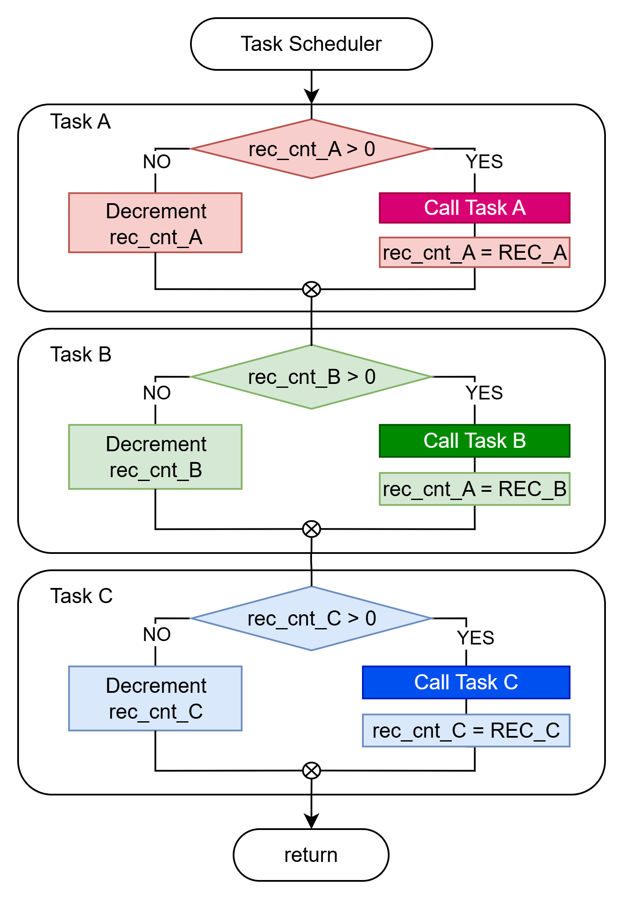

*Figura 3.4: Convertirea unui task cu spin-lock într-un task non-blocking*

**Planificarea execuției taskurilor secvențiale**
Se realizează prin stabilirea recurenței și offset-ului pentru fiecare task, cât și ordinea în care acestea sunt executate. Recurența taskului este stabilită din considerentele de viteză de evoluție a proceselor pe care le gestionează a metodelor de prelucrare a semnalului, și cât de critic este acel proces din punct de vedere temporal.

Stabilirea de recurențe și offset-uri adecvate este necesară pentru a asigura o utilizare optimă a procesorului și pentru a evita suprasolicitarea acestuia. În cazul limita în care toate taskurile au recurență de 1 ms și offset 0, toate taskurile se vor executa în fiecare tick, ceea ce poate duce la supraîncărcarea procesorului și la întârzieri în execuția taskurilor.

Acest lucru este ilustrat în Figura 3.5.

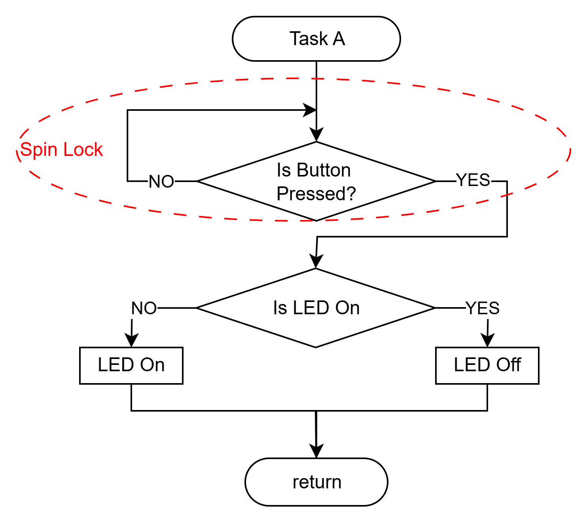

*Figura 3.5: Execuția task-urilor secvențiale cu recurență de 1ms*

Pentru a evita acest lucru, este recomandat să se stabilească recurențe și offset-uri diferite pentru fiecare task, în funcție de necesitățile aplicației.

De exemplu, pentru un task care gestionează apăsarea unui buton, se va lua în considerare viteza maximă de apăsare a unui buton, care este de aproximativ 5 apăsări pe secundă, ceea ce înseamnă o recurență minimă de 200 ms. Recurența se mărește în cazul în care informația pe care o gestionează va necesita o prelucrare. De exemplu, pentru cazul butonului va fi necesară o prelucrare de debounce, care va implica maturarea semnalului timp de 5 citiri consecutive de aceeași valoare, ceea ce va implica o creștere a recurenței până la 40 ms. Considerând că un buton se poate apăsa în anumite cazuri mai repede de 200 ms, se poate stabili o recurență de 20 ms, pentru a asigura citirea corectă a stării butonului.

În mod similar, pentru un task care gestionează un senzor de temperatură, se poate stabili o recurență mai mare, de exemplu 1 s, deoarece temperatura nu se schimbă foarte rapid. Utilizarea unor metode de filtrare, cum ar fi filtrarea zgomotului uniform sau impulsionar, presupune colectarea unui număr mai mare de citiri, de exemplu pe o fereastră de 8 citiri. Acest lucru ajută la filtrarea zgomotului și la obținerea unei valori mai precise.

Astfel, recurența poate fi mărită, iar 100 ms reprezintă un compromis bun între viteza de răspuns și precizia măsurătorii.

Definind recurențe relaxate pentru fiecare task, se poate asigura că nu toate taskurile se vor executa în același tick, evitând astfel supraîncărcarea procesorului. Acest lucru este ilustrat în Figura 3.6.

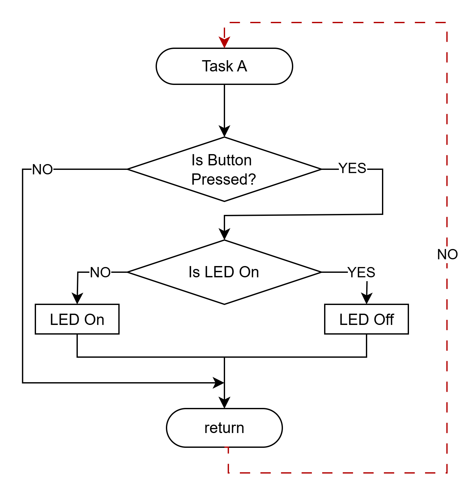

*Figura 3.6: Execuția task-urilor secvențiale cu recurențe diferite*

Offsetul se stabilește în funcție de recurența taskului și de ordinea în care acesta trebuie să fie executat. De exemplu, dacă un task are nevoie de informații de la un alt task, care are nevoie de 20 ms pentru ca datele pe care le produce să fie valide, atunci offsetul pentru primul task ar trebui să fie setat la minim 20 ms.

Un alt factor de selecție a offsetului este timpul de execuție al taskului. Suma tuturor tascurilor care se execută într-un sistem tick trebuie să fie mai mică decât durata unui tick. Respectiv, la planificarea recurenței trebuie să se țină cont și de timpul de execuție al fiecărui task, pentru a distribui corect execuția tascurilor în timp și a nu suprasolicita un anumit tick. Pentru calcul se folosește utilizarea CPU (CPU load), care se calculează ca CPU load = timpul de execuție total × 100% durata tick-ului
(3.1)
unde timpul de execuție total este suma timpilor de execuție ai tuturor task-urilor și durata tick-ului este intervalul de timp între două întreruperi consecutive de timer. Pentru a asigura o funcționare stabilă a sistemului, CPU utilization în fiecare tick ar trebui să fie menținută sub 100%, ideal sub 70-80%, pentru a permite și alte procese de sistem să ruleze fără întârzieri.

În cazul în care se identifică suprasolicitarea unui tick, se poate interveni prin modificarea offsetului taskurilor, astfel încât să se reducă numărul de taskuri care se execută în același tick. De exemplu, dacă două taskuri cu offseturi diferite se execută în același tick, se poate ajusta offsetul unuia dintre ele pentru a evita suprapunerea. În planificarea execuției din figura 3.7, s-a reușit reducerea până la un task per tick în majoritatea tick-urilor, prin ajustarea offseturilor taskurilor.

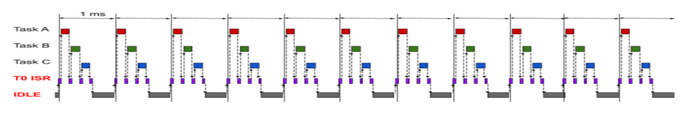

*Figura 3.7: Execuția task-urilor secvențiale cu offset-uri diferite*

În concluzie, pentru reducerea de CPU Load se poate interveni și prin mărirea recurenței taskurilor și prin ajustarea offseturilor, astfel încât să se evite suprapunerea execuției aces- tora în același tick. Acest lucru ajută la distribuirea mai uniformă a sarcinii pe procesor și la menținerea unei utilizări eficiente a CPU-ului.

Sincronizarea și comunicarea între taskuri în sistemele secvențiale non-preemptive se realizează prin simple interfețe de comunicare, cum ar fi variabile globale sau structuri de date partajate implementate prin funcții tip setter și getter.

Riscul de corupere a datelor în cazul accesului concurent la resurse partajate nu există în cazul sistemelor secvențiale non-preemptive, deoarece taskurile nu sunt întrerupte în timpul accesului la resurse partajate, iar toate operațiile de citire și scriere se finalizează fără a fi întrerupte.

Excepția ar putea fi cazurile de acces concurent la periferice hardware, fără a tține cont de starea acestora - flaguri de finalizare a operațiilor, cât și cazul în care se rulează pe un microcontroller cu arhitectură multi-core, unde taskurile pot rula pe nuclee diferite.

Pot apărea situații de acces concurent la resursele partajate, ceea ce ar duce la coruperea datelor. Respectiv, ar fi nevoie de mecanisme de sincronizare mai complexe, cum ar fi mutex-uri sau semafoare, pentru a preveni aceste situații.
### 3.1.2 Sisteme de operare RTOS
RTOS (Real-Time Operating System) este un sistem de operare specializat pentru gestionarea sarcinilor în timp real. Sistemele de operare RTOS permit execuția multitasking preemptivă, unde mai multe taskuri pot rula concurențiar sistemul de operare gestionează planificarea, sincronizarea și alocarea resurselor. În RTOS, fiecare task are o prioritate și poate fi întrerupt (preemptat) de un alt task cu prioritate mai mare, asigurând răspuns rapid la evenimente critice.

Unul din sistemele de operare populare open source pentru sisteme electronice încorporate este FreeRTOS, care oferă o gamă largă de funcționalități pentru gestionarea taskurilor, inclusiv planificare preemptivă, semafoare, mutex-uri, cozi de mesaje și timere software. FreeRTOS este proiectat pentru a fi ușor de utilizat și integrat în aplicații embedded, oferind un echilibru între performanță și complexitate.

Comoditatea utilizarii FreeRTOS constă în faptul că oferă o interfață simplă și clară pentru crearea și gestionarea taskurilor, precum și pentru sincronizarea și comunicarea între acestea.

Programarea concurentă cu mai multe taskuri este mult mai simplă și mai sigură decât în cazul programării bare-metal, deoarece FreeRTOS gestionează automat planificarea și invocarea taskurilor, reducând riscul de erori umane în gestionarea acestora.

Fiecare dintre taskuri se va executa într-un context propriu, cu stiva și resursele alocate, ceea ce izolează taskurile între ele, creând impresia că fiecare task rulează pe un microcontroller dedicat, fără să țină cont de existența altor taskuri, dacă acesta nu are nevoie de interacțiune cu ele.

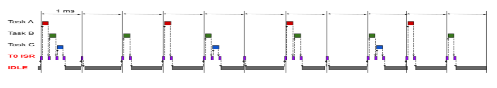

*Figura 3.8: Diagrama flux: execuția taskurilor concurente în RTOS*

În RTOS, fiecare task este definit printr-o funcție care contține logica specifică a taskului și arată ca în listingul 3.10.

**Listing 3.10: Exemplu de cod: definiția unui task în FreeRTOS**
```c
void Task_A_RTOS(void *pvParameters) {
  // Inițializări specifice task-ului A
  // ...
  while (1) {
    // Logica specifică a task-ului A
    // ...
  }
}
```
Pentru a lansa taskurile în FreeRTOS, este necesar să se creeze fiecare task folosind
funcția xTaskCreate(), care alocă resursele necesare și înregistrează taskul în sistemul de
operare. De asemenea, este necesar să se pornească planificatorul RTOS folosind funcția
vTaskStartScheduler(), care începe execuția taskurilor concurente. Acest lucru este
ilustrat în listingul 3.11.

**Listing 3.11: Exemplu de cod: lansarea taskurilor în FreeRTOS**
```c
void main(void) {
  // Inițializări hardware și alte inițializări
  // ...
  
  // Crearea taskurilor
  xTaskCreate(Task_A_RTOS, "Task A", configMINIMAL_STACK_SIZE, NULL, 1, NULL);
  xTaskCreate(Task_B_RTOS, "Task B", configMINIMAL_STACK_SIZE, NULL, 1, NULL);
  xTaskCreate(Task_C_RTOS, "Task C", configMINIMAL_STACK_SIZE, NULL, 1, NULL);
  
  // Pornirea planificatorului RTOS
  vTaskStartScheduler();
  
  // Schedulerul nu ar trebui să revină niciodată aici
  for(;;);
}
```
Odată ce planificatorul RTOS a fost pornițacesta va gestiona execuția taskurilor conform
priorităților și politicilor de planificare definite. Fiecare task va fi programat să ruleze în
funcție de timpul său de execuție și de resursele disponibile.

Sisteme secvențiale cu RTOS
Reieșind din definiția sistemelor secvențiale, care execută taskurile periodic cu o recurență
și un offset, se poate implementa un sistem secvențial folosind RTOS, prin crearea de taskuri cu recurență și offset diferite, care să ruleze concurent.

Pentru a implementa mecanismul de offset, se poate utiliza o reținere de execuție a
buclei taskului până la expirarea offsetului, folosind funcția vTaskDelay(portTickType
xTicksToDelay).

Această funcție pune taskul în starea de așteptare(blocked state) pentru un număr
specificat de tick-uri, eliberând CPU pentru alte taskuri. Astfel, taskul nu va consuma
resurse CPU în timpul perioadei de așteptare, permițând altor taskuri să ruleze.

Pentru a implementa recurența, se poate utiliza aceeași funcție vTaskDelay(), pentru
a introduce o întârziere între execuțiile succesive ale taskului. Dar în acest caz, întârzierea
trebuie să fie calculată astfel încât să se asigure că taskul se va executa la intervale regulate,
conform recurenței specificate considerand și timpul de executie a taskului.

O metodă mai eficientă este folosirea funcției vTaskDelayUntil(portTickType *
pxPreviousWakeTime, portTickType xTimeIncrement), care asigură că taskul se va
trezi la intervale regulate, indiferent de timpul de execuție al taskului. Această funcție
ia ca parametru un pointer la variabila care retține timpul ultimei treziri a taskului și un
increment de timp. Astfel, taskul va fi programat să ruleze la intervale regulate, conform
recurenței specificate, fără a fi afectat de variațiile în timpul de execuție.

O implementare simplificată a unui task secvențial în FreeRTOS utilizând aceste funcții
este ilustrată în listingul 3.12.

**Listing 3.12: Exemplu de cod: definiția unui task secvențial în FreeRTOS**
```c
#define REC_A 3   // recurența task A în ms
#define OFFSET_A 1 // offset-ul task A în ms

void Task_A_RTOS(void *pvParameters) {
  // Inițializări specifice task-ului A
  // ...
  
  // Convertirea offset-ului și recurenței în tick-uri
  const portTickType offsetTicks = pdMS_TO_TICKS(OFFSET_A);
  const portTickType recTicks = pdMS_TO_TICKS(REC_A);
  
  // Inițializarea variabilei pentru timpul ultimei treziri
  portTickType xLastWakeTime;
  
  // Așteaptă offset-ul inițial
  vTaskDelay(offsetTicks);
  
  // Obține timpul curent
  xLastWakeTime = xTaskGetTickCount();
  
  for (;;) {
    // Execuția taskului secvential cu logica specifică a task-ului A
    Task_A();
    
    // Așteaptă următoarea trezire
    vTaskDelayUntil(&xLastWakeTime, recTicks);
  }
}
```
Dat fiind faptul că FreeRTOS este un sistem de operare preemptiv, ce presupune că
taskurile pot fi întrerupte în orice moment de către alte taskuri cu prioritate mai mare,
este important să se acorde atenție la proiectarea taskurilor secvențiale pentru a evita
problemele de sincronizare și a asigura o execuție corectă. de exemplu a se utiliza priorități
egale pentru toate taskurile secvențiale, pentru a preveni întreruperile nedorite.

În cazul FreeRTOS nu mai putem evita accesul concomitent la resurse partajate,
deoarece taskurile pot fi întrerupte în orice moment. Respectiv, este necesar să se utilizeze
mecanisme de sincronizare, cum ar fi mutex-uri sau semafoare pentru a proteja resursele
partajate și a preveni coruperea datelor.

Sisteme concurente cu RTOS
Sistemele concurente cu RTOS permit execuția simultană a mai multor taskuri, fiecare
având propriile sale cerințe de timp și resurse. În acest context, FreeRTOS oferă mecanisme eficiente pentru gestionarea concurenței, cum ar fi planificarea bazată pe prioritate,
semafoare, mutex-uri și cozi de mesaje.

Semafoarele sunt utilizate pentru a sincroniza taskurile, acestea reprezentând puncte
de sincronizare. cea mai simplă formă de semafor este un flag binar, care poate fi setat
sau resetat de către un task, iar alte taskuri pot aștepta până când semaforul este setat
pentru a continua execuția.

De exemplu, un task identifica anumite situații și setează un semafor, iar un alt task
așteaptă semaforul pentru a continua execuția, implementând astfel un mecanism de
programare bazat pe evenimente.
vezi exemplul din listingul 3.13.

**Listing 3.13: Exemplu de cod: utilizarea semafoarelor în FreeRTOS**
```c
#include "FreeRTOS.h"
#include "semphr.h"

SemaphoreHandle_t xSemaphore;

void Task_A(void *pvParameters) {
  for (;;) {
    // Logica specifică a task-ului A
    // ...
    
    // Setează semaforul pentru a semnala un eveniment
    xSemaphoreGive(xSemaphore);
  }
}

void Task_B(void *pvParameters) {
  for (;;) {
    // Așteaptă semaforul pentru a continua execuția
    if (xSemaphoreTake(xSemaphore, portMAX_DELAY) == pdTRUE) {
      // Logica specifică a task-ului B după ce semaforul este luat
      // ...
    }
  }
}
```

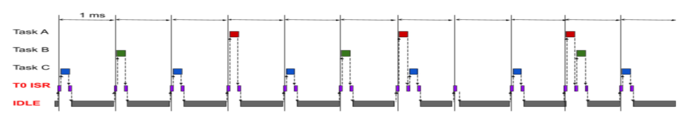

*Figura 3.9: Mecanismul de sincronizare între taskuri cu semafor binar în RTOS*

Mecanismul de semafoare este pe larg descris în documentația FreeRTOS, vezi referința [11].

Mutex-urile sunt utilizate pentru a proteja resursele partajate, acestea asigurând că doar un singur task poate accesa o resursă la un moment dat. Acest mecanism este recomandat în interacțiunea între mai multe taskuri prin interfețe tip setter și getter. De exemplu taskul producător de informație va apela interfața setter pentru a actualiza o variabilă globală, iar taskul consumator va apela interfața getter pentru a citi valoarea variabilei. Pentru a preveni coruperea datelor, ambele interfete vor folosi un mutex pentru a proteja accesul la variabila globala.

Setterii și getterii cu mutex sunt ilustrați în listingul 3.14.

**Listing 3.14: Exemplu de cod: utilizarea mutex-urilor în FreeRTOS**
```c
#include "FreeRTOS.h"
#include "semphr.h"

SemaphoreHandle_t xMutex;
int sharedVariable;

void setSharedVariable(int value) {
  // Blochează mutex-ul înainte de a accesa resursa partajată
  xSemaphoreTake(xMutex, portMAX_DELAY);
  sharedVariable = value; // Actualizează variabila partajată
  
  // Eliberează mutex-ul după ce a terminat accesul
  xSemaphoreGive(xMutex);
}

int getSharedVariable(void) {
  int value;
  // Blochează mutex-ul înainte de a accesa resursa partajată
  xSemaphoreTake(xMutex, portMAX_DELAY);
  value = sharedVariable; // Citește variabila partajată
  
  // Eliberează mutex-ul după ce a terminat accesul
  xSemaphoreGive(xMutex);
  return value;
}

void Task_Producer(void *pvParameters) {
  // initializarea semaforului
  xMutex = xSemaphoreCreateMutex();
  
  for (;;) {
    // Logica specifică a task-ului producător
    int newValue = ...; // Generează o nouă valoare
    setSharedVariable(newValue); // Actualizează variabila partajată
  }
}

void Task_Consumer(void *pvParameters) {
  for (;;) {
    // Logica specifică a task-ului consumator
    int value = getSharedVariable(); // Citește valoarea variabilei partajate
    // Procesează valoarea citită
    ...
  }
}
```

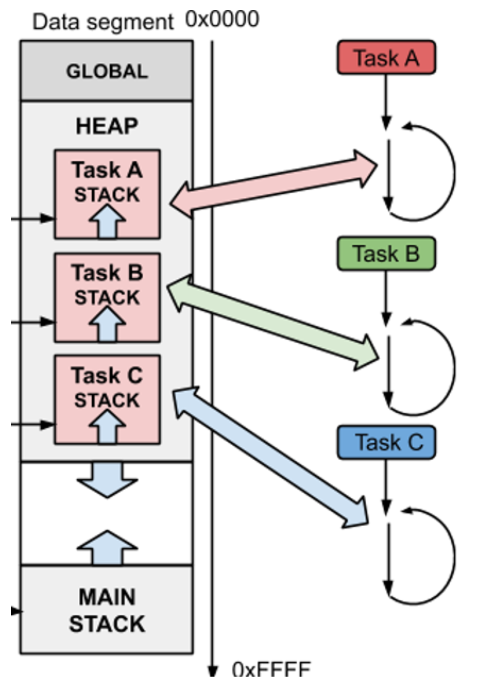

*Figura 3.10: Mecanismul de protecție a resurselor partajate cu mutex*

Mechanismul de mutex-uri este pe larg descris în documentația FreeRTOS, vezi referința [13].

Cozi de mesaje (queues) sunt utilizate pentru a facilita comunicarea între taskuri, permițând unui task să trimită date către alt task prin intermediul unei cozi. Acest mecanism este util pentru transmiterea de mesaje sau date între taskuri fără a necesita acces direct la resurse partajate.

Acest mecanism este util în comunicarea asincronă între taskuri, unde un task poate produce date la un ritm diferit față de cel la care un alt task le consumă. De exemplu, un task producător poate citi date de la o interfață hardware, cum ar fi portul serial, și le poate trimite printr-o coadă, iar un alt task consumator poate prelua datele din coadă și le poate procesa.

Un exemplu de utilizare a cozilor de mesaje este ilustrat în listingul 3.15.

**Listing 3.15: Exemplu de cod: utilizarea cozilor de mesaje în FreeRTOS**
```c
#include "FreeRTOS.h"
#include "queue.h"

QueueHandle_t xQueue;

void Task_Producer(void *pvParameters) {
  int valueToSend = 0;
  
  for (;;) {
    // Generează o nouă valoare
    valueToSend++;
    // Trimite valoarea prin coadă
    xQueueSend(xQueue, &valueToSend, portMAX_DELAY);
    vTaskDelay(pdMS_TO_TICKS(100));
  }
}

void Task_Consumer(void *pvParameters) {
  int receivedValue;
  
  for (;;) {
    // Așteaptă să primească o valoare din coadă
    if (xQueueReceive(xQueue, &receivedValue, portMAX_DELAY) == pdPASS) {
      // Procesează valoarea primită
      ...
    }
  }
}
```


*Figura 3.11: Mecanismul de comunicare între taskuri cu cozi de mesaje în RTOS*

Mecanismul de cozi de mesaje este pe larg descris în documentația FreeRTOS, vezi referința [12].

Dacă în cazul sistemelor secvențiale bare-metal nu problema cea mai mare de blocare a sistemului o reprezintă spin-lock-urile, pentru că blocarea unui task neinteruptibil bloca execuția întregului sistem. În cazul RTOS, spin-lock-urile nu mai sunt la fel de relevante, deoarece afectează doar taskul care le detține.

Însă totuși există riscuri de blocare a sistemului, care pot apărea în cazul utilizării mecanismelor de sincronizare și comunicare între taskuri. Printre aceste tipuri de blocare se regăsesc live-lock-urile și dead-lock-urile.

Live-lock-urile apar atunci când două sau mai multe taskuri sunt blocate reciproc, fiecare reacționând la acțiunile celuilalt fără a progresa efectiv. În RTOS, live-lock-ul poate apărea dacă taskurile reacționează continuu la semnale sau mesaje, dar nu reușesc să finalizeze operațiile, de exemplu, în cazul unor protocoale de comunicare defectuos implementate.

Dead-lock-urile apar atunci când două sau mai multe taskuri sunt blocate reciproc, fiecare așteptând ca celălalt să elibereze o resursă. În RTOS, dead-lock-ul poate apărea dacă taskurile dețin resurse multiple și așteaptă eliberarea acestora într-o ordine circulară, blocând complet execuția.

Diferența dintre live-lock și dead-lock în contextul RTOS constă în faptul că în livelock, taskurile continuă să ruleze dar nu progresează, în timp ce în dead-lock, taskurile sunt complet blocate și nu mai pot fi planificate de sistemul de operare. RTOS oferă mecanisme precum semafoare, mutex-uri și time-out-uri pentru a preveni aceste situații și pentru a asigura funcționarea corectă a aplicațiilor concurente., Aceste tipuri de blocaje pot fi prevenite printr-o proiectare atentă a sistemului, inclusiv prin utilizarea corectă a mecanismelor de sincronizare și comunicare, corect proiectate și justificate.
## 3.2 Sarcina de laborator
Sistem de monitorizare a duratei apăsărilor butonului cu semnalizare vizuală și raportare periodică. Proiectați și implementați o aplicație multitasking pentru mi, crocontroler care să monitorizeze durata fiecărei apăsări a unui buton, să semnalizeze vizual durata apăsării prin LED-uri și să raporteze periodic statistici către utilizator prin STDIO.

Aplicația va fi structurată în cel puțin 3 task-uri distincte:
- Task 1 - Detectare și măsurare durată apăsare: Monitorizează starea butonului, detectează tranzițiile apăsat/eliberat și măsoară durata fiecărei apăsări (în
milisecunde). La fiecare apăsare validă, salvează durata într-o variabilă globală și semnalizează vizual apăsarea scurtă (< 500 ms) sau lungă (≥ 500 ms) prin aprinderea unui LED verde (scurtă) sau roșu (lungă).
- Task 2 - Contorizare și statistici apăsări: La fiecare apăsare detectată, incrementează un contor global de apăsări, actualizează suma totală a duratelor scurte și lungi, precum și numărul de apăsări scurte și numărul de apăsări lungi. Realizează un blink rapid al LED-ului galben la fiecare apăsare: 5 blicuri pentru scurtă și 10 pentru lungă.
- Task 3 - Raportare periodică: La intervale de 10 secunde, transmite utilizatorului prin STDIO: numărul total de apăsări, numărul de apăsări scurte (< 500 ms), numărul de apăsări lungi, durata medie a apăsărilor și resetează statisticile.

### 3.2.1 Partea 1 - Sisteme de operare Non-Preemptive (bare-metal)
Implementați sarcina cu task-uri non-preemptive, bare-metal secvențial. Folosiți structuri de context pentru fiecare task și tablouri cu recurență, offset și pointer la funcție.

Demonstrați planificarea eficientă a CPU cu un singur task activ per tick.
### 3.2.2 Partea 2 - Sisteme de operare Preemptive (FreeRTOS)
Implementați sarcina cu task-uri preemptive cu FreeRTOS. Folosiți delay și delayUntil pentru recurență și offset. Portați codul între bare-metal și FreeRTOS cu modificări minime. Extindeți cu mecanisme de sincronizare între task-uri: semafoare binare pentru semnalizarea evenimentelor și mutex-uri pentru protecția variabilelor partajate. Demonstrați accesul sigur la resurse globale și comunicarea între task-uri.

**Cerințe suplimentare:** Pentru lucrările de laborator privind sistemele de operare embedded (bare-metal sau RTOS), respectați următoarele recomandări pentru structură, modularitate și validare:
- Structurați aplicația modular, separând fiecare task într-un modul software dedicat (ex: măsurare, statistici, raportare).
- Implementați planificatorul de task-uri folosind structuri de context și tabele de configurare (recurență, offset, pointer la funcție).
- Pentru RTOS, creați taskuri dedicate pentru fiecare funcționalitate și utilizați mecanisme de sincronizare (semafoare binare, mutex) pentru accesul la resurse partajate.
- Reutilizați modulele pentru butoane, LED-uri și interfața STDIO, cu separare clară între nivelurile HW/SW (MCAL/ECAL/SRV).
- Documentați arhitectura software, diagramele de flux ale task-urilor, planificarea execuției (Gantt/diagramă tick), și interfețele HW/SW.
- Testați fiecare task și mecanism de sincronizare conform scenariilor de validare definite.
- Asigurați latență sub 100ms la schimbarea semnalului de intrare (buton).
- Prezentați rezultate de testare (log STDIO, capturi de ecran, măsurători de latență).
- Consultați resursele teoretice despre multitasking, planificare și sincronizare în sisteme embedded.

**Materiale și resurse necesare pentru realizarea lucrării:**
- Componente hardware: microcontroler compatibil cu FreeRTOS (ex.: Arduino Mega,
ESP32, STM32), LED-uri (verde, roșu, galben) cu rezistențe de limitare, buton fizic cu rezistor de pull-up sau pull-down, placă de prototipare (breadboard), cabluri de conexiune (jumper wires), sursă de alimentare (USB sau baterie).
- Resurse software: mediu de dezvoltare (PlatformIO, Arduino IDE sau STM32CubeIDE), biblioteci software (FreeRTOS pentru multitasking, biblioteci standard pentru GPIO), simulator hardware (Wokwi, Proteus sau hardware real), instrument de construire a diagramelor (ex.: draw.io, Lucidchart).

**NOTĂ:** Realizarea sarcinii se va desfășura în două etape distincte, definite ca două probleme în cadrul lucrării de laborator. Aceste probleme vor fi realizate conform metodologiei prezentate în anexa de problemă rezolvată. Fiecare etapă va fi documentată conform cerințelor metodologice, incluzând cerințe, schițe arhitecturale, diagrame de flux, scenarii de testare și rezultatele obținute. Fiecare parte a lucrării (problema) este planificată pentru o ședință de 2 ore academice.

### Mersul lucrării
1. Sa se analizeze și sa se inteleaga Sarcina lucrarii de laboratorși anume Analiza situației în domeniu și Contextul tehnologic al aplicației dezvoltate conform sectiunii
1.1.
2. sa se falmiliarizeze cu problema propusa spre elaborareși sa se identifice obiectivele și sarcina individuala vezi A.1.1.
3. Sa se analizeze componentgele și resursele untilizate in realizarea aplicatiei din cadrul lucrarii de laborator.
4. In urma analizei sarcinii lucrarii și definitiei problemei propuse, sa se defineasca un set de cerinte tehnice acoperind aspectele funcitionale și nefunctionale ale problemei, vezi A.1.2
5. In urma analizei cerintelor tehnice elaborate sa se defineasca scenarii de testare și criteriilor de validare cu minim 1 test per cerinta care sa raspunda la intrebarea cum ma asigur ca cerinta se satidface, vezi A.1.3
6. sa se identifice componentele ce compun sistemul aplicatiei, sa se organizeze intr-o lista cu descrierea rolului acerstora in aplicatie.
7. Sa se realizeze diagrama structurala cu reprezentarea componentelor și interactiunii intre acestea asa cum este prezentat in sectiunea A.1.4
8. Sa se realizeze arhitectura pe nivele pentru interfata hardware-software pentru fiecare dintre interfete vezi A.1.4.
9. Sa se realizeze diagramele de comportament pentru functionalitatile Componentelor cu diagrame de de flux stari sau de secvență, dupa caz, ca in A.1.5
10. sa se elaboreze schita electrica a aplicatiei intr-un mediu de simulare, vezi A.1.6.
11. sa se creeze structura de directoare și fisiere pentru implementarea aplicatiei care va reflecta arhitectura definita de sistemși de interfata hardware Software vezi A.1.7.
12. Sa se implementeze driverele de interfata hardware-software pentru fiecare componenta electronica utilizata in aplicatie acoperind nivelele ECAL și SRV dupa cazA.1.7.
13. Sa se implementeze comportamentul aplicatiei urmand diagrama de flux definita,
A.1.7.
14. Sa se simuleze functionare aplicatia in medii precum Wokwi sau PlatformIO. cu o eventuala rulare pe hardware real.
15. Sa se testeze și valideze aplicatia conform scenariilor de testare și criteriilor de validare definite anterior, vezi exemplu in A.1.8.
16. Sa se documenteze rezultatele testarii cu observatii și recomandari pentru imbunatatiri,
A.1.8.
17. Sa se optimizeze aplicatia pe baza rezultatelor testarii și validarii
18. sa se documenteze toate etapele realizate in cadrul lucrarii de laborator conform cerintelor pentru raportul lucrarii de laborator expuse in 1.1.5.

Acest proces este urmat în cadrul tuturor lucrărilor de laborator din cadrul cursului, asigurându-se astfel o înțelegere profundă a modului în care funcționează sistemele electronice incorporate, multitasking și a importanței unei abordări metodice în proiectarea acestora.
### Întrebări de control
1. Explicați diferența dintre execuția secvențială bare-metal și execuția multitasking cu
RTOS. Care sunt avantajele și limitările fiecărei abordări?
2. Ce rol au recurența și offset-ul în planificarea task-urilor într-un sistem secvențial? Cum influențează acestea utilizarea CPU?
3. Descrieți structura unui planificator secvențial de task-uri. Cum se realizează activarea periodică a task-urilor?
4. Ce este un spin-lock și de ce trebuie evitat în sistemele secvențiale bare-metal? Cum se poate transforma un task blocking într-un task non-blocking?
5. Explicați conceptul de multitasking preemptiv în RTOS. Cum se realizează sincronizarea și protecția datelor partajate între task-uri?
6. Care sunt principalele mecanisme de sincronizare oferite de FreeRTOS? Dați exemple de utilizare pentru semafoare, mutex-uri și cozi de mesaje.
7. Cum se implementează comunicarea între task-uri în RTOS folosind variabile globale, semafoare sau cozi? Ce riscuri apar dacă nu se protejează accesul la resurse?
8. Comparați abordarea modulară a aplicației (separare pe task-uri și drivere) cu implementarea monolitică. Ce avantaje oferă modularitatea pentru mentenanță și extindere?
9. Descrieți metodologia de testare pentru o aplicație multitasking. Ce scenarii de testare sunt importante pentru validarea funcțională și de performanță?
10. Ce pași trebuie urmați pentru portarea unei aplicații de la execuție bare-metal la execuție cu RTOS? Ce modificări sunt necesare la nivel de structură și sincronizare?

## 3.5 Grila de evaluare a lucrării de laborator
1. Analiza sarcinii și contextului tehnologic (12p)
  a. Analiza situației în domeniu și contextul tehnologic (1.1) (4p)
  b. Identificarea resurselor externe și referințe în bibliografie (4p)
  c. Analiza componentelor și resurselor utilizate (4p)
2. Definirea cerințelor tehnice și scenariilor de testare (13p)
  a. Identificarea obiectivelor și sarcinii individuale (A.1.1) (3p)
  b. Formularea cerințelor funcționale și non-funcționale (A.1.2) (5p)
  c. Definirea scenariilor de testare și criteriilor de validare (A.1.3) (5p)
3. Proiectarea arhitecturală și modelare comportamentală (18p)
  a. Listarea componentelor și descrierea rolului fiecăreia (3p)
  b. Diagrama structurală cu componente și interacțiuni (A.1.4) (4p)
  c. Arhitectura pe nivele pentru interfața hardware-software (4p)
  d. Diagrame comportament pentru funcționalități (flux, stări, secvență) (A.1.5) (7p)
4. Proiectarea și simularea schiței electrice (13p)
  a. Elaborarea schiței electrice în mediu de simulare (A.1.6) (4p)
  b. Reprezentarea corectă a conexiunilor și dimensionarea componentelor (2p)
  c. Simularea funcționării aplicației în medii precum Wokwi/PlatformIO (3p)
  d. Rularea aplicației pe HW real (10p)
5. Implementarea software modulară (18p)
  a. Structura de directoare și fișiere conform arhitecturii (A.1.7) (4p)
  b. Implementarea de interfață HW-SW conform proiectării în detaliu (6p)
  c. Implementarea comportamentului aplicației conform proiectării în detaliu (6p)
  d. Comentarii explicative și documentare în cod (2p)
6. Simulare, testare și validare (16p)
  a. Testarea și validarea conform scenariilor definite (A.1.8) (8p)
  b. Documentarea rezultatelor testării, observații și recomandări (5p)
  c. Optimizarea aplicației pe baza rezultatelor testării și validării (3p)
7. Documentare finală (10p)
  a. Documentarea etapelor realizate conform cerințelor raportului (1.1.5) (5p)
  b. Observații, recomandări, concluzii generale (5p)
Total: 100p
---
# Lucrarea de laborator nr. 4: Senzori - Achiziție și condiționare semnal
**Scopul lucrării**
Familiarizarea cu metodele de achiziție a semnalelor provenite de la senzori analogici și digitali, precum și cu tehnicile de condiționare digitală a acestor semnale pentru utilizarea lor eficientă în aplicații embedded. Lucrarea urmărește implementarea unui sistem modular care permite preluarea, filtrarea, conversia și afișarea parametrilor fizici măsurați, punând accent pe procesarea corectă și adaptarea semnalului la cerințele aplicației.
**Obiectivele lucrării**
- Studierea principiilor de achiziție a semnalelor de la senzori analogici, digitali și binari, cu accent pe particularitățile fiecărui tip de interfață.
- Implementarea metodelor de condiționare digitală a semnalului, incluzând, saturare, filtrare (sare și piper, mediere ponderată), conversie liniara și neliniară.
- Integrarea funcționalităților de achiziție și condiționare în structuri modulare, cu separarea clară a componentelor software pentru facilitarea testării și reutilizării.
- Documentarea arhitecturii software, prezentarea schemelor bloc și a schemelor electrice ca parte a metodologiei de proiectare.

## 4.1 Analiza domeniului de aplicare a sistemelor de achiziție și condiționare a semnalului
Sistemele electronice încorporate utilizează senzori pentru a colecta informații din mediul înconjurător, transformând parametrii fizici (temperatură, lumină, presiune, umiditate, mișcare etc.) în semnale electrice. Pentru ca aceste semnale să fie utilizate eficient de microcontroler, este necesară o etapă complexă de achiziție și condiționare, care implică preluarea, filtrarea, conversia și adaptarea semnalului la cerințele specifice ale aplicației.

Acest capitol prezintă principiile fundamentale ale achiziției și condiționării semnalului, metodele de procesare digitală și modul în care acestea influențează acuratețea, precizia și fiabilitatea datelor în sistemele embedded moderne. Fluxul de achiziție și condiționare a semnalului reprezintă un lanț complex de transformări prin care trece informația în calea sa de la forma inițială de parametru fizic din mediul extern până la o structură de date utilizabilă în aplicația embedded. Acest proces implică multiple etape de prelucrare, atât în domeniul analog, cât și în cel digital, fiecare cu rolul său specific în asigurarea calității și relevanței informației finale [4] [5].

Un flux tipic de achiziție pentru un semnal provenit de la un senzor analogic include:
- Conversia parametrului fizic în semnal electric de către elementul senzitiv 4.1.1.
- Condiționarea electrică a semnalului (amplificare, filtrare, linearizare) 4.1.2.
- Conversia analog-digitală prin intermediul ADC-ului microcontrolerului 4.1.3.
- Filtrarea și condiționarea digitală (eliminare zgomot, mediere, calibrare) pentru semnalul analogic 4.1.4. semnal digital 4.1.5 sau semnal binar 4.1.6.
- Conversia în unități fizice relevante pentru aplicație 4.1.7.
- Expunerea datelor prelucrate prin intermediul unei interfețe software.

Reprezentarea grafică a acestui flux, cu componentele sale principale și transformările specifice, este ilustrată în figura 4.1.

![Figura 4.1: Fluxul de achiziție și condiționare a semnalului de la un senzor analogic, evidențiind transformările succesive ale informației de la parametru fizic la date digitale [5]](figures/figura_4_1.png)

*Figura 4.1: Fluxul de achiziție și condiționare a semnalului de la un senzor analogic, evidențiind transformările succesive ale informației de la parametru fizic la date digitale [5]*

In secțiunile ce urmează vom analiza pe rând fiecare etapă a fluxului de achiziție și condiționare a semnalului, punând accent pe metodele și tehnicile utilizate.
### 4.1.1 Achiziția semnalului de la senzori
Sursa primară a informației pentru sistemele electronice încorporate o reprezintă mediul înconjurător, unde diverse mărimi fizice (temperatură, umiditate, luminozitate, presiune, forță, accelerație, distanță, etc.) poartă informații relevante pentru aplicație. Pentru ca aceste mărimi să poată fi procesate de circuitele electronice, este necesară conversia lor în mărimi electrice măsurabile (tensiune, curențrezistență, capacitate, inductanță, frecvență, etc.).

Această conversie fundamentală este realizată de componente specializate numite senzori. Termenul provine din latinescul sentire - a simți, a percepe, reflectând funcția lor esențială de a "simți" mediul fizic și a-l traduce în limbajul electronic.

Un senzor reprezintă, în esență, un transductor care utilizează un material sau un fenomen fizic specific pentru a transforma o mărime fizică de interes într-o mărime electrică proporțională. Această transformare se bazează pe diverse proprietăți fizice (piezoelectrice, termoelectrice, fotoelectrice, etc.) și poate fi ulterior prelucrată prin tehnici electronice pentru a obține un semnal util, reprezentativ pentru mărimea fizică originală, compatibil cu sistemele de procesare.

Senzorii pot fi clasificați în funcție de mai multe criterii, printre care cele mai relevante pentru construirea fluxului de achizitie ar fi urmatoarele
- Tipul de mărime fizică măsurată: temperatură, umiditate, presiune, lumină, accelerație, proximitate, etc. important pentru a intelege natura semnalului și evolutia sa in timp.
- Tipul de semnal de ieșire: analogic (tensiune, curent) sau digital (pulsuri, date
seriale), influiențând alegerea interfețelor de achiziție și prelucrare.
- Principiul de funcționare: piezoelectric, termoelectric, capacitiv, inductiv etc., oferind indicii despre caracteristicile și limitele de utilizare.

În cadrul sistemelor încorporate nu se pune problema de construirea a unui senzor, ci mai degrabă de identificarea senzorului potrivit pentru aplicație reieșind din specificațiile tehnice ale acestuia, cerințele de performanță ale sistemului și condițiile de mediu în care va funcționa, și nu în ultimul rând costul acestuia.
### 4.1.2 Condiționarea electrică semnalului
Semnalele electrice provenite de la senzori sunt adesea slabe, zgomotoase și susceptibile la interferențe, și deseori într-un domeniu de tensiuni și curenți care nu sunt compatibili cu circuitele de achiziție și procesare. Pentru a asigura o achiziție corectă și precisă, este necesară o etapă de condiționare a semnalului, care include diverse tehnici de prelucrare analogică și digitală.

Condiționarea unui semnal analogic poate include:
- Amplificarea: utilizarea amplificatoarelor operaționale pentru a creste sau atenua nivelul semnalului la valori adecvate pentru conversia ADC, îmbunătățind raportul semnal-zgomot.
- Filtrarea: implementarea de filtre pasive sau active (trece-joștrece-suștrecebandă) pentru a elimina componentele de frecvență nedorite și a reduce zgomotul.
- Linearizarea: corectarea non-linearităților senzorului prin circuite analogice sau tehnici de calibrare. Această etapă poate fi una opțională, fiind transferată în domeniul digital.
- Izolarea galvanică: utilizarea de optocuploare sau transformatoare pentru a proteja circuitele de achiziție de tensiuni periculoase sau interferențe, fiind opțională în cele mai multe aplicații embedded.
- Adaptarea impedanței: asigurarea unei potriviri optime între senzor și circuitul de achiziție pentru a minimiza pierderile de semnal.
- Saturarea: protecția la supratensiuni - implementarea de circuite de protecție pentru a preveni deteriorarea echipamentului în cazul unor condiții anormale de funcționare.

Realizarea etapelor de condiționare electrică presupune utilizarea unor circuite electronice specializate ce realizează funcțiile dorite. Procesul de proiectare a acestor circuite implică cunoștințe în analiza și sinteza circuitelor electrice, electronică analogică și de putere, precum și o bună înțelegere a caracteristicilor senzorului și a cerințelor aplicației.

Nu ne vom aprofunda în cadrul acestei lucrări de laborator în proiectarea acestor circuite, ci vom menționa câteva metode în scop de studiu.

În figura 4.2 sunt ilustrate principalele etape de condiționare electrică a semnalului cum ar fi atenuarea, amplificarea și saturarea, iar în figura 4.3 sunt prezentate principalele tipuri de filtre cum ar fi trece-joștrece-suștrece-bandă, reject-bandă utilizate în etapa de condiționare electrică a semnalului.

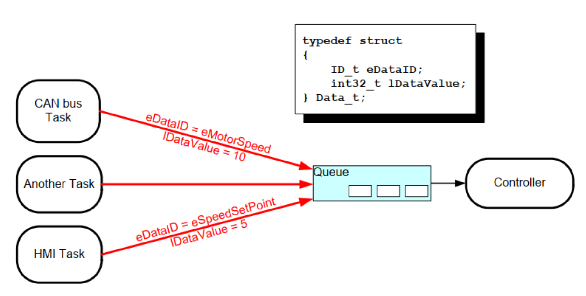

*Figura 4.2: Etape de condiționare electrică: atenuare, amplificare, saturare a semnalului de la senzor*

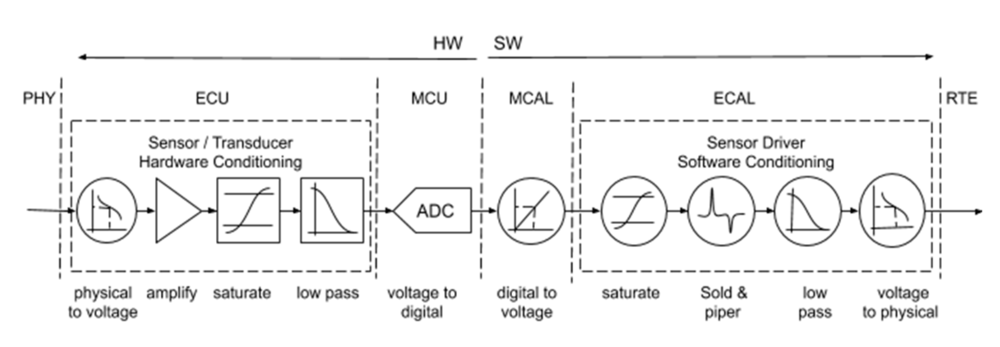

*Figura 4.3: Metode de filtrare electrică: trece-joștrece-suștrece-bandă, reject-bandă*

În electronica contemporană, datorită nivelului ridicat de integrare a circuitelor, în multe cazuri senzorii vin cu circuite de condiționare electrică integrate, iar în alte cazuri aceste circuite sunt realizate pe cablaje specializate pentru fiecare tip de senzor în parte, oferind o interfață standardizată.

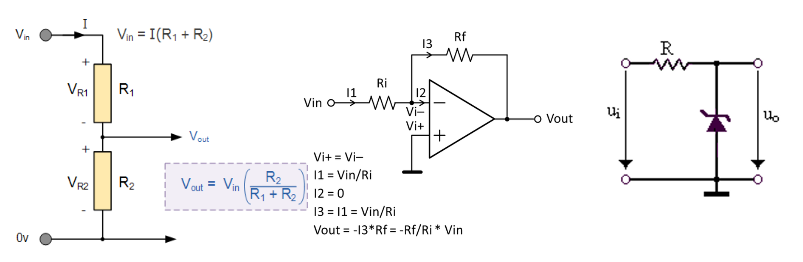

*Figura 4.4: Soluții integrate de senzori: module cu PCB dedicat, circuite de condiționare și interfață*

standardizată
Prin urmare, în etapa de condiționare electrică a semnalului, grija principală revine integrității semnalului la interfața dintre senzor și dispozitivul de achiziție a semnalului, ce presupune utilizarea de cabluri de calitate, ecranare, conectori corespunzători, capacități de filtrare a zgomotului și protecție la inversarea polarității și supratensiuni.
### 4.1.3 Conversia semnalului electric în format digital MCU
Pentru ca semnalele electrice provenite de la senzori să poată fi procesate de microcontroler, acestea fie trebuie convertite din semnal binar sau analogic în format digital, fie trebuie citite de la un senzor digital de pe o interfață specializată, de exemplu I2 C sau
SPI. Fiecare din aceste interfețe are particularitățile sale, iar alegerea corectă depinde de tipul senzorului, cat și de tipul microcontrolerului utilizat.

În această etapă, semnalul electric din lumea fizică, din lumea hardware (HW), reprezentat în majoritatea cazurilor de o tensiune, măsurată în volți (V), este convertit într-un format digital, unde își pierde caracterul fizic și devine o valoare numerică, o stare logică un bit sau un șir de biți, stocate în celulele de memorie ale microcontrolerului. Din acest momențmărimea este transferată în lumea Software (SW), asupra căreia se pot aplica diverse operații aritmetice și/sau logice, în funcție de cerințele aplicației.

În funcție de tipul senzorului, acesta este conectat la una din interfețele microcontrollerului reprezentate de pinii acestuia, fie binară, fie analogică, fie digitală. Fiecare din interfețe are particularitățile sale, iar alegerea corectă depinde de tipul senzorului, cât și de tipul microcontrollerului utilizat.
**Interfața binară digitală**
Senzorii binari oferă un semnal simplu de tip on/off, indicând prezența sau absența unui eveniment (de exemplu, un buton apăsat sau un senzor de proximitate). Aceștia pot fi conectați direct la pinii digitali ai microcontrolerului și pot genera întreruperi pentru reacții rapide la schimbări. din pdvd electric este importanta identificarea nivelelor logice (0, 5v, 3.3v etc.) și a proteja intrarea cu rezistențe de pull-up/pull-down dacă este necesar.
**Interfața binară digitală permite conectarea senzorilor care furnizează semnale digitale**
în două stări distincte, cum ar fi on/off, nivel logic 0 sau 1, nivel HIGH sau LOW.

Acest tip de interfață este cel mai simplu și este utilizat pentru conectarea senzorilor precum butoane, comutatoare, senzori de proximitate, senzori de mișcare etc. Starea logică achiziționată se salvează într-un bit de registru GPIO (General Purpose Input Output) al microcontrolerului, acestea fiind de cele mai dese cazuri grupate pe porturi de câte 8 pini.

Citirea stării unui pin digital se poate face prin accesarea directă a registrului corespunzător portului, sau prin funcții de bibliotecă care abstractizează acest proces. Aceste librarii poarta denumirea de MCAL (Microcontroller Abstraction Layer), HAL (Hardware Abstraction Layer), SPL (Standard Peripheral Library) sau altele Acestea sunt specifice fiecărui microcontroler în parte. În cazul platformei Arduino, libraria Arduino.h, funcția utilizată este digitalRead(pin).

De asemenea, pinii digitali pot fi configurați pentru a genera întreruperi la schimbarea stării, permițând reacții rapide la evenimente externe a stării pinului.
**Interfața analogică**
Semnalele de la senzori analogici sunt în general tensiuni sau curenți variabili continuu, care trebuie convertite în format digital pentru a fi procesate de microcontroler. Această conversie este realizată de convertoare analog-digital (ADC) integrate în microcontroler sau ca componente externe. ADC-urile variază în rezoluție (numărul de biți), viteză de conversie și precizie, iar alegerea lor depinde de cerințele aplicației.
**Interfața analogică este utilizată pentru conectarea senzorilor care furnizează semnale**
continue, cum ar fi tensiuni variabile în funcție de mărimea fizică măsurată. Tensiunea de intrare acceptata de microcontroler este limitată la un interval specific, de exemplu 0-5V sau 0-3.3V, iar semnalul analogic trebuie să fie condiționat electric pentru a se încadra în acest interval.

Acest tip de interfață este util în interacțiunea cu senzori precum termistori, fotorezistenți, senzori de presiune, senzori de umiditate etc. Semnalul analogic este convertit în format digital prin intermediul unui convertor analog-digital (ADC) integrat în microcontroler sau ca componentă externă. ADC-urile variază în rezoluție (numărul de biți), viteză de conversie și precizie, iar alegerea lor depinde de cerințele aplicației.

Citirea valorii unui pin analogic se face prin funcții specifice bibliotecilor utilizate.

În cazul platformei Arduino, funcția utilizată este analogRead(pin), care returnează o valoare numerică proporțională cu tensiunea măsurată, de obicei în intervalul 0-1023 pentru un ADC pe 10 biți. Această valoare poate fi apoi convertită în unități fizice relevante pentru aplicație, utilizând formule de calibrare specifice senzorului.

Conversie prin scalare și offset în unități fizice relevante
Pentru a osigura o corespundere a măsurărilor cu specificațiile tehnice ale senzorului, este recomandat inițial de a converti semnalul din mărimea achiziționată digital (e.g. 01023) în mărimea specificată în datele tehnice ale senzorului (e.g. 0-5V), și ulterior în conformitate cu specificațiile senzorului în mărimea fizică relevantă (e.g. temperatura în °C).

Conversia din mărime brută (RAW - 0-1023) în tensiune (V) în cazul în care este o dependență liniară se face cu formula 4.1.

V = RAW ×
Vref 1023
(4.1)
unde Vref este tensiunea de referință a ADC-ului (de exemplu, 5V sau 3.3V). iar RAW este valoarea citită de la ADC, dependența ADC-Tensiune se poate vedea în figura 4.5.

Tensiune [V] (1023, 3V ) Vref = 3V (512, 1.5V )
V = RAW ×
Vref 1023 ADC (RAW)
1023

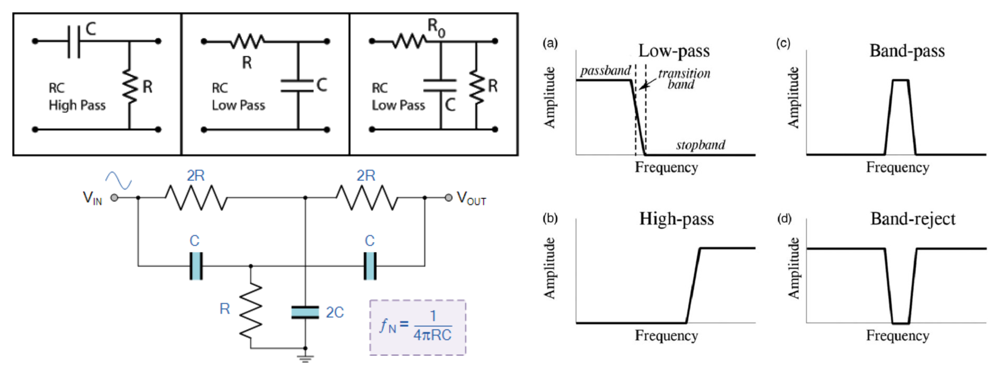

*Figura 4.5: Exemplu grafic: conversia valorii ADC RAW=512 în tensiune V = 1.5V pentru Vref = 3V*

În cazul în care se presupune un offset pe tensiunea de intrare evaluarea se va realiza cu formula 4.2.

Vref − Vof f set (4.2) 1023 unde Vof f set este offsetul de tensiune specificat în datele tehnice ale senzorului, iar 1023 este factorul de scalare (de obicei 1024 pentru ADC pe 10 biți). În figura 4.6 este ilustrată conversia cu offset de tensiune a valorii ADC (RAW) în tensiune [V].

V = RAW ×
Tensiune [V] (1023, Vmax )
Vof f set = 0.5V RES = 1023 Vref = 3V
(512, 2.0V ) V = RAW ×
Vref RES
V = 512 ×
(0, Vof f set )
3.0V
− Vof f set
− 0.5 ≈ 1.0V
1023
ADC (RAW) 1023
> **Figura 4.6:** *Exemplu grafic: conversia valorii ADC RAW=512 cu offset Vof f set = 0.5V în tensiune*

>
> *(Această figură este generată din date și nu poate fi extrasă automat din PDF)*
V = 2.0V pentru Vref = 3V
**Interfața digitală**
Senzorii digitali oferă date direct în format digital, eliminând necesitatea conversiei ADC.

Acestea comunică cu microcontrolerul prin diverse protocoale digitale, cum ar fi I2 C, SPI, UART, 1-Wire etc. Fiecare protocol are avantajele și limitările sale în termeni de viteză, complexitate și număr de pini utilizați.

Senzorii cu interfață digitală sunt, de regulă, dispozitive mai complexe, furnizând date direct în format digital printr-o interfață standardizată cum ar fi I2 C, SPI, UART, 1Wire etc. Acești senzori includ frecvent și circuite de condiționare integrate în modulul senzorului, fie într-un circuit integrat (IC) dedicat, fie implementate pe un PCB care încorporează atât elementul senzitiv cât și funcțiile de condiționare a semnalului.

Pentru interconectarea acestor senzori cu un microcontroler, este necesar ca microcontrolerul să dispună de interfața respectivă la nivel fizic, sau să o implementeze prin emulare software în cazul în care aceasta nu există la nivel hardware. Majoritatea microcontrolerelor moderne integrează suport hardware pentru protocoalele comune de comunicație, facilitând astfel conectarea senzorilor digitali.

Principalele tipuri de interfețe digitale utilizate pentru senzori includ:
- I2 C (Inter-Integrated Circuit): utilizează doar două linii (SDA - date și SCL ceas), permite conectarea multiplă a dispozitivelor pe aceeași magistrală cu adresare individuală, și este ideal pentru senzori care nu necesită transfer rapid de date.
- SPI (Serial Peripheral Interface): oferă comunicație full-duplex prin patru linii (MOSI, MISO, SCK, SS), permite viteze mai mari de transfer comparativ cu I2 C, și necesită o linie separată de selecție pentru fiecare senzor.
- UART (Universal Asynchronous Receiver/Transmitter): folosește două linii (TX - transmitere și RX - recepție) pentru comunicație bidirecțională asincronă, fiind utilizat frecvent pentru comunicații simple între două dispozitive.
- 1-Wire: protocol digital care utilizează o singură linie pentru comunicație bidirecțională, potrivit pentru rețele de senzori unde spațiul și complexitatea de cablare sunt factori limitativi.

Citirea datelor de la senzorii digitali implică inițializarea interfeței de comunicație, transmiterea comenzilor specifice senzorului (citire registri, configurare parametri), și interpretarea datelor primite conform protocolului definit în documentația tehnică a senzorului. Bibliotecile specializate pentru diverse senzori simplifică semnificativ acest proceșoferind funcții de nivel înalt pentru achiziția și procesarea datelor.
### 4.1.4 Condiționarea semnalelor analogice
Odată ce semnalul a fost convertit în formatul digital, acesta uneori necesită în continuare diverse operații de prelucrare pentru a fi utilizat eficient în aplicații. Acest proces poartă denumirea de condiționare software a semnalului și include tehnici de filtrare digitală, saturare, și conversie în unități fizice relevante pentru aplicație.

Condiționarea software a semnalului prezintă avantaje semnificative față de condiționarea analogică, precum flexibilitatea modificării algoritmilor fără a schimba hardware-ul, posibilitatea implementării de algoritmi complexi de filtrare și calibrare, precum și reducerea influenței zgomotului și a interferențelor externe.

Principalele etape de condiționare software a semnalului includ saturarea valorilor, filtrarea digitală, și conversia în unități fizice relevante.

Un exemplu de semnal colectat de la o interfață analogică prin ADC este ilustrat în figura 4.7.

Sensor Value
1,000
1,000
Time [ms]
> **Figura 4.7:** *Semnal brut (RAW) cu zgomot colectat de la o interfață analogică prin ADC*

>
> *(Această figură este generată din date și nu poate fi extrasă automat din PDF)*
**Saturarea (limitarea) valorilor**
Saturarea sau limitarea valorilor reprezintă o operație prin care semnalul este menținut între anumite limite minime și maxime definite. Această operație are rolul de a:
- Protejarea împotriva valorilor aberante (outliers) cauzate de defecțiuni ale senzorului.
- Asigurarea că valorile utilizate în calculele ulterioare nu vor cauza erori aritmetice.
- Menținerea valorilor în intervalul valid definit de specificațiile senzorului sau aplicației.

După aplicarea saturației pe semnalul colectat, prezentat în figura 4.7, pe limitele de 100 și 900, vom obține semnalul din figura 4.8.

Sensor Value
1,000
1,000
Time [ms]
> **Figura 4.8:** *Semnal cu zgomot după aplicarea saturării între limitele 100 și 900*

>
> *(Această figură este generată din date și nu poate fi extrasă automat din PDF)*
**Filtrarea mediană pentru eliminarea zgomotului impulsionar**
Filtrarea digitală este utilizată pentru eliminarea zgomotului și a interferențelor din semnal, Tehnicile de filtrare variază în complexitate și eficiență, fiecare fiind potrivită pentru anumite tipuri de zgomot sau interferențe.

Zgomotul impulsionar (sau "salt and pepper") constă în valori izolate anormale care deviază semnificativ de la valorile vecine. Acest tip de zgomot poate apărea din cauza interferențelor electromagnetice, defecțiunilor tranzitorii ale senzorului sau erorilor de comunicație.

Filtrul median este deosebit de eficient în eliminarea zgomotului impulsionar, înlocuind fiecare valoare cu mediana unui set de valori adiacente în timp (fereastra de filtrare). Acest lucru permite păstrarea tranzițiilor abrupte legitime din semnal, eliminând în același timp vârfurile izolate.

Realizarea unui filtru median poate fi implementată prin stocarea unui număr fix de eșantioane consecutive într-un buffer circular, sortarea acestora și selectarea valorii mediane. Funcționarea filtrului median este ilustrată în figura 4.9, unde se observă cum valorile aberante sunt eliminate, păstrând în același timp forma generală a semnalului.
> **Figura 4.9:** *Diagrama conceptuală a filtrului median: eliminarea zgomotului impulsionar*

>
> *(Această figură este generată din date și nu poate fi extrasă automat din PDF)*
Aplicând acest filtru pe semnalul din figura 4.8, vom obține semnalul din figura 4.10.

Sensor Value
1,000
Time [ms]
> **Figura 4.10:** *Semnal după aplicarea filtrului median pentru eliminarea zgomotului impulsionar*

>
> *(Această figură este generată din date și nu poate fi extrasă automat din PDF)*
Filtrarea digitală - Filtrarea prin mediere pentru eliminarea zgomotului uniform
Zgomotul uniform (sau "white noise") este caracterizat prin variații aleatorii de mică amplitudine în jurul valorii reale a semnalului. Acest tip de zgomot este frecvent în majoritatea senzorilor analogici și poate fi eficient redus prin tehnici de mediere.

Filtrarea prin mediere simplă implică calcularea valorii medii a unui număr de eșantioane consecutive, reducând astfel variațiile aleatoare. Formula de calcul a mediei pentru o fereastră de N eșantioane este prezentata in ecuatia 4.3.

PN i=1 xi
Vavg =
N
(4.3)
O metodă mai eficientă de filtrare a zgomotului uniform este aplicarea mediei ponderate, unde valorile recente primesc o pondere mai mare decât cele vechi, ceea ce permite un răspuns mai rapid la schimbările semnalului. În acest caz formula de calcul a mediei ponderate este prezentată în ecuația 4.4.

PN
Vwavg = i=1 wi · xi
PN i=1 wi
(4.4)
Funcționarea conceptuală a filtrului de mediere este ilustrată în figura 4.11, unde se observă cum zgomotul de mică amplitudine este redușiar forma generală a semnalului este păstrată.

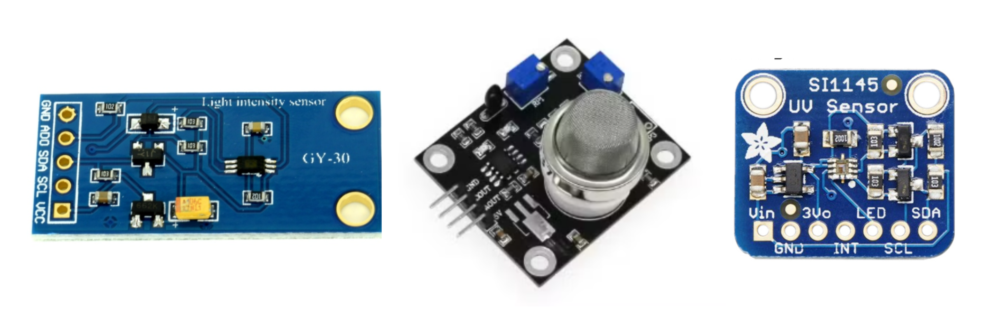

*Figura 4.11: Filtrarea prin mediere: reducerea zgomotului uniform păstrând forma generală a semnalului*

Aplicând acest filtru pe semnalul din figura 4.10, aplicând ponderile [50,25,15,10], vom obține semnalul din figura 4.12.

Sensor Value
1,000
Time [ms]
> **Figura 4.12:** *Semnal după aplicarea filtrului de mediere ponderată pentru eliminarea zgomotului uniform*

>
> *(Această figură este generată din date și nu poate fi extrasă automat din PDF)*
Filtrarea exponențială (Filtrarea trece-jos de ordinul întâi)
O alternativă eficientă la filtrarea prin mediere este filtrarea exponențială, care acordă mai multă importanță valorilor recente și implementează un filtru trece-jos digital. Este o alternativă la media aritmetica ponderată. Acest tip de filtru este deosebit de util pentru aplicații în timp real și necesită stocare minimă, fiind specificat prin factorul alpha α care determină rata de actualizare a valorii filtrate.

Formula de calcul a filtrului exponențial este prezentată în ecuația 4.5.

Vf iltered (n) = α · Vnew (n) + (1 − α) · Vf iltered (n − 1)
(4.5)
unde:
- Vf iltered (n) este valoarea filtrată curentă
- Vnew (n) este noua valoare de intrare
- Vf iltered (n − 1) este valoarea filtrată anterioară
- α este factorul de filtrare (0 < α < 1)
- n este indicele eșantionului curent
Implementarea în cod C pentru microcontrolere a filtrului exponențial este prezentată în listingul 4.1.

**Listing 4.1: Implementarea unui filtru exponențial (trece-jos)**
```c
// Filtrare exponențială (alpha între 0 și 1)
// alpha = 0: ignoră noile valori, alpha = 1: ignoră istoricul
float applyExponentialFilter(float newValue, float previousValue, float alpha) {
  return alpha * newValue + (1 - alpha) * previousValue;
}
```
Efectul factorului alpha asupra răspunsului filtrului este ilustrat în figura 4.13. Un
alpha mic(aproape de 0) produce filtrare puternică dar răspuns lent la schimbări, iar un
alpha mare(aproape de 1) oferă răspuns rapid dar filtrare redusă. Aplicând acest filtru
pe semnalul din figura 4.10, obținem semnalele din figura 4.13 cu alpha=0.1 (albastru) și
alpha=0.3 (rosu), pentru comparație.

Sensor Value
1,000
Time [ms]

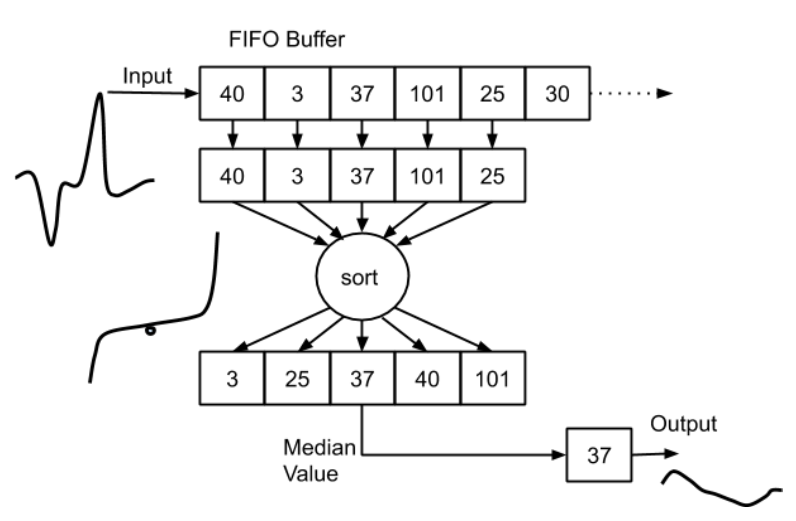

*Figura 4.13: Semnal după aplicarea filtrului exponențial pentru eliminarea zgomotului uniform*

### 4.1.5 Condiționarea semnalelor digitale
Senzorii digitali, spre deosebire de cei analogici, oferă avantaje semnificative: imunitate mai bună la zgomot, precizie sporită și transmiterea multiplelor parametri simultan prin interfețe standardizate (I2C, SPI, UART, 1-Wire).

Acești senzori includ intern circuite de condiționare care realizează: filtrarea și amplificarea primară a semnalului, compensarea factorilor de influență (ex. temperatura), linearizarea răspunsului și calibrarea din fabrică, precum și detecția erorilor de măsurare.

Cu toate acestea, condiționarea software a semnalelor digitale poate fi necesară pentru: validarea integrității datelor (verificare checksum/CRC), eliminarea valorilor aberante (outliers), corectarea erorilor sistematice și sincronizarea măsurătorilor de la mai mulți senzori.

Pentru semnalele digitale cu probleme de calitate se pot aplica aceleași tehnici ca la semnalele analogice: saturare, filtrare mediană sau exponențială. În aplicații mai complexe, se pot implementa algoritmi avansați precum filtre Kalman sau metode de machine learning, în funcție de cerințele de acuratețe și resursele de procesare disponibile.
### 4.1.6 Condiționarea semnalelor binare
Semnalele binare pot suferi de diverse probleme, cum ar fi zgomotul de fond, fluctuațiile rapide ale tensiunii sau interferențele electromagnetice. Aceste probleme pot afecta integritatea semnalului și pot duce la erori de citire sau interpretare. Semnalele binare pot fi citite de microcontroler prin intermediul porturilor digitale, care pot detecta doar două stări: HIGH (1) și LOW (0) unde se consideră că semnalul este stabil și se mizează pe circuitele de conversie a semnalului binar electric în semnal digital. Însa, în practică, deseori se recurge la citirea semnalelor binare prin intermediul convertorului analog-digital (ADC), care poate oferi o măsurare mai precisă a tensiunii semnalului și poate ajuta la identificarea și filtrarea zgomotului pentru a asigura integritatea măsurărilor și o flexibilitate în stabilirea nivelelor logice pentru semnalele binare. De exemplu, se poate stabili un prag de tensiune pentru a determina dacă semnalul este HIGH sau LOW, cum ar fi 0-1.5V pentru LOW și 3.5-5V pentru HIGH, cu o zonă de incertitudine între 1.5V și 3.5V, diferită de cea TTL (0-0.8V pentru LOW și 2-5V pentru HIGH).

Grafic această metodă este ilustrată în figura 4.14.

Voltaj [V]
HIGH threshold = 3.5V
LOW threshold = 1.5V
Binar
Timp [ms]
> **Figura 4.14:** *Sus: Semnal voltaj binar cu zgomot și praguri de decizie; Jos: Semnal binar filtrat (0/1)*

>
> *(Această figură este generată din date și nu poate fi extrasă automat din PDF)*
corespunzător regulii de threshold cu hysteresis.

Saturarea semnalelor binare
Saturarea semnalelor binare apare atunci când un semnal depășeste limitele acceptabile de tensiune, ceea ce poate duce la interpretarea greșită a stării semnalului. Pentru a preveni acest lucru, se pot implementa tehnici de saturare software care limitează valorile semnalului la un interval definit. De exemplu, dacă un semnal binar ar trebui să fie între 0V și 5V, orice valoare sub 0V poate fi setată la 0V, iar orice valoare peste 5V poate fi setată la 5V. Aceasta asigură că semnalul rămâne în limitele specificate și reduce riscul de interpretare greșită.

Filtrarea semnalelor binare - Debouncing software
În cazul semnalelor binare, cum ar fi cele provenite de la butoane sau comutatoare mecanice, zgomotul poate cauza multiple comutări nedorite (bounce) atunci când contactele se închid sau se deschid. Acest fenomen, cunoscut ca "bouncing", poate dura între 5-20ms și poate fi interpretat eronat ca multiple apăsări de către microcontroler. Pentru a elimina aceste efecte, se implementează tehnici de debouncing software.

O metodă eficientă de debounce este bazată pe numărarea eșantioanelor consecutive cu aceeași valoare. Această abordare utilizează un contor care creste sau scade în funcție de starea curentă a semnalului de intrare. Principiul de funcționare este următorul:
- Contorul incrementează când semnalul de intrare este HIGH (1) și decrementează când este LOW (0), dar rămâne întotdeauna în limitele unui interval predefinit [0,
MAX_COUNTER_VALUE].
- Când contorul atinge valoarea maximă, se consideră că semnalul este stabil în starea
HIGH (1).
- Când contorul ajunge la zero, se consideră că semnalul este stabil în starea LOW (0).
- Pentru valorile intermediare ale contorului, se menține ultima stare stabilă cunoscută.

Acest algoritm este eficient pentru filtrarea atât a zgomotului electric de scurtă durată cât și a contactelor mecanice instabile, fiind adaptabil la diferite niveluri de sensibilitate prin ajustarea valorii maxime a contorului dar și a ratei de incrementare/decrementare.

Grafic această metodă este ilustrată în figura 4.15.
### 4.1.7 Conversia semnalelor condiționate în mărimi fizice
După ce semnalul senzorului a fost condiționat (filtrat, calibrat etc.), următorul pas este convertirea valorilor măsurate (de exemplu, valorile RAW de la ADC) în mărimi fizice
ABC up/down
Output
Input
MAX=8
MIN=0
TIME [ms]

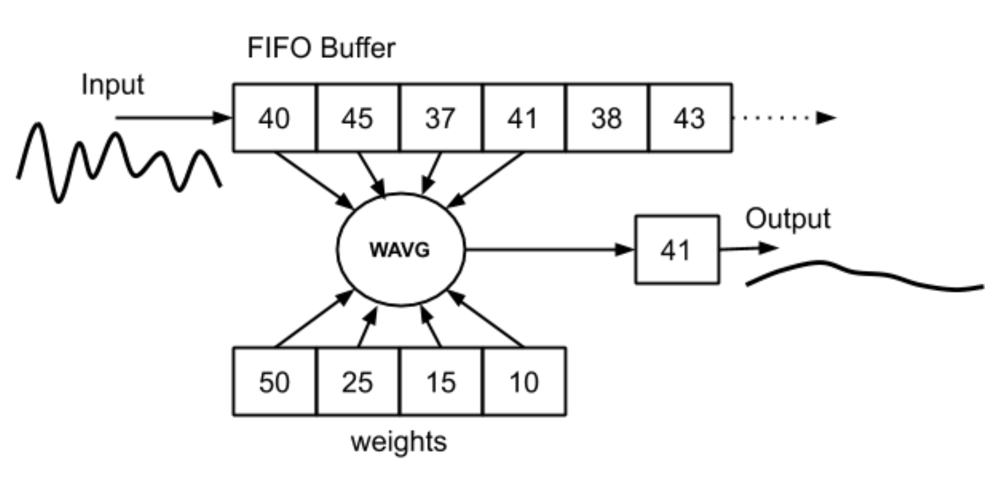

*Figura 4.15: Debouncing cu contor: INPUT (sus), contor ABC (mijloc), OUTPUT (jos) — aliniate, cu*

axa timp pornind de la 0 ms.
relevante (tensiune, temperatură, presiune etc.). Această conversie se realizează de obicei prin aplicarea unor formule matematice derivate din datele tehnice ale senzorului dar și prin metode de interpolare sau ajustare a curbelor de răspuns. In cazul dependentelor lineare se va dete evalua utilizand doua puncte experimentale cu o conversie linear, iar in cazul dependentei nelineare exprimate printr-o tabela experimentala - prin interpolare liniara sau spline.

Conversia liniară prin două puncte
Iar în cazul în care dependența este redată de două puncte, se poate aplica conversia liniară prin ecuația canonică a dreptei ce trece prin două puncte. (RAW1, V1 ) și (RAW2, V2 ) după formula 4.6:

V − V1 RAW − RAW1 = V2 − V1 RAW2 − RAW1
(4.6)
din care se poate deduce formula:

V = V1 +
(V2 − V1 ) × (RAW − RAW1 ) RAW2 − RAW1
(4.7)
unde (RAW1, V1 ) și (RAW2, V2 ) sunt cele două puncte cunoscute din datele tehnice ale senzorului. În figura 4.16 este ilustrată conversia liniară prin două puncte a valorii ADC (RAW) în tensiune [V].

Tensiune [V]
(RAW1, V1 ) = (204.6, 1V ) (RAW2, V2 ) = (819.2, 3V )
(RAW2, V2 )
(RAW = 512, V = 2V )
V = V1 + (RAW1, V1 )
(V2 − V1 ) × (RAW − RAW1 ) (RAW2 − RAW1 ) (3 − 1) × (512 − 204.6)
V = 1+
≈ 2V
819.2 − 204.6 ADC (RAW)
1023
> **Figura 4.16:** *Exemplu grafic: conversia din valoare bruta (RAW) in tensiune (V)*

>
> *(Această figură este generată din date și nu poate fi extrasă automat din PDF)*
in aceste exemplu se vede cum o valoare ADC RAW=512 prin ecuația canonică a dreptei ce trece prin punctele (RAW1, V1 ), (RAW2, V2 ) este evaluata ca și V = 2V Conversia neliniară LUT- Lookup Table
Conversia neliniară a semnalului de la senzor poate fi realizată prin utilizarea unei tabele de căutare (LUT - Lookup Table). Această metodă este utilă în special pentru senzori care au un comportament neliniar complex, care nu poate fi descris ușor prin formule matematice simple. de exemplu pentru un sensor de temperatura cu caracteristici neliniare, cum ar fi LM20 tabela de conversie se poate gasi in specificatiile tehnice a acesteia [16]. si va arata dupa cum urmeaza:

Temperatură (T) 130◦ C 100◦ C 80◦ C 30◦ C 25◦ C 0◦ C -30◦ C -40◦ C -55◦ C
Typical VO 303 mV 675 mV 919 mV 1515 mV 1574 mV 1863.9 mV 2205 mV 2318 mV 2485 mV
Table 4.1: Caracteristica senzorului: dependența VO de temperatură
Grafic acest tabel este ilustrat in figura 4.17.
> **Figura 4.17:** *Caracteristica neliniară a senzorului LM20: dependența temperaturii de tensiune [16]*

>
> *(Această figură este generată din date și nu poate fi extrasă automat din PDF)*
Pentru a realiza conversia unei valori măsurate de tensiune Vmeas în temperatură Tmeas, se parcurg următorii pași:
- Se caută în tabel două puncte consecutive (Ti, Vi ) și (Ti+1, Vi+1 ) astfel încât Vi ≤
Vmeas ≤ Vi+1
- Se aplică interpolarea liniară între aceste două puncte pentru a determina Tmeas
Pentru exemplul de valoare masurata de 2.0 V vom avea punctele : (T1, V1 ) = (30◦ C, 1.515 V) și (T2, V2 ) = (−30◦ C, 2.205 V).

Aplicăm interpolarea liniarăpe aceste doua puncte vom obtine calculul:

Tmeas = T1 +
(T2 − T1 ) × (Vmeas − V1 ) (−30 − 30) × (2.0 − 1.515) = 30 + = −12.17◦ C (V2 − V1 ) (2.205 − 1.515)
Astfel, pentru Vmeas = 2.0 V, temperatura estimată este Tmeas ≈ −12.17◦ C.

Aceste etape de condiționare software a semnalului, combinate cu condiționarea electrică anterioară și interfețele de achiziție adecvate, asigură că datele obținute de la senzori sunt precise, stabile și reprezentative pentru parametrii fizici măsurați, permițând luarea deciziilor corecte în cadrul aplicației embedded.
## 4.2 Sarcina de laborator
### 4.2.1 Partea 1: Achizitie semnal Binar
Pentru un senzor analogic sau digital de temperatura, sa se realizeze o aplicație pentru MCU care va achiziționa periodic semnalul de la senzor selectat din o lista de senzori, va afisa o alerta alerta de un prag prestabilit afisand starile intermediare de conditonare și starea curentă in interfata STDIO fie pe un display LCD, fie interfata seriala. Aplicația va realiza urmatoarele functionalitati
- Achiziție (Sensor Acquisition): citeste raw data de la senzor (ADC pentru senzori analogici sau interfață I2 C / SPI / UART pentru senzori digitali), la o recurență configurabilă (ex.: 20-100 ms). Expune valoarea brută printr-o interfață internă (de ex. sensor_read()).
- Conditionare semnal binar (Threshold Alerting): implementează detecția depășirii pragurilor configurabile prin aplicarea unei histereze între două valori prestabilite (ex: 25°C ± 1°C), prevenind oscilațiile alertelor la valori aflate în proximitatea pragului. Aplică un filtru de tip treshold și antibouncing pentru validarea persistenței stării, asigurând că alerta se declanșează doar după confirmarea stabilă a depășirii pragului pentru un interval minim configurat.
- Afișare și raportare (Display & Reporting): la o recurență mai mică (ex.: 500 ms) afișează pe LCD prin STDIO (printf) un raport structurat cu valorile procesate intermediare, starea sistemului și eventuale alerte (praguri depășite).

### 4.2.2 Partea 2 - Achizitie Semnal Analogic
Pentru un senzor analogic sau digital de temperatura, sa se realizeze o aplicație pentru MCU care va achiziționa periodic semnalul de la senzor selectat din o lista de senzori, va filtra semnalul și va afisa valorile intermediare și cea curenta prin STDIO fie catre un afisor LCD, fie catre o interfata seriala. Aplicația va realiza urmatoarele functionalitati
- Achiziție (Sensor Acquisition): citeste raw data de la senzor (ADC pentru senzori analogici sau interfață I2 C / SPI / UART pentru senzori digitali), la o recurență configurabilă (ex.: 20-100 ms). Expune valoarea brută printr-o interfață internă (de ex. sensor_read()).
- Condiționare semnal (Signal Conditioning): primește valorile raw, aplică operații de preprocesare: saturare, filtrare „sare și piper” (median filter), mediere ponderată.

Rularea acestui task poate rula la aceeași recurență sau la o recurență derivată.
- Afișare și raportare (Display & Reporting): la o recurență mai mică (ex.: 500 ms) afișează pe LCD prin STDIO (printf) un raport structurat cu valorile procesate, starea sistemului și eventuale alerte (praguri depășite).

**Cerințe suplimentare:** Pentru lucrările de laborator cu senzori, respectați următoarele recomandări pentru structură, modularitate și validare:
- Structurați aplicația modular, separând logica de achiziție, condiționare și alertare în module software dedicate.
- Utilizați diagrame de flux și/sau diagrame de stare pentru a descrie procesarea semnalului și scenariile de alertă.
- Implementați debouncing software pentru semnalele binare (butoane, senzori digitali).
- Dacă folosiți FreeRTOS, creați taskuri dedicate pentru fiecare funcționalitate majoră (achiziție, condiționare, alertă, afișare).
- Pentru comunicarea între taskuri, utilizați semafoare binare sau mutex pentru protecția variabilelor globale.
- Afișați valorile intermediare, starea sistemului și alertele catre STDIO prin LCD sau interfață serială.
- Reutilizați modulele pentru senzori, LED-uri și interfață de afișare, evitând duplicarea codului.
- Testați fiecare scenariu de alertă și filtrare conform criteriilor de validare definite.
- Documentați clar arhitectura, diagramele de flux/stare, interfețele HW/SW și scenariile de testare.
- Consultați resursele teoretice despre achiziție, condiționare și proiectare modulară.
- Sistemul trebuie să răspundă la schimbarea semnalului cu o latență sub 100ms.
- utilizati instrumente de analiză și vizualizare a datelor (ex.: Arduino Serial Plotter) pentru a monitoriza performanța sistemului în timp real.

**Materiale și resurse necesare pentru realizarea lucrării:**
- Componente hardware: microcontroler compatibil cu FreeRTOS (ex.: Arduino Mega,
ESP32), LED-uri (verde, roșu sau galben) cu rezistență de limitare, senzor la alegere (din kitul 37-in-1 sau oferit de mentor), display LCD pentru afișarea datelor, placă de prototipare (breadboard), cabluri de conexiune (jumper wires), sursă de alimentare (USB sau baterie).
- Resurse software: mediu de dezvoltare (PlatformIO, Arduino IDE sau STM32CubeIDE), simulator hardware (opțional, ex.: Wokwi, Proteus), emulator terminal serial (ex.: Monitor Serial din PlatformIO, TeraTerm sau Putty), instrument pentru realizarea diagramelor (ex.: draw.io, Lucidchart).

**Realizarea sarcinii poate fi executată în mai multe variante, fiecare dintre ele cu un punctaj diferit după cum urmează:**
- Varianta A (80% din punctajul maxim): Implementare toata functionalitatea intr-un singur task secvențial (achiziție, condiționare, alertă, afișare).
- Varianta B (90% din punctajul maxim): Implementare toate functionalitatile in task-uri separate, fiecare task avand propria recurență, cu asigurarea interfetelor protejate intre task-uri.
- Varianta C (100% din punctajul maxim): Implementarea sistem de monitorizare a doi senzori, unul analogic și unul digital cu afisarea valorilor și alertelor de la ambii senzori pe display LCD.

**NOTĂ:** Realizarea sarcinii se va desfășura în două etape distincte, definite ca două probleme în cadrul lucrării de laborator. Aceste probleme vor fi realizate conform metodologiei prezentate în anexa de problemă rezolvată. Fiecare etapă va fi documentată conform cerințelor metodologice, incluzând cerințe, schițe arhitecturale, diagrame de flux, scenarii de testare și rezultatele obținute. Fiecare parte a lucrării (problema) este planificată pentru o ședință de 2 ore academice.

### Mersul lucrării
1. Sa se analizeze și sa se inteleaga Sarcina lucrarii de laboratorși anume Analiza situației în domeniu și Contextul tehnologic al aplicației dezvoltate conform sectiunii
1.1.
2. sa se falmiliarizeze cu problema propusa spre elaborareși sa se identifice obiectivele și sarcina individuala vezi A.1.1.
3. Sa se analizeze componentgele și resursele untilizate in realizarea aplicatiei din cadrul lucrarii de laborator.
4. In urma analizei sarcinii lucrarii și definitiei problemei propuse, sa se defineasca un set de cerinte tehnice acoperind aspectele funcitionale și nefunctionale ale problemei, vezi A.1.2
5. In urma analizei cerintelor tehnice elaborate sa se defineasca scenarii de testare și criteriilor de validare cu minim 1 test per cerinta care sa raspunda la intrebarea cum ma asigur ca cerinta se satidface, vezi A.1.3
6. sa se identifice componentele ce compun sistemul aplicatiei, sa se organizeze intr-o lista cu descrierea rolului acerstora in aplicatie.
7. Sa se realizeze diagrama structurala cu reprezentarea componentelor și interactiunii intre acestea asa cum este prezentat in sectiunea A.1.4
8. Sa se realizeze arhitectura pe nivele pentru interfata hardware-software pentru fiecare dintre interfete vezi A.1.4.
9. Sa se realizeze diagramele de comportament pentru functionalitatile Componentelor cu diagrame de de flux stari sau de secvență, dupa caz, ca in A.1.5
10. sa se elaboreze schita electrica a aplicatiei intr-un mediu de simulare, vezi A.1.6.
11. sa se creeze structura de directoare și fisiere pentru implementarea aplicatiei care va reflecta arhitectura definita de sistemși de interfata hardware Software vezi A.1.7.
12. Sa se implementeze driverele de interfata hardware-software pentru fiecare componenta electronica utilizata in aplicatie acoperind nivelele ECAL și SRV dupa cazA.1.7.
13. Sa se implementeze comportamentul aplicatiei urmand diagrama de flux definita,
A.1.7.
14. Sa se simuleze functionare aplicatia in medii precum Wokwi sau PlatformIO. cu o eventuala rulare pe hardware real.
15. Sa se testeze și valideze aplicatia conform scenariilor de testare și criteriilor de validare definite anterior, vezi exemplu in A.1.8.
16. sa se documenteze rezultatele testarii cu observatii și recomandari pentru imbunatatiri,
A.1.8.
17. Sa se optimizeze aplicatia pe baza rezultatelor testarii și validarii
18. sa se documenteze toate etapele realizate in cadrul lucrarii de laborator conform cerintelor pentru raportul lucrarii de laborator expuse in 1.1.5.

Acest proces este urmat în cadrul tuturor lucrărilor de laborator din cadrul cursului, asigurându-se astfel o înțelegere profundă a modului în care funcționează sistemele electronice incorporate, multitasking și a importanței unei abordări metodice în proiectarea acestora.
### Întrebări de control
1. Ce reprezintă condiționarea semnalului și care sunt principalele etape ale acestui proces în sistemele electronice încorporate?
2. Explicați diferența dintre condiționarea electrică și condiționarea software a semnalului. Care sunt avantajele fiecăreia?
3. Care este rolul filtrului median în procesarea semnalelor de la senzori și pentru ce tip de zgomot este el cel mai eficient?
4. Descrieți principiul de funcționare al filtrului de mediere ponderată și explicați cum influențează valorile ponderilor comportamentul filtrului în raport cu valorile recente versus cele mai vechi.
5. Ce este histerezisul în contextul detecției pragurilor de alertă și cum previne acesta oscilațiile nedorite ale stării alertei?
6. Explicați diferența dintre debouncing-ul bazat pe temporizare și debouncing-ul bazat pe contor. Care sunt avantajele metodei cu contor?
7. Cum se realizează conversia unui semnal analogic din valori ADC în unități fizice (ex: grade Celsius)? Descrieți procesul pentru un senzor cu răspuns neliniar (ex:
NTC).
8. Care sunt avantajele utilizării unui tabel de căutare (LUT - Look-Up Table) pentru conversia semnalelor de la senzori cu caracteristici neliniare?
9. Explicați importanța saturării semnalului în procesul de condiționare. Ce probleme pot apărea dacă saturarea nu este implementată corect?
10. Cum se asigură sincronizarea între task-urile de achiziție, condiționare și afișare întro aplicație multitasking cu FreeRTOS? Ce mecanisme de protecție se folosesc pentru variabilele partajate?

## 4.5 Grila de evaluare a lucrării de laborator
1. Analiza sarcinii și contextului tehnologic (12p)
  a. Analiza situației în domeniu și contextul tehnologic (1.1) (4p)
  b. Identificarea resurselor externe și referințe în bibliografie (4p)
  c. Analiza componentelor și resurselor utilizate (4p)
2. Definirea cerințelor tehnice și scenariilor de testare (13p)
  a. Identificarea obiectivelor și sarcinii individuale (A.1.1) (3p)
  b. Formularea cerințelor funcționale și non-funcționale (A.1.2) (5p)
  c. Definirea scenariilor de testare și criteriilor de validare (A.1.3) (5p)
3. Proiectarea arhitecturală și modelare comportamentală (18p)
  a. Listarea componentelor și descrierea rolului fiecăreia (3p)
  b. Diagrama structurală cu componente și interacțiuni (A.1.4) (4p)
  c. Arhitectura pe nivele pentru interfața hardware-software (4p)
  d. Diagrame comportament pentru funcționalități (flux, stări, secvență) (A.1.5) (7p)
4. Proiectarea și simularea schiței electrice (13p)
  a. Elaborarea schiței electrice în mediu de simulare (A.1.6) (4p)
  b. Reprezentarea corectă a conexiunilor și dimensionarea componentelor (2p)
  c. Simularea funcționării aplicației în medii precum Wokwi/PlatformIO (3p)
  d. Rularea aplicației pe HW real (10p)
5. Implementarea software modulară (18p)
  a. Structura de directoare și fișiere conform arhitecturii (A.1.7) (4p)
  b. Implementarea de interfață HW-SW conform proiectării în detaliu (6p)
  c. Implementarea comportamentului aplicației conform proiectării în detaliu (6p)
  d. Comentarii explicative și documentare în cod (2p)
6. Simulare, testare și validare (16p)
  a. Testarea și validarea conform scenariilor definite (A.1.8) (8p)
  b. Documentarea rezultatelor testării, observații și recomandări (5p)
  c. Optimizarea aplicației pe baza rezultatelor testării și validării (3p)
7. Documentare finală (10p)
  a. Documentarea etapelor realizate conform cerințelor raportului (1.1.5) (5p)
  b. Observații, recomandări, concluzii generale (5p)
Total: 100p
---
# Lucrarea de laborator nr. 5: Actuatori - Acționare și conversie putere
**Scopul lucrării**
Familiarizarea cu metodele de acționare asupra mediului de putere prin intermediul actuatoarelor (relee, drivere de motoare, alte elemente de comandă), precum și cu tehnicile de conversie și control al puterii în aplicații embedded. Lucrarea urmărește implementarea unui sistem modular care permite controlul actuatoarelor, dar și condiționarea semnalului de comandă prin metode tip pornire lină sau debouncing temporal ca metode de protecție, punând accent pe siguranța în exploatare și adaptarea parametrilor de comandă la cerințele aplicației.
**Obiectivele lucrării**
- Studierea principiilor de acționare a dispozitivelor de putere prin intermediul actuatoarelor (relee, drivere de motoare), cu accent pe particularitățile fiecărui tip de interfață de comandă.
- Implementarea metodelor de conditionare a semnalului de comandă, incluzând metode de saturare și filtrare (debouncing temporal pentru actuatoare binare și pornire/oprire lină pentru actuatoarele analogice binare) în scop de protecție la suprasarcină.
- Integrarea funcționalităților de comandă și monitorizare în structuri modulare, cu separarea clară a componentelor software (drivere pentru releu, L298, motor, LCD/STDIO) pentru facilitarea testării și reutilizării.
- Documentarea arhitecturii software, prezentarea schemelor bloc și a schemelor electrice ca parte a metodologiei de proiectare, cu accent pe siguranța și fiabilitatea în exploatare.

## 5.1 Analiza domeniului de aplicare al actuatorilor și conversiei de putere
Sistemele electronice încorporate utilizează actuatoare pentru a interacționa cu mediul înconjurător, transformând semnale electrice de comandă în acțiuni fizice (pornire/oprie, mișcare, iluminare, ventilare etc.). Pentru ca aceste acțiuni să fie realizate eficient și sigur de către microcontroler, este necesară o etapă complexă de control și condiționare a semnalului de comandă, care implică generarea, filtrarea, adaptarea și protecția semnalului în funcție de cerințele specifice ale aplicației și de caracteristicile actuatoarelor. Acest capitol prezintă principiile fundamentale ale acționării și conversiei de putere, metodele de procesare digitală a semnalului de comandă și modul în care acestea influențează siguranța, fiabilitatea și performanța sistemelor embedded moderne.

Fluxul de acționare și conversie de putere reprezintă un lanț complex de transformări prin care trece semnalul de comandă, de la forma sa inițială generată de aplicația embedded, până la acțiunea fizică asupra mediului extern. Acest proces implică multiple etape de prelucrare, atât în domeniul digital (generare, filtrare, temporizare, debouncing), cât și în cel electric (adaptare niveluri, protecție, amplificare), fiecare cu rolul său specific în asigurarea funcționării corecte și sigure a actuatoarelor.

Considerând funcția de acționare ca și funcție complementară funcției de achiziție și semnalului, vom considera că și fluxul de condiționare și conversie a semnalului de, comandă pentru actuatori este similar cu cel al fluxului de achiziție și condiționare a semnalului de la senzori, dar în sens invers [3], [4], .

În așa mod un flux tipic de acționare pentru un actuator controlat de un microcontroler include:
- Expunerea interfețelor software pentru controlul actuatorului (funcții de inițializare, pornire, oprire, setare parametri) 5.1.6.
- Conversie parametru fizic în semnal de putere/voltaj aplicat la actuator 5.1.5.
- Condiționarea software a semnalului de comandă (filtrare, saturare, temporizare, debouncing) 5.1.5.
- Conversie semnal de putere/voltaj în semnal digital de comandă (DAC, PWM,
ON/OFF) 5.1.4.
- Condiționarea electrică a semnalului (amplificare, izolare, protecție la suprasarcină)
5.1.2.
- Conversia energiei electrice în acțiune fizică prin intermediul convertoarelor de energie (ex: încălzire, rotație, iluminare) 5.1.1.

Reprezentarea grafică a acestui flux, cu componentele sale principale și transformările specifice, este ilustrată în figura 5.1.

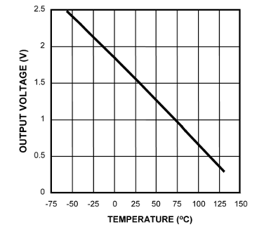

*Figura 5.1: Fluxul de generare, condiționare și conversie a semnalului de comandă pentru actuatori,*

evidențiind etapele de procesare de la semnal digital la acțiune fizică [3]
În secțiunile ce urmează vom analiza pe rând fiecare etapă a fluxului de acționare și conversie a semnalului de comandă pentru actuatori.
### 5.1.1 Conversia energiei în acțiune fizică
Acțiunea fizică a actuatoarelor este realizată ca regulă prin intermediul convertoarelor de energie dintr-o formă în alta. Așa cum în sistemele contemporane se utilizează pe larg energia electrică în majoritatea aplicațiilor, conversia energiei este de regulă o conversie din energia electrică în altă formă de energie.

De exemplu energie electrică în energie termică cu o rezistență electrică, care ulterior încălzeste un element conductor (aer, lichid, solid) de căldură către mediu pentru realizarea unui sistem de încălzire de exemplu al încăperii. În figura 5.2 este ilustrat un exemplu de încălzitor alimentat de la o sursă de energie.

![Figura 5.2: Tipuri de încălzitoare electrice [9]](figures/figura_5_2.png)

*Figura 5.2: Tipuri de încălzitoare electrice [9]*

Pentru iluminare se vor folosi convertoare de energie electrică în flux luminoșcele mai populare dispozitive fiind cu un LED, lampa halogen sau bec electric incandescent prezentate în figura 5.3.

![Figura 5.3: Tipuri de dispozitive de iluminare [29]](figures/figura_5_3.png)

*Figura 5.3: Tipuri de dispozitive de iluminare [29]*

Pentru mișcare se vor folosi convertoare de energie electrică în energie mecanică, aceste convertoare purtând denumirea de motor electric. Un motor electric se poate folosi de exemplu la punerea în mișcare a unui vehicul electric, a unui ventilator pentru răcirea unui sistem electronic sau a unei pompe Există diverse tipuri de motoare electrice cel mai simplu ca și construcție fiind motorul de curent continuu (DC) prezentat în figura 5.4.

![Figura 5.4: Motor de curent continuu (DC) [8]](figures/figura_5_4.png)

*Figura 5.4: Motor de curent continuu (DC) [8]*

Tipul convertorului utilizat depinde de cerințele specifice ale aplicației, inclusiv de tipul de acțiune dorită (încălzire, iluminare, mișcare), de puterea necesară, de eficiența energetică și de condițiile de operare.

Chiar dacă cele mai multe conversii de energie se realizează din energie electrică în alte forme de energie, asta nu exclude că sunt practicate pe larg și alte tipuri de conversii de energie cum ar fi conversia energiei pneumatice sau hidraulice în energie mecanică care ulterior se converteste în energie electrică cu un generator electric care ulterior este convertită în altă formă de energie sau energie electrică se converteste în energie chimică cu o electroliză pentru a fi stocată într-o baterie sau alt tip de acumulator. Aceste cazuri de conversii se folosesc în colectarea energiei regenerabile. Însă acest context este în afara scopului acestei lucrări de laborator.
### 5.1.2 Conversia și condiționarea electrică a pentru actuator binar (ON/OFF)
Conversia semnalului electric de control în energie electrică necesară pentru acționarea actuatorului implică mai multe etape principale, fiecare având un rol specific în asigurarea funcționării corecte și sigure a sistemului. Vom analiza aici cazul particulare de actuatoare, unul binar.

Un actuator binar este un dispozitiv care poate avea doar două stări: pornit sau oprit. Exemple de actuatoare binare includ: relee, comutatoare și LED-uri. În cazul unui actuator binar, semnalul de control este de obicei un semnal digital (ON/OFF) care activează sau dezactivează dispozitivul.

O schema electrică tipică pentru controlul unui actuator binar (releu) este prezentată în figura 5.5.

![Figura 5.5: Schema electrică tipică pentru controlul unui releu cu un microcontroler [19]](figures/figura_5_5.png)

*Figura 5.5: Schema electrică tipică pentru controlul unui releu cu un microcontroler [19]*

Etapele de conversie pentru o comanda a unui actuator binar cu releu vor include adaptarea nivelurilor de semnal, izolarea galvanică, amplificarea semnalului, protecția la tensiune inversă și controlul sarcinii, fiecare fiind detaliat mai jos:

Adaptarea nivelurilor de semnal: conversia semnalului digital de la microcontroler (3.3 V sau 5 V) la nivelurile necesare actuatorului. În schema din figura 5.5, tensiunea de 5 V trebuie adaptată la aprox. 1.2 V pentru dioda optocuplorului. Rezistorul R1 limitează curentul și asigură căderea de tensiune necesară. Pentru un curent maxim de 10mA prin diodă și considerând căderea de tensiune pe dioda de protecție (0.7V):
5V − 1.2V − 0.7V 3.1V R1 = = = 310 Ω 10mA 10mA Izolarea galvanică: în schema din figura 5.5, izolarea galvanică se realizează prin optocuplor, protejând microcontrolerul de supratensiuni sau zgomote electrice din circuitul de putere. Optocuplorul transmite semnalul prin lumină, fără conexiune electrică directă între comanda (microcontroler) și putere (releu/sarcină). Lumina de la dioda LED activează fototranzistorul, care furnizează semnalul pentru etajul de amplificare și comanda releului.

Amplificarea semnalului: pentru amplificarea curentului necesar pentru a activa releul, se utilizează un tranzistor (ex: NPN) ca întrerupător de putere. Când fototranzistorul optocuplorului este activațacesta alimentează baza tranzistorului prin rezistorul R2, permițând curentului să treacă de la colector la emitor și să alimenteze bobina releului.

Protecția la tensiune inversă: când releul este dezactivat, bobina poate genera o tensiune inversă (back-EMF) care poate deteriora tranzistorul și alte componente. Dioda D1 (dioda de protecție) este plasată în paralel cu bobina releului pentru a oferi un traseu sigur pentru această tensiune inversă, protejând astfel circuitul de eventuale daune.

Controlul sarcinii: releul acționează ca un întrerupător electromecanic, permițând sau întrerupând alimentarea sarcinii conectate la contactele sale. Când bobina releului este energizată, contactele se închid, permițând curentului să treacă către sarcină (ex: un bec electric, un motor).

Datorită faptului că releul reprezintă un contact mecanic, acesta poate fi supus poate conduce curenți mari către sarcina de exemplu un bec electric, cum e prezentat în figura 5.6.

![Figura 5.6: Exemplu de sarcină controlată printr-un releu: un bec electric [19]](figures/figura_5_6.png)

*Figura 5.6: Exemplu de sarcină controlată printr-un releu: un bec electric [19]*

În concluzie, aceste etape de conversie și condiționare a semnalului asigură că actuatorul binar (releul) este controlat eficient și în siguranță de către microcontroler, prevenind daunele și asigurând o funcționare fiabilă a sistemului. realizate prin transformări succesive: semnal logic → lumină → curent → energie electrică, fiecare etapă incluzând protecții adecvate pentru funcționarea sigură și fiabilă a sistemului.

Totuși, contactele releului au o durată de viață limitată din cauza uzurii mecanice.

Pentru aplicații cu comutații frecvente sau unde este necesară o fiabilitate ridicată, se recomandă utilizarea actuatoarelor de stare solidă (SSR - Solid State Relay) sau a altor dispozitive fără contacte mecanice, care oferă un număr practic nelimitat de comutații și o rezistență sporită la medii dificile. Deci una din limitările, caracteristicile sau domeniile de aplicare ale metodei de acționare cu semnal binar (ON/OFF) este controlul simplu, de activare/dezactivare, cu o frecvență mică, a unor sarcini electrice (ex: iluminare, încălzire, motoare simple) și este recomandat să se ia în considerare acest aspect la proiectarea unui sistem de acționare. Pentru frecvențe mari de comutații sau pentru control fin al parametrilor sarcinii se recomandă metode de acționare mai avansate, cum ar fi PWM (modulația impulsului în durată) sau controlul analogic.
### 5.1.3 Conversia și condiționarea electrică a pentru actuator Analogic variabil
Semnal de comanda analogic versus PWM
În practică, se disting două tipuri principale de comandă pentru actuatoare analogice, PWM sau tensiune variabilă. Fiecare metodă are avantaje și dezavantaje specifice, iar alegerea depinde de aplicația specifică și de cerințele de control.

Comanda prin semnal de tensiune variabilă (regim liniar). Tranzistorul funcționează în zona activă, unde curentul de colector este proporțional cu tensiunea de comandă. Deși permite control în curent continuu, acest mod generează disipare termică semnificativă în tranzistor (puterea disipată Pd = VCE × IC ), necesitând radiator adecvat. Se utilizează rar în aplicații embedded, fiind mai frecvent în aplicații audio sau în sisteme analogice specifice unde se impune un răspuns continuu fără comutație.

Comanda prin semnal PWM (modulație în lățime de impuls). Tranzistorul comută rapid între saturație și blocare, creând o tensiune medie variabilă care controlează viteza motorului. Frecvența PWM tipică este de 1-20 kHz, suficient de mare pentru ca inerția motorului să netezească oscilațiile mecanice. Acest mod oferă control fin al vitezei cu eficiență energetică ridicată, fiind soluția preferată în aplicații embedded moderne.

Pentru aplicațiile embedded tipice cum ar fi controlul motoarelor DC, se recomandă comanda PWM datorită eficienței energetice ridicate și controlului precis al vitezei, fără supraîncălzirea componentelor de putere.

Semnalul PWM poate fi numit un semnal quasi-analogic, deoarece prin forma lui de undă dreptunghiulară reprezintă un semnal binar iar prin valoarea medie a tensiunii aplicate la sarcină reprezintă un semnal analogic variabil. Astfel semnalul PWM combină avantajele ambelor tipuri de semnale:
- Control digital precis și imun la zgomot, specific semnalelor binare.
- Eficiență energetică ridicată și disipare termică redusă, specific semnalelor digitale.
- Control fin al parametrilor sarcinii (ex: viteză motor) prin variația raportului de umplere (duty cycle).

O prezentare grafică pentru relația între semnalul PWM și tensiunea medie aplicată la sarcină este prezentată în figura 5.7.

![Figura 5.7: Relația între semnalul PWM și tensiunea medie aplicată la sarcină [18]](figures/figura_5_7.png)

*Figura 5.7: Relația între semnalul PWM și tensiunea medie aplicată la sarcină [18]*

Control unipolar al actuatorului
Control unipolar al actuatorului este o metoda care poate avea o gamă continuă de valori între două extreme, dar care operează într-o singură direcție. Exemple de Control unipolar al actuatorului includ control motoare DC cu un singur sens de rotație și valve proporționale unipolare. În cazul unui Control unipolar al actuatorului, semnalul de control este de obicei un semnal în domeniu de valori continue (de exemplu, un semnal PWM sau un semnal de tensiune variabilă) care reglează poziția, viteza sau forța dispozitivului.

O schema electrică tipică pentru controlul unui motor DC cu un tranzistor este prezentată în figura 5.8.

![Figura 5.8: Schema electrică tipică pentru controlul unui motor DC cu un tranzistor [10]](figures/figura_5_8.png)

*Figura 5.8: Schema electrică tipică pentru controlul unui motor DC cu un tranzistor [10]*

Ca și etape de conversie pentru o comandă a controlului unipolar al actuatorului includ - adaptare niveluri, amplificare, transfer de putere, protecție la suprasarcină, fiecare fiind detaliat mai jos:

Adaptarea nivelurilor de semnal: semnalul de control (3.3 V) este adaptat prin rezistorul R1 pentru a activa baza tranzistorului. Pentru regimul activ valoarea lui R1 este calculată pentru un curent de bază de aproximativ 1 mA:

R1 =
3.3V − 0.7V Vcontrol − VBE = = 2.6kΩ IB 1mA unde VBE ≈ 0.7V este căderea de tensiune bază-emitor. În practică, se alege 3.3 kω.

Variația semnalului 0-3.3 V permite controlul vitezei motorului prin modularea curentului de colector, funcționând în regim activ. Opțional, se poate aplica filtrare software pentru o comandă mai lină.

Pentru regimul PWM, R1 este dimensionat pentru a asigura un curent de bază suficient pentru a satura tranzistorul la tensiunea maximă de comandă (3.3 V). De exemplu, pentru un curent de bază de 5 mA:

R1 =
3.3V − 0.7V Vcontrol − VBE = 520Ω = IB 5mA
Se poate alege 560 Ω ca valoare standard. În acest mod, tranzistorul intră în saturație completă când semnalul PWM este HIGH, minimizând disiparea de putere.

Amplificarea și transferul de putere: tranzistorul funcționează ca un întrerupător controlat electric, amplificând semnalul slab de la microcontroler pentru a comanda puterea necesară motorului. Când baza primește un semnal HIGH (prin R1), tranzistorul intră în saturație, permițând curentului să circule de la colector la emitor, alimentând astfel motorul. Curentul de colector maxim IC este limitat de sarcină (motorul) și de tensiunea de alimentare:

Vsupply IC = Rmotor Tranzistorul trebuie ales astfel încât să suporte acest curent maxim, cu un coeficient de siguranță adecvat.

Protecția la tensiune inversă și suprasarcină: motoarele DC generează tensiuni inverse (back-EMF) atunci când sunt oprite sau când direcția curentului se schimbă brusc.

Dioda D1, plasată în paralel cu motorul, oferă un traseu sigur pentru aceste tensiuni inverse, protejând astfel tranzistorul și alte componente sensibile. Dioda trebuie să fie de tipul de recuperare rapidă (fast recovery) și să suporte curentul maxim al motorului. În plușse recomandă adăugarea unui condensator de filtrare în paralel cu sursa de alimentare pentru a reduce zgomotul electromagnetic generat de comutarea motorului și pentru a proteja împotriva supratensiunilor tranzitorii.

Control bipolar al actuatorului
Controlul bipolar al actuatorului este o metodă care poate avea o gamă continuă de valori între două extreme, operând în ambele direcții. Exemple de control bipolar al actuatorilor includ motoarele cu sens de rotație reversibil și motoarele pas cu pas in regim bipolar. În cazul acesta, semnalul de control este de obicei reprezentat de două semnale analogice aplicate la două poluri diferite ale actuatorului. O diferență de potențial pozitivă va conduce actuatorul într-o direcție, iar o diferență de potențial negativă va conduce actuatorul în direcția opusă. Această alternare de polaritate poate fi realizată prin conectarea polilor actuatorului prin chei electronice fie la sursa de alimentare, fie la ground. Circuitul care realizează această alternare poartă denumirea de punte H, datorită schemei electrice care seamănă cu litera H. Schematic puntea H este prezentată în figura 5.9.
  a. Concept cu chei electrice
  b. Implementare cu tranzistori

![Figura 5.9: Schema electrică tipică pentru o punte H [26]](figures/figura_5_9.png)

*Figura 5.9: Schema electrică tipică pentru o punte H [26]*

Considerentele de aplicație sunt similare ca și la actuatorul analogic unipolar, cu anumite limitări, și anume:
- Necesitatea controlului a patru chei electronice (tranzistori) pentru a realiza alternarea polarității.
- Necesitatea evitării scurtcircuitării sursei de alimentare prin deschiderea simultană a cheilor din aceeași ramură a punții H.
- Necesitatea utilizării unor tranzistori de tip P pentru partea superioară a punții H, care necesită o tensiune de comandă mai mare decât tensiunea de alimentare pentru a se satura complet.

În scop de a simplifica controlul punții H, se recomandă utilizarea soluției integrate cum ar fi driverul L298, care include toate cele patru tranzistori necesari și circuitele de protecție necesare într-un singur pachet. figura 5.10 reprezintă schema electrică a driverului L298 și modul de conexiune pentru controlul bipolar a două motoare DC cu câte un H-Bridge pentru fiecare motor.

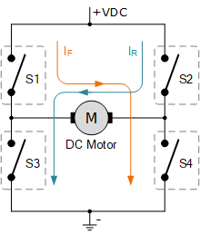

*Figura 5.10: Schema electrică a driverului L298 și conexiunea pentru controlul a două motoare DC în*

mod bipolar [18]
În figura 5.11 este prezentată schema electrică conceptuală al driverului L298 prezentată ca și 4 amplificatoare, câte unul pentru fiecare ramură a puntii H. Acest fapt permite controlul unipolar a 4 motoare și control bipolar a 2 motoare.

![Figura 5.11: Schema electrica conceptuala al driverului L298 [27]](figures/figura_5_11.png)

*Figura 5.11: Schema electrica conceptuala al driverului L298 [27]*

Având această abstractizare a puntii H, controlul unui motor DC bipolar devine similar cu cel al unui motor unipolar, cu diferența că pentru a schimba sensul de rotație al motorului, se inversează semnalul de comandă aplicat la intrările driverului L298. Respectiv și etapele de conversie și condiționare a semnalului sunt similare cu cele ale motorului, unipolar prezentate în secțiunea anterioară 5.1.3.
### 5.1.4 Conversie semnal de comandă software în semnal electric de comandă
(DAC, PWM, ON/OFF)
Conversia semnalului de comandă software într-un semnal electric adecvat pentru actuator implică utilizarea unor tehnici specifice, în funcție de tipul actuatorului și de cerințele aplicației. Cele mai comune metode includ utilizarea de DAC-uri (digital-to-analog converters), PWM (pulse-width modulation) și semnale ON/OFF.

Generarea semnalului ON/OFF
Generarea semnalului ON/OFF pentru un actuator se poate realiza prin simpla comutare a unui pin de ieșire al microcontrolerului între stările HIGH și LOW. Aceasta poate fi realizată prin intermediul unei funcții de control care să primească ca parametru starea dorită (pornit/oprit) și să seteze pinul corespunzător.

Componenta periferică a microcontrolerului care realizează această funcție este portul GPIO (General Purpose Input/Output). Pentru a fi utilizat un pin GPIO ca ieșire digitală, acesta trebuie configurat corespunzător în modul de ieșire prin intermediul regiștrilor periferici ai microcontrolerului. La fel ca și pentru generarea de nivel digital de iesire la pinul GPIO.

Libraria Arduino oferă funcții simple pentru configurarea pinilor GPIO și generarea semnalului ON/OFF, cum ar fi pinMode(...) și digitalWrite(...). unde:
- pinMode(pin, OUTPUT) configurează pinul pin ca ieșire digitală.
- digitalWrite(pin, HIGH/LOW) setează starea pinului pin la HIGH sau LOW.
Generarea semnalului PWM
Generarea semnalului PWM pentru un actuator se poate realiza prin configurarea unui pin de ieșire al microcontrolerului în modul PWM și setarea factorului de umplere (duty cycle) dorit. Periferiile microcontrolerului implicate în realizarea acestei funcții sunt GPIO, temporizatoarele (timers) și modulele PWM (Pulse Width Modulation). GPIO este utilizat pentru a seta pinul ca ieșire PWM, temporizatoarele sunt folosite pentru a genera semnalul de ceas necesar pentru PWM, iar modulele PWM sunt responsabile pentru generarea efectivă a semnalului PWM cu factorul de umplere (duty cycle) dorit. Configurațiile se pot realiza prin intermediul regiștrilor periferici ai microcontrolerului sau prin utilizarea unor librării software care abstractizează aceste detalii.

Libraria Arduino oferă funcții simple pentru generarea semnalului PWM, cum ar fi analogWrite(pin, value) unde value este un număr între 0 și 255 care reprezintă factorul de umplere (duty cycle) dorit. În cazul librăriei Arduino, aceasta nu oferă flexibilitatea de a seta frecvența semnalului PWM, și alte rafinamente care pot fi necesare în aplicații avansate. Pentru astfel de cazuri, este recomandat să se utilizeze librării specializate de nivel profesional sau să se configureze direct perifericele microcontrollerului prin intermediul regiștrilor săi.

Generarea semnalului analogic (DAC)
În cazul în care se doreste generarea unui semnal analogic real, (nu PWM), generarea semnalului analogic pentru un actuator se poate realiza prin utilizarea unui convertor digital-analogic (DAC) integrat în microcontroler sau prin utilizarea unui DAC extern conectat la microcontroler printr-o interfață de comunicație (precum SPI sau I2C). Periferiile microcontrolerului implicate în realizarea acestei funcții sunt DAC-ul intern (dacă este disponibil) sau interfața de comunicație pentru DAC-ul extern. Configurarea DACului se poate realiza prin intermediul regiștrilor periferici ai microcontrollerului sau prin utilizarea unor librării software care abstractizează aceste detalii.

O prezentare de implementare în variantă discretă cu un DAC după schema R-2R este prezentată în figura 5.12.

![Figura 5.12: Schema electrică tipică pentru un DAC R-2R [15]](figures/figura_5_12.png)

*Figura 5.12: Schema electrică tipică pentru un DAC R-2R [15]*

Datorită rețelei de rezistențe R și 2R, se realizează o divizare ponderată a tensiunii de referință, unde fiecare bit al cuvântului digital contribuie cu o pondere diferită la tensiunea V1. Aceasta este apoi amplificată în curent cu un amplificator operațional repetor pentru a obține tensiunea de ieșire analogică V2.

Librăria Arduino oferă funcții simple pentru generarea semnalului analogic pe microcontrolere cu DAC integrat (precum Arduino Due sau ESP32), cum ar fi analogWrite(pin, value) aplicată pe pinii DAC dedicați, unde value este un număr între 0 și valoarea maximă suportată de rezoluția DAC-ului (de exemplu, 0-4095 pentru un DAC pe 12 biți).

Pentru microcontrolere fără DAC integrat, se poate utiliza un modul DAC extern (ex:

MCP4725) comunicând prin I2C sau SPI.
### 5.1.5 Condiționarea software a semnalului de comandă
Condiționarea semnalului de comandă software, înainte ca acesta să prindă o formă electrică adecvată pentru actuator, poate include diverse tehnici de procesare necesare pentru a asigura o funcționare corectă și sigură a sistemului de acționare.

Considerând funcția de acționare ca fiind una complementară celei de achiziție de semnal, tehnicile de condiționare software a semnalului de comandă pot fi similare cu cele utilizate în achiziția de semnal, dar adaptate pentru nevoile specifice ale controlului actuatorului. Mai jos vom analiza câteva tehnici comune care pot fi aplicate în acest context evidențiind aspectele aplicare pentru domenul actuatorilor.

Conversia dintr-un domeniu în altul
Conversia semnalului de comandă dintr-un domeniu în altul are rolul de a transforma mărimea fizică definită în software (ex.: viteza dorită a motorului în RPM) într-o mărime electrică generată de microcontroler (ex.: tensiune aplicată la polii motorului). Această etapă permite ca valorile utilizate în aplicație, exprimate în unități relevante pentru utilizator, să fie convertite în semnale electrice compatibile cu cerințele actuatorului.

Procedeele de conversie utilizate sunt similare cu cele prezentate pentru senzori în secțiunile anterioare:
- Scalare și offset — pentru relații liniare simple între domenii ( 4.1.7).
- Conversie liniară prin două puncte — pentru relații liniare definite de puncte de calibrare ( 4.1.7).
- Conversie neliniară prin LUT (Look-Up Table) — pentru relații complexe care nu pot fi aproximate liniar ( 4.1.7).

Exemplu practic: Motor DC Un exemplu reprezentativ este conversia vitezei dorite a unui motor DC în tensiunea aplicată la polii acestuia. Această relație nu este liniară datorită caracteristicilor electrice și mecanice ale motorului (rezistența bobinei, pierderile prin frecare, forța contra-electromotoare). Pentru un anumit motor DC, relația dintre tensiune și viteză poate fi reprezentată astfel:

Tensiune (V)
Viteză (RPM)
Table 5.1: Exemplu de relație nelineară între tensiune și viteză pentru un motor DC
Graficul din figura 5.13 prezintă această relație nelineară, evidențiind creșterea rapidă inițială a vitezei pentru tensiuni mici, urmată de o saturare progresivă la tensiuni mai mari.

Viteză (RPM)
Curba Tensiune-Viteză
Tensiune (V)

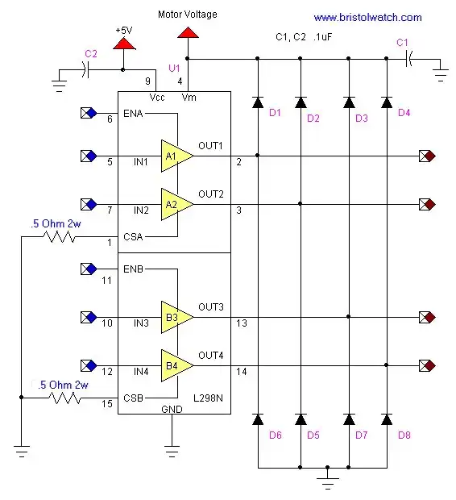

*Figura 5.13: Relația nelineară dintre tensiune și viteză pentru un motor DC*

Datorită acestei neliniariați, conversia dintre viteza dorită și tensiunea aplicată necesită o abordare specială. O metodă eficientă este utilizarea unei tabele de căutare (LUT Look-Up Table) cu interpolare liniară între punctele definite, similar metodei prezentate în secțiunea 4.1.7 pentru senzori.

Pentru conversia inversă (de la parametrul fizic dorit - viteza în RPM - la tensiunea de aplicat în Volți), se va folosi aceeași funcție de interpolare LUT, dar cu inversarea axelor din tabelul de căutare. Astfel, funcția va căuta în coloana de viteză pentru a identifica intervalul corespunzător vitezei dorite și va returna tensiunea interpolată corespunzătoare.

Implementarea în cod C pentru această conversie va utiliza funcția lib_sig_cond_lut_float() prezentată anterior, adaptată pentru axele inversate (viteză → tensiune în loc de tensiune → viteză).

Saturarea semnalului de comanda
Saturarea semnalului de comandă se referă la limitarea valorilor acestuia într-un interval specificat, pentru a preveni depășirea limitelor fizice ale actuatorului. De exemplu, dacă un motor DC are o viteză maximă de 1000 RPM, semnalul de comandă trebuie să fie limitat la această valoare. Mecanismul de saturare poate fi implementat printr-o funcție simplă care verifică dacă semnalul de comandă depășeste limitele specificate și îl ajustează corespunzător. Mecanismul de saturare a fost prezentat în secțiunea 4.1.4.

Filtru impulsionar pentru semnalul de comanda
Filtrarea impulsionară a semnalului de comandă se referă la aplicarea unui filtru pentru a elimina zgomotul sau fluctuațiile nedorite din semnalul de comandă datorat unor tranziții interne ale sistemului în evaluarea comenzii. Filtrul median este o soluție simplă pentru această problemă. Această metodă de filtrare a fost prezentată în secțiunea 4.1.4.

Filtru trece-jos pentru semnalul de comanda
Filtrul trece-jos este utilizat pentru a elimina componentele de frecvență înaltă din semnalul de comandă, pentru a reduce schimbările bruște aplicate actuatorului și pentru a asigura o tranziție mai lină între valorile comenzii. Acest lucru este deosebit de important în cazul actuatorilor mecanici, unde schimbările bruște pot duce la uzura prematură a componentelor. Filtrul trece-jos poate fi implementat printr-un filtru digital de mediere ponderată, prezentat în secțiunea 4.1.4.

Mecanism de pornire lină (rampare) a semnalului de comandă
Mecanismul de pornire lină (sau rampare) a semnalului de comandă se referă la introducerea unei perioade de tranziție graduală atunci când se schimbă valoarea semnalului de comandă. Un exemplu este creșterea vitezei cu accelerație constantă. care raportat la formula de forță va limita sarcina aplicată asupra actuatorului. Acest mecanism poate fi implementat printr-o funcție care ajustează treptat valoarea semnalului de comandă pe parcursul unei perioade specificate, în loc să o schimbe brusc.

Legitatea prin care se asigură o accelerare și o decelerare lină a actuatorului este prezentată de formula ∆v a= ∆t unde:
- a este accelerația (sau decelerația) constantă,
- ∆v este schimbarea vitezei (diferența dintre viteza finală și cea inițială),
- ∆t este intervalul de timp în care are loc această schimbare.

Considerând ∆t ca fiind recurența taskului de control, ∆v va fi valoarea a schimbării de viteză pe fiecare pas de control.

Un grafic care prezintă conceptul de pornire lină (rampare) este prezentat în figura 5.14.

Viteză (RPM)
a = ∆v ∆t
∆v
∆t Pornire/Oprire lină
Timp (ms)
> **Figura 5.14:** *Conceptul de pornire lină (rampare) și oprire lină (decelerare) a semnalului de comandă*

>
> *(Această figură este generată din date și nu poate fi extrasă automat din PDF)*
pentru motor DC
### 5.1.6 Expunerea interfețelor software pentru controlul actuatorului
- Inițializarea actuatorului.
- Pornirea și oprirea actuatorului.
- Setarea parametrilor de control (ex: viteză, direcție).
- Monitorizarea stării actuatorului.

Aceste interfețe vor fi implementate ca funcții C care pot fi apelate din orice parte a aplicației, asigurând modularitatea și reutilizabilitatea codului.
## 5.2 Sarcina de laborator
### 5.2.1 Partea 1 - Control Actuator binar
Pentru un actuator binar bec iluminare prin releu, sau altul convenit cu mentorul să se realizeze o aplicație pentru MCU care va interpreata comenzi de control de la utilizator prin STDIO (serial sau keypad), va controla actuatorul afișând starea curentă pe un display LCD. Aplicația va realiza următoarele funcționalități:
- Control actuator binar (Actuator Control): primește comenzi ON/OFF de la utilizator prin STDIO (serial/tastatură), aplică debouncing și controlează starea actuatorului (releu, LED) la o recurență configurabilă (ex.: 50-100 ms). Expune starea actuatorului printr-o interfață internă (ex. actuator_get_state()).
- Condiționare semnal (Signal Conditioning): aplică operații de preprocesare: saturare, debouncing software pentru eliminarea comutărilor false, validare persistentă a stării. Rularea acestui task poate fi la aceeași recurență sau derivată.
- Afișare și raportare (Display & Reporting): la o recurență mai mică (ex.: 500 ms) afișează pe LCD sau STDIO (printf) un raport structurat cu starea actuatorului și eventuale alerte.

### 5.2.2 Partea 2 - Control actuator analogic
Pentru un actuator analogic (ex.: motor DC controlat prin driver L298 sau PWM), să se realizeze o aplicație pentru MCU care va controla periodic actuatorul selectat dintr-o listă de actuatoare analogice, va genera alertă de stare și va afișa starea curentă pe un display LCD.

Aplicația va realiza următoarele funcționalități:
- Control actuator analogic: primește comenzi de viteză sau poziție (valori numerice, ex.: 0–100% sau 0–255) prin interfață STDIO (terminal serial, say keypad
4x4), aplică validare și controlează actuatorul analogic la o recurență configurabilă (ex.: 50–100 ms). Expune starea actuatorului printr-o interfață internă (ex.: actuator_get_speed()).
- Condiționare semnal analogic: procesează comenzile brute, aplică operații de preprocesare: saturare la limitele fizice (ex.: 0–100%), filtrare mediană pentru eliminarea zgomotului impulsionar, mediere ponderată pentru reducerea fluctuațiilor, rampare (pornire/oprire lină) pentru protecția actuatorului. Task-ul de condiționare poate rula la aceeași recurență sau la o recurență derivată.
- Afișare și raportare: la o recurență mai mică (ex.: 500 ms) afișează prin STDIO fie serial sau LCD (printf) un raport structurat cu valorile procesate, starea sistemului și eventuale alerte (ex.: suprasarcină, limită atinsă).

**Cerințe suplimentare:** Pentru lucrările de laborator cu actuatori, respectați următoarele recomandări pentru structură, modularitate și validare:
- Structurați aplicația modular, separând logica de control a actuatorului într-un modul software dedicat.
- Utilizați diagrame de stare sau de flux pentru a descrie comportamentul actuatorului și condiționarea semnalului de comandă.
- Implementați debouncing software pentru comenzile binare (ex.: butoane, comutatoare) care acționează actuatorul.
- Dacă folosiți FreeRTOS, creați taskuri dedicate pentru fiecare funcționalitate majoră (interpretare comenzi, condiționare semnal, control actuator, afișare).
- Pentru comunicarea între taskuri, utilizați semafoare binare sau mutex pentru protecția variabilelor globale partajate.
- Reutilizați modulele pentru actuatori, LED-uri, butoane și interfață de afișare, acolo unde este posibil.
- Testați fiecare funcționalitate și tranziție de stare conform scenariilor de validare definite.
- Documentați clar arhitectura software, diagramele de stare/flux, interfețele HW/SW și scenariile de testare.
- Consultați resursele teoretice despre controlul actuatorilor, protecție la suprasarcină și proiectare modulară.
- Sistemul trebuie să răspundă la comenzi sau schimbări de semnal cu o latență sub
100ms.
- Afișați starea curentă a actuatorului și valorile relevante pcatre STDIO prin interfața serială sau LCD.
- utilizati instrumente de analiză și vizualizare a datelor (ex.: Arduino Serial Plotter) pentru a monitoriza performanța sistemului în timp real.

**Materiale și resurse necesare pentru realizarea lucrării:**
- Componente hardware: microcontroler compatibil cu FreeRTOS (ex.: Arduino Mega,
ESP32), LED-uri (verde, roșu sau galben) cu rezistență de limitare, actuator la alegere (releu cu optocuplor sau motor DC cu driver L298), display LCD pentru afișarea datelor, placă de prototipare (breadboard), cabluri de conexiune (jumper wires), sursă de alimentare (USB sau baterie).
- Resurse software: PlatformIO, Wokwi sau Proteus pentru simulare și testare, emulator terminal serial (ex.: Monitor Serial din PlatformIO, TeraTerm sau Putty), instrument pentru realizarea diagramelor (ex.: draw.io, Lucidchart).

**Realizarea sarcinii poate fi executată în mai multe variante, fiecare dintre ele cu un punctaj diferit după cum urmează:**
- Varianta A (80% din punctajul maxim): Implementare toată funcționalitatea într-un singur task secvențial (control, condiționare, alertă, afișare).
- Varianta B (90% din punctajul maxim): Implementare toate funcționalitățile în task-uri separate, fiecare task având propria recurență, cu asigurarea interfețelor protejate între task-uri.
- Varianta C (100% din punctajul maxim): Implementarea sistem de control a doi actuatori, unul binar și unul analogic, cu afișarea valorilor și alertelor de la ambii actuatori pe display LCD.

**NOTĂ:** Realizarea sarcinii se va desfășura în două etape distincte, definite ca două probleme în cadrul lucrării de laborator. Aceste probleme vor fi realizate conform metodologiei prezentate în anexa de problemă rezolvată. Fiecare etapă va fi documentată conform cerințelor metodologice, incluzând cerințe, schițe arhitecturale, diagrame de flux, scenarii de testare și rezultatele obținute. Fiecare parte a lucrării (problema) este planificată pentru o ședință de 2 ore academice.

### Mersul lucrării
1. Sa se analizeze și sa se inteleaga Sarcina lucrarii de laboratorși anume Analiza situației în domeniu și Contextul tehnologic al aplicației dezvoltate conform sectiunii
1.1.
2. sa se falmiliarizeze cu problema propusa spre elaborareși sa se identifice obiectivele și sarcina individuala vezi A.1.1.
3. Sa se analizeze componentgele și resursele untilizate in realizarea aplicatiei din cadrul lucrarii de laborator.
4. In urma analizei sarcinii lucrarii și definitiei problemei propuse, sa se defineasca un set de cerinte tehnice acoperind aspectele funcitionale și nefunctionale ale problemei, vezi A.1.2
5. In urma analizei cerintelor tehnice elaborate sa se defineasca scenarii de testare și criteriilor de validare cu minim 1 test per cerinta care sa raspunda la intrebarea cum ma asigur ca cerinta se satidface, vezi A.1.3
6. sa se identifice componentele ce compun sistemul aplicatiei, sa se organizeze intr-o lista cu descrierea rolului acerstora in aplicatie.
7. Sa se realizeze diagrama structurala cu reprezentarea componentelor și interactiunii intre acestea asa cum este prezentat in sectiunea A.1.4
8. Sa se realizeze arhitectura pe nivele pentru interfata hardware-software pentru fiecare dintre interfete vezi A.1.4.
9. Sa se realizeze diagramele de comportament pentru functionalitatile Componentelor cu diagrame de de flux stari sau de secvență, dupa caz, ca in A.1.5
10. sa se elaboreze schita electrica a aplicatiei intr-un mediu de simulare, vezi A.1.6.
11. sa se creeze structura de directoare și fisiere pentru implementarea aplicatiei care va reflecta arhitectura definita de sistemși de interfata hardware Software vezi A.1.7.
12. Sa se implementeze driverele de interfata hardware-software pentru fiecare componenta electronica utilizata in aplicatie acoperind nivelele ECAL și SRV dupa caz A.1.7.
13. Sa se implementeze comportamentul aplicatiei urmand diagrama de flux definita,
A.1.7.
14. Sa se simuleze functionare aplicatia in medii precum Wokwi sau PlatformIO. cu o eventuala rulare pe hardware real.
15. Sa se testeze și valideze aplicatia conform scenariilor de testare și criteriilor de validare definite anterior, vezi exemplu in A.1.8.
16. sa se documenteze rezultatele testarii cu observatii și recomandari pentru imbunatatiri,
A.1.8.
17. Sa se optimizeze aplicatia pe baza rezultatelor testarii și validarii
18. sa se documenteze toate etapele realizate in cadrul lucrarii de laborator conform cerintelor pentru raportul lucrarii de laborator expuse in 1.1.5.

Acest proces este urmat în cadrul tuturor lucrărilor de laborator din cadrul cursului, asigurându-se astfel o înțelegere profundă a modului în care funcționează sistemele electronice incorporate, multitasking și a importanței unei abordări metodice în proiectarea acestora.
### Întrebări de control
1. Ce reprezintă conversia energiei în acțiune fizică și care sunt principalele etape ale acestui proces în sistemele electronice încorporate?
2. Explicați diferența dintre controlul unipolar și bipolar al actuatorilor analogici. Care sunt avantajele fiecăruia?
3. Care este rolul semnalului PWM în controlul actuatorilor analogici și cum se cal- culează factorul de umplere pentru o tensiune medie dorită?
4. Descrieți principiul de funcționare al unui punte H (H-bridge) pentru controlul motoarelor DC și explicați cum se realizează schimbarea direcției de rotație.
5. Ce este ramparea (pornire lină) în contextul controlului actuatorilor și cum previne aceasta șocurile mecanice nedorite?
6. Explicați diferența dintre debouncing-ul temporal și antibouncing-ul pentru actuatori binari. Care sunt avantajele metodei temporale?
7. Cum se realizează conversia unui semnal de comandă software în semnal electric (PWM, DAC) pentru actuatori? Descrieți procesul pentru un actuator cu răspuns neliniar (ex: motor DC).
8. Care sunt avantajele utilizării unui tabel de căutare (LUT - Look-Up Table) pentru conversia semnalelor de comandă pentru actuatori cu caracteristici neliniare?
9. Explicați importanța saturării semnalului de comandă în procesul de condiționare. Ce probleme pot apărea dacă saturarea nu este implementată corect?
10. Cum se asigură sincronizarea între task-urile de interpretare comenzi, condiționare și control într-o aplicație multitasking cu FreeRTOS? Ce mecanisme de protecție se folosesc pentru variabilele partajate?

## 5.5 Grila de evaluare a lucrării de laborator
1. Analiza sarcinii și contextului tehnologic (12p)
  a. Analiza situației în domeniu și contextul tehnologic (1.1) (4p)
  b. Identificarea resurselor externe și referințe în bibliografie (4p)
  c. Analiza componentelor și resurselor utilizate (4p)
2. Definirea cerințelor tehnice și scenariilor de testare (13p)
  a. Identificarea obiectivelor și sarcinii individuale (A.1.1) (3p)
  b. Formularea cerințelor funcționale și non-funcționale (A.1.2) (5p)
  c. Definirea scenariilor de testare și criteriilor de validare (A.1.3) (5p)
3. Proiectarea arhitecturală și modelare comportamentală (18p)
  a. Listarea componentelor și descrierea rolului fiecăreia (3p)
  b. Diagrama structurală cu componente și interacțiuni (A.1.4) (4p)
  c. Arhitectura pe nivele pentru interfața hardware-software (4p)
  d. Diagrame comportament pentru funcționalități (flux, stări, secvență) (A.1.5) (7p)
4. Proiectarea și simularea schiței electrice (13p)
  a. Elaborarea schiței electrice în mediu de simulare (A.1.6) (4p)
  b. Reprezentarea corectă a conexiunilor și dimensionarea componentelor (2p)
  c. Simularea funcționării aplicației în medii precum Wokwi/PlatformIO (3p)
  d. Rularea aplicației pe HW real (10p)
5. Implementarea software modulară (18p)
  a. Structura de directoare și fișiere conform arhitecturii (A.1.7) (4p)
  b. Implementarea de interfață HW-SW conform proiectării în detaliu (6p)
  c. Implementarea comportamentului aplicației conform proiectării în detaliu (6p)
  d. Comentarii explicative și documentare în cod (2p)
6. Simulare, testare și validare (16p)
  a. Testarea și validarea conform scenariilor definite (A.1.8) (8p)
  b. Documentarea rezultatelor testării, observații și recomandări (5p)
  c. Optimizarea aplicației pe baza rezultatelor testării și validării (3p)
7. Documentare finală (10p)
  a. Documentarea etapelor realizate conform cerințelor raportului (1.1.5) (5p)
  b. Observații, recomandări, concluzii generale (5p)
Total: 100p
---
# Lucrarea de laborator nr. 6: Reglare automata și in sistemele incorporate
**Scopul lucrării**
este proiectarea și implementarea unor aplicații modulare pentru microcontroler (MCU) care realizează control automat asupra unui parametru fizic măsurabil (ex.: temperatură, umiditate, turație, poziție), folosind două metode principale: control ON-OFF cu histereză și control PID. Sistemul va achiziționa date de la senzori, va aplica algoritmul de control selectat, va acționa un actuator (releu, motor, ventilator, încălzitor) și va afișa valorile relevante (Set Point, valoare măsurată, stare actuator) pe LCD sau interfață serială. Aplicația va permite configurarea parametrilor de control și transmiterea datelor pentru analiză.
**Obiectivele lucrării**
- Familiarizarea cu metodele generale de control automat (ON-OFF cu histereză, PID) în sisteme electronice incorporate.
- Implementarea unui sistem modular de control pentru un parametru fizic măsurabil
- Configurarea și ajustarea parametrilor de control.
- Realizarea interfeței de afișare și raportare a valorilor relevante.
- Controlul unui actuator conform aplicatiei specifice.
- Transmiterea datelor relevante in format Plotter pentru analiză vizuală și debugging.
- Documentarea arhitecturii, scenariilor de testare, criteriilor de validare și rezultatelor obținute.

## 6.1 Analiza domeniului de aplicare
controlul unui sistem prin reglarea autmata presupune mentineara unui parametru la o valoare dorita. Sau mai in detaliu, utilizarea unor algoritmi care ajustează parametrii de funcționare ai sistemului pentru a menține un anumit set point (valoare de referință) în fața variațiilor și perturbărilor externe.

În contextul sistemelor electronice incorporate, acest proces implică achiziția de date de la senzori, procesarea acestor date pentru a determina eroarea față de set point, și aplicarea unei acțiuni de control prin intermediul unui actuator pentru a corecta această eroare.

Cele mai frecvent folosite metode de reglare automată sunt controlul ON-OFF cu histereză și controlul PID (Proporțional-Integral-Derivativ). Le vom explora pe scurt in sectiunile de mai jos.
### 6.1.1 Control On/Off
Controlul ON-OFF este o metodă simplă de reglare automată care implică comutarea actuatorului între două stări: ON (pornit) și OFF (oprit), în funcție de valoarea măsurată a parametrului fizic comparativ cu o valoare de referință.

Schematic acest tip de control poate fi reprezentat ca in diagrama din figura 6.1.

![Figura 6.1: Diagrama bloc a controlului ON-OFF[6].](figures/figura_6_1.png)

*Figura 6.1: Diagrama bloc a controlului ON-OFF[6].*

unde legitatea de control se va exprima prin formula 6.1 R(t) =
 K, 0, dacă Vact (t) < Vdes (t) altfel
(6.1)
unde R(t) este semnalul de control ON/OFF la momentul t, Kc este valoarea de comandă pentru ON (ex: 1 pentru releu), Vact (t) este valoarea măsurată la țiar Vdes (t) este valoarea de referință la t. grafic acest tip de control va avea un comportament ca in figura 6.2.

![Figura 6.2: Graficul de funcționare al controlului ON-OFF[6].](figures/figura_6_2.png)

*Figura 6.2: Graficul de funcționare al controlului ON-OFF[6].*

Aceasta metoda are cateva neajunsuri printre care și faptul ca poate duce la comutari frecvente ale actuatorului in jurul punctului de referinta, ceea ce poate duce la uzura prematura a componentelor. Pentru a preveni acest fenomen, se poate introduce histereză în sistemul de control.

Histereza introduce o marjă de toleranță în jurul valorii de referință, definite ca puncte de Vof f și Von . Astfel, actuatorul va comuta la ON doar când valoarea măsurată scade sub Vof f și va comuta la OFF doar când valoarea măsurată depășeste Von . legitatea de control cu histereză se exprimă prin formula 6.2.
   Kc, dacă Vact (t) < Von (t) R(t) = 0, dacă Vact (t) > Vof f (t)    R(t − 1), altfel
(6.2)
unde Von (t) și Vof f (t) sunt pragurile de histereză la momentul t.

Grafic legitatea histereza reprezinta o dependenta a valorii de iesire R(t) de valoarea concurenta cu tranzitii pe valorile Von (t) și Vof f (t) si va arata ca in figura 6.3 unde se vede profilul de creștere a valorii de iesire care este diferit de cel de descadere.

![Figura 6.3: Graficul legității histereză[6].](figures/figura_6_3.png)

*Figura 6.3: Graficul legității histereză[6].*

graficul de evolutie a valorii de isire controlat de mecanismul de reglare ON-OFF cu histereză va arata ca in figura 6.4.

![Figura 6.4: Graficul de funcționare al controlului ON-OFF cu histereză [6].](figures/figura_6_4.png)

*Figura 6.4: Graficul de funcționare al controlului ON-OFF cu histereză [6].*

Iar rezultatele simularii in mediu real vor arata ca in figura 6.5.

![Figura 6.5: Simularea controlului ON-OFF cu histereză [6].](figures/figura_6_5.png)

*Figura 6.5: Simularea controlului ON-OFF cu histereză [6].*

Aceasta metoda previne comutările frecvente relaxand astfel uzura componentelor și asigurând o funcționare mai stabilă a sistemului de control.
### 6.1.2 Control PID
Metoda de control PID reprezinta o mentoda de reglare mai fina, care utilizeaza un algoritm ce ajustează continuu semnalul de control pe baza erorii dintre valoarea măsurată și valoarea de referință., Erroarea este definită ca o diferenta dintre valoare dorita Vdes (t) si cea actiala Vact (t), reprezentata prin formula 6.3. e(t) = Vdes (t) − Vact (t)
(6.3)
Algoritmul PID combină trei componente principale fiecare dintre ele avand un rol specific in procesul de reglare automata.

Componenta Proportionala - P contribuie la semnalul de iesire pentru actionare cu o valoare proportionala cu eroarea masurata intre valoarea dorita Vdes (t) si cea actiala Vact (t), reprezentata prin formula 6.3. Semnalul de control proporțional este dat de formula 6.4.

P (t) = Kp · e(t) (6.4) unde P (t) este componenta proporțională a semnalului de control la momentul țiar Kp este câștigul proporțional, coeficient de ajustare a sensibilității sistemului la eroare.

Grafic componenta proportionala va arata ca in figura 6.6.

![Figura 6.6: Graficul de funcționare al componentei proporționale[6].](figures/figura_6_6.png)

*Figura 6.6: Graficul de funcționare al componentei proporționale[6].*

iar simularile unde se poate observa impactul ajustarii coeficientului Kp vor arata ca in figura 6.7.

![Figura 6.7: Simularea componentei proporționale[6].](figures/figura_6_7.png)

*Figura 6.7: Simularea componentei proporționale[6].*

Din grafic și simulări se observă că, pe măsură ce coeficientul Kp creste, valoarea actuală se apropie de cea dorită. Totuși, o creștere excesivă a lui Kp poate duce la oscilații în jurul valorii de referință, deoarece sistemul devine prea sensibil la eroare și reacționează prea agresiv. Reglarea doar cu componenta proporțională nu permite atingerea exactă a valorii dorite, iar creșterea coeficientului accentuează oscilațiile. Această metodă este utilă pentru a aduce valoarea măsurată aproape de cea dorită, dar nu asigură eliminarea completă a erorii.

Componenta Derivativa (D) anticipează tendința viitoare a erorii, oferind o corecție bazată pe rata de schimbare a erorii. Semnalul de control derivativ este dat de formula 6.5. de(t) D(t) = Kd · (6.5) dt este unde D(t) este componenta derivativă a semnalului de control la momentul țiar de(t) dt derivata erorii în timp, reprezentând rata de schimbare a erorii, Kd este câștigul derivativ.

Pentru calculul numeric derivatei erorii se poate utiliza o aproximare discretă reporezentata de formula 6.6. de(t) e(t) − e(t − ∆t) ≈ dt ∆t
(6.6)
Iar formula de control PD este exprimata de relatia 6.7.

R(t) = P (t) + D(t) = Kp · e(t) + Kd · de(t) e(t) − e(t − ∆t) = Kp · e(t) + Kd · dt ∆t
(6.7)
Impactul componentei derivativa poate fi observat in graficul din figura 6.8.

![Figura 6.8: Graficul de funcționare al componentei derivativă [6].](figures/figura_6_8.png)

*Figura 6.8: Graficul de funcționare al componentei derivativă [6].*

Din grafic și simulări se observă că, adăugarea componentei derivative corectează dinamica sistemului, reducând oscilațiile și stabilizând răspunsul. Totuși, această componentă nu elimină eroarea pe termen lung, ci doar atenuează variațiile rapide.

Componenta Integrală (I): Această componentă ia în considerare suma erorilor trecute, oferind o corecție pentru erorile persistente care nu pot fi eliminate doar cu componenta proporțională sau derivativă. Semnalul de control integral este dat de formula:

I(t) = Ki ·
Z t e(τ )dτ
(6.8)
unde I(t) este componenta integrală a semnalului de control la momentul t, Ki este câștigul integral, iar e(τ ) este eroarea la momentul τ .

Pentru calculul numeric al integralei erorii se poate utiliza o aproximare discretă reprezentate de formula 6.9.

Z t e(τ )dτ ≈
N X e(n · ∆t) · ∆t
(6.9)
n=0
Grafic, componenta integrală are rolul de a elimina eroarea statică (offset-ul) care poate rămâne prezentă în sistem atunci când se utilizează doar componentele P sau PD. Aceasta creste treptat acțiunea de control până când eroarea este eliminată complet. Impactul componentei integrale poate fi observat in graficul din figura 6.9.

![Figura 6.9: Simularea controlului PID complet (P+I+D) [6].](figures/figura_6_9.png)

*Figura 6.9: Simularea controlului PID complet (P+I+D) [6].*

Ca și principiu componenta I colecteaza eroarea acumulata in timp și contribuie cu un adaos la semnalul de control pentru a elimina eroarea statica. Totusi, o valoare prea mare a coeficientului Ki poate duce la instabilitate și oscilații, deoarece sistemul devine prea sensibil la erorile acumulate. Odata ce eroarea acumulata in timp devine 0 rezulta ca Sistemul se mentine la valoare dorita fara a mai avea o eroare statica. formula completa de control PID este exprimata de relatia 6.10.

Z t de(t) (6.10) dt unde R(t) este semnalul de control la momentul țiar Kp, Ki, Kd sunt coeficienții de reglare pentru fiecare componentă.

R(t) = Kp · e(t) + Ki · e(τ )dτ + Kd ·
iar pentru calcul numeric se poate folosi relatia 6.11.

R(t) = Kp · e(t) + Ki ·
N X n=0 e(n · ∆t) · ∆t + Kd ·
e(t) − e(t − ∆t) ∆t
(6.11)
Reglarea coeficienților Kp, Ki, Kd influențează direct răspunsul sistemului: rapiditate, stabilitate și eliminarea erorii statice. Acești coeficienți pot fi determinați fie prin metode teoretice din domeniul Ingineriei Reglării Automate (IRA), fie prin algoritmi iterativi de PID Tuning. Pentru aplicații practice, se recomandă o metodă de reglare pas cu pas (PID Tuning) ușor de aplicațprezentată mai jos, fiecare pas fiind formulat astfel încât să nu depășească 80 de caractere pe rând:
- Setează valoarea dorită Vd și inițializează coeficienții: Kp = 0, Ki = 0, Kd = 0.
- Creste treptat Kp până când sistemul începe să oscileze (răspunsul devine instabil), apoi reduce Kp la jumătate. Acum sistemul ar trebui să răspundă rapid, dar fără oscilații mari.
- Creste Kd puțin câte puțin, observând dacă oscilațiile se reduc și răspunsul devine mai stabil. O valoare potrivită pentru Kd va atenua vârfurile și va face sistemul să se stabilizeze mai repede.
- Creste Ki treptat, până când eroarea statică dispare (sistemul ajunge exact la valoarea dorită). Dacă apar oscilații, reduce Ki la jumătate sau la o treime.
- Testează sistemul cu mai multe valori ale Vd pentru a verifica dacă răspunsul rămâne stabil și rapid.

Astfel, reglarea se face experimental, observând direct comportamentul sistemului la fiecare pas.
- Setează valoarea dorită Vd și inițializează coeficienții: Kp = 0, Ki = 0, Kd = 0.
- Creste treptat Kp până când sistemul începe să oscileze (răspunsul devine instabil), apoi reduce Kp la jumătate. Acum sistemul ar trebui să răspundă rapid, dar fără oscilații mari.
- Creste Kd puțin câte puțin, observând dacă oscilațiile se reduc și răspunsul devine mai stabil. O valoare potrivită pentru Kd va atenua vârfurile și va face sistemul să se stabilizeze mai repede.
- Creste Ki treptat, până când eroarea statică dispare (sistemul ajunge exact la valoarea dorită). Dacă apar oscilații, reduce Ki la jumătate sau la o treime.
- Testează sistemul cu mai multe valori ale Vd pentru a verifica dacă răspunsul rămâne stabil și rapid.

Astfel, reglarea se face experimental, observând direct comportamentul sistemului la fiecare pas.
## 6.2 Sarcina de laborator
### 6.2.1 Partea 1: Reglare automata cu ON-OFF control cu hstereza
Să se proiecteze și să se implementeze o aplicație modulară pentru microcontroler (MCU) care realizează controlul ON-OFF cu histereză asupra unui parametru fizic (de exemplu: temperatură, umiditate sau poziție rotor). Sistemul va acționa un actuator (releu sau driver L298) în funcție de valoarea măsurată a parametrului, comparată cu o valoare de referință (Set Point) configurabilă.

Setarea valorii de referință se va face printr-un mecanism de interacțiune ales (potențiometru, butoane, tastatură (UP/DOWN) sau interfață serială). Valorile parametrului măsurațale Set Point-ului și starea actuatorului vor fi afișate pe LCD și/sau prin interfața serială (STDIO). Controlul ON-OFF va utiliza histereză pentru a preveni comutările frecvente ale actuatorului la variații mici ale parametrului controlat. Rularea functionalitatilor achizitie, procesareși actionare, vor fi realizate in sistemul de operare FreeRTOS fie cu tascuri secventiale cu recurente justificate..

Sistemul va implementa una dintre următoarele variante:
- Varianta A - Control temperatură sau umiditate, pe baza valorii de la un senzor digital (ex. DHT22), cu acționare prin releu.
- Varianta B - Control poziție rotor (ex. servo motor) cu acționare prin driver L298, folosind control ON/OFF cu histereză. Motorul va fi acționat în regim de saturație (putere fixă 50%), cu comutare între direcții în funcție de abatere.
- Varianta X - o varianta selectata indivdual, coordonata cu mentorul.

Pentru demonstrarea controlului în timp real, datele relevante (SetPoint, Value, Output) vor fi trimise către Arduino Serial Plotter.
### 6.2.2 Partea 2: Reglare automată cu control PID
Să se proiecteze și să se implementeze o aplicație modulară pentru microcontroler (MCU) care realizează controlul PID asupra unui parametru fizic (de exemplu: temperatură, umiditate, turație motor sau poziție rotor). Sistemul va achiziționa periodic valoarea parametrului de la un senzor adecvat, va compara cu valoarea de referință (Set Point) configurabilă și va calcula acțiunea de control utilizând algoritmul PID (proporționalintegral-derivativ).

Setarea valorii de referință (Set Point) se va face printr-un mecanism de interacțiune ales (potențiometru, butoane, tastatură (UP/DOWN), encoder sau interfață serială).

Parametrii PID (Kp, Ki, Kd) vor fi configurabili din cod sau din interfață. Valorile parametrului măsurațale Set Point-ului, ale semnalului de control și starea actuatorului vor fi afișate pe LCD și/sau prin interfața serială (STDIO). Controlul PID va asigura reglarea fină și stabilă a parametrului fizic, cu răspuns rapid și minimizare a erorii de reglare. Rularea functionalitatilor achizitie, procesareși actionare, vor fi realizate in sistemul de operare FreeRTOS fie cu tascuri secventiale cu recurente justificate..

Sistemul va implementa una dintre următoarele variante:
- Varianta A – Control temperatură, cu senzor digital (ex. DHT22) și încălzitor acționat prin PWM sau releu.
- Varianta B – Control umiditate, cu senzor digital (ex. DHT22) și ventilator acționat prin PWM.
- Varianta C – Control turație motor, cu encoder ca senzor de viteză și driver L298 pentru alimentarea motorului.
- Varianta D – Control poziție rotor, cu potențiometru ca senzor și driver L298 ca actuator, pentru poziționare bidirecțională.
- Varianta X – Un alt parametru pentru control la alegere (cu validare din partea profesorului).

Pentru demonstrarea controlului în timp real, datele relevante (SetPoint, Value, Output) vor fi trimise către Arduino Serial Plotter.

**Cerințe suplimentare:** Pentru lucrările de laborator cu control automat (ON-OFF cu histereză, PID), respectați următoarele recomandări pentru structură, modularitate și validare:
- Structurați aplicația modular, separând logica de control (ON-OFF/PID), achiziție, condiționare și acționare în module software dedicate.
- Utilizați diagrame de stare și/sau diagrame bloc pentru a vizualiza algoritmul de control și fluxul de date.
- Implementați debouncing software pentru toate intrările digitale (butoane, senzori).
- Dacă folosiți FreeRTOS, creați taskuri separate pentru achiziție, control, acționare și afișare, fiecare cu recurență justificată., • Pentru comunicarea între taskuri, utilizați semafoare binare, cozi sau mutex pentru protecția variabilelor partajate.
- Afișați valorile relevante (SetPoint, valoare măsurată, ieșire control, stare actuator) catre STDIO prin interfața serială sau LCD.
- Reutilizați modulele pentru senzori, actuatori și interfață de afișare, evitând duplicarea codului.
- Testați fiecare scenariu de control și tranziție de stare conform criteriilor de validare definite.
- Documentați clar arhitectura software, diagramele de control, interfețele HW/SW și scenariile de testare.
- Consultați resursele teoretice despre control automat, histereză, PID și proiectare modulară.
- utilizati instrumente de analiză și vizualizare a datelor (ex.: Arduino Serial Plotter) pentru a monitoriza performanța sistemului în timp real.

**Materiale și resurse necesare pentru realizarea lucrării:**
- Componente hardware: microcontroler compatibil (ESP32, STM32, Arduino), senzor (DHT11, DHT22, potențiometru, encoder), actuator (releu, motor DC cu driver
L298), LCD I2C (2x16 sau 4x20), tastatură 4x4, potențiometru, butoane, breadboard, fire jumper, rezistențe, sursă de alimentare (USB sau externă).
- Resurse software: Visual Studio Code cu extensia PlatformIO instalată, biblioteci pentru LCD, STDIO (Serial), senzorul ales, Keypad, simulator hardware (opțional, ex.: Proteuș Wokwi), emulator terminal serial (Monitor Serial din PlatformIO, TeraTerm sau Putty), Arduino Serial Plotter, instrument pentru realizarea diagramelor (ex.: draw.io, Lucidchart).

**NOTĂ:** Realizarea sarcinii se va desfășura în două etape distincte, definite ca două probleme în cadrul lucrării de laborator. Aceste probleme vor fi realizate conform metodologiei prezentate în anexa de problemă rezolvată. Fiecare etapă va fi documentată conform cerințelor metodologice, incluzând cerințe, schițe arhitecturale, diagrame de flux, scenarii de testare și rezultatele obținute. Fiecare parte a lucrării (problema) este planificată pentru o ședință de 2 ore academice.

### Mersul lucrării
1. Sa se analizeze și sa se inteleaga Sarcina lucrarii de laboratorși anume Analiza situației în domeniu și Contextul tehnologic al aplicației dezvoltate conform sectiunii
1.1.
2. sa se falmiliarizeze cu problema propusa spre elaborareși sa se identifice obiectivele și sarcina individuala vezi A.1.1.
3. Sa se analizeze componentgele și resursele untilizate in realizarea aplicatiei din cadrul lucrarii de laborator.
4. In urma analizei sarcinii lucrarii și definitiei problemei propuse, sa se defineasca un set de cerinte tehnice acoperind aspectele funcitionale și nefunctionale ale problemei, vezi A.1.2
5. In urma analizei cerintelor tehnice elaborate sa se defineasca scenarii de testare și criteriilor de validare cu minim 1 test per cerinta care sa raspunda la intrebarea cum ma asigur ca cerinta se satidface, vezi A.1.3
6. sa se identifice componentele ce compun sistemul aplicatiei, sa se organizeze intr-o lista cu descrierea rolului acerstora in aplicatie.
7. Sa se realizeze diagrama structurala cu reprezentarea componentelor și interactiunii intre acestea asa cum este prezentat in sectiunea A.1.4
8. Sa se realizeze arhitectura pe nivele pentru interfata hardware-software pentru fiecare dintre interfete vezi A.1.4.
9. Sa se realizeze diagramele de comportament pentru functionalitatile Componentelor cu diagrame de de flux stari sau de secvență, dupa caz, ca in A.1.5
10. sa se elaboreze schita electrica a aplicatiei intr-un mediu de simulare, vezi A.1.6.
11. sa se creeze structura de directoare și fisiere pentru implementarea aplicatiei care va reflecta arhitectura definita de sistemși de interfata hardware Software vezi A.1.7.
12. Sa se implementeze driverele de interfata hardware-software pentru fiecare componenta electronica utilizata in aplicatie acoperind nivelele ECAL și SRV dupa cazA.1.7.
13. Sa se implementeze comportamentul aplicatiei urmand diagrama de flux definita,
A.1.7.
14. Sa se simuleze functionare aplicatia in medii precum Wokwi sau PlatformIO. cu o eventuala rulare pe hardware real.
15. Sa se testeze și valideze aplicatia conform scenariilor de testare și criteriilor de validare definite anterior, vezi exemplu in A.1.8.
16. sa se documenteze rezultatele testarii cu observatii și recomandari pentru imbunatatiri,
A.1.8.
17. Sa se optimizeze aplicatia pe baza rezultatelor testarii și validarii
18. sa se documenteze toate etapele realizate in cadrul lucrarii de laborator conform cerintelor pentru raportul lucrarii de laborator expuse in 1.1.5.

### Întrebări de control
1. Ce este metoda de control ON-OFF cu histereză și de ce este utilă?
2. Cum se implementează logica de histereză în codul unui MCU?
3. Care sunt diferențele între acționarea prin releu și prin driver L298?
4. Ce avantaje și dezavantaje oferă fiecare metodă de setare a Set Point-ului?
5. Ce probleme pot apărea la controlul sistemelor cu comutări frecvente și cum pot fi evitate?
6. De ce este importantă raportarea valorilor SetPoint și Actual Value în timp real?
7. Cum funcționează metoda PID și care este rolul fiecărui termen?
8. Ce diferențe există între controlul PID și controlul ON/OFF cu histereză?
9. Cum se determină turația unui motor utilizând un encoder?
10. Cum se reglează direcția și puterea unui motor DC cu L298?
11. Ce surse pot introduce erori în sistemul de control și cum pot fi corectate?
12. Cum poate fi analizat comportamentul sistemului folosind Serial Plotter?

## 6.5 Grila de evaluare a lucrării de laborator
1. Analiza sarcinii și contextului tehnologic (12p)
  a. Analiza situației în domeniu și contextul tehnologic (1.1) (4p)
  b. Identificarea resurselor externe și referințe în bibliografie (4p)
  c. Analiza componentelor și resurselor utilizate (4p)
2. Definirea cerințelor tehnice și scenariilor de testare (13p)
  a. Identificarea obiectivelor și sarcinii individuale (A.1.1) (3p)
  b. Formularea cerințelor funcționale și non-funcționale (A.1.2) (5p)
  c. Definirea scenariilor de testare și criteriilor de validare (A.1.3) (5p)
3. Proiectarea arhitecturală și modelare comportamentală (18p)
  a. Listarea componentelor și descrierea rolului fiecăreia (3p)
  b. Diagrama structurală cu componente și interacțiuni (A.1.4) (4p)
  c. Arhitectura pe nivele pentru interfața hardware-software (4p)
  d. Diagrame comportament pentru funcționalități (flux, stări, secvență) (A.1.5) (7p)
4. Proiectarea și simularea schiței electrice (13p)
  a. Elaborarea schiței electrice în mediu de simulare (A.1.6) (4p)
  b. Reprezentarea corectă a conexiunilor și dimensionarea componentelor (2p)
  c. Simularea funcționării aplicației în medii precum Wokwi/PlatformIO (3p) (d) Rularea aplicației pe HW real (10p)
5. Implementarea software modulară (18p)
  a. Structura de directoare și fișiere conform arhitecturii (A.1.7) (4p)
  b. Implementarea de interfață HW-SW conform proiectării în detaliu (6p)
  c. Implementarea comportamentului aplicației conform proiectării în detaliu (6p)
  d. Comentarii explicative și documentare în cod (2p)
6. Simulare, testare și validare (16p)
  a. Testarea și validarea conform scenariilor definite (A.1.8) (8p)
  b. Documentarea rezultatelor testării, observații și recomandări (5p)
  c. Optimizarea aplicației pe baza rezultatelor testării și validării (3p)
7. Documentare finală (10p)
  a. Documentarea etapelor realizate conform cerințelor raportului (1.1.5) (5p)
  b. Observații, recomandări, concluzii generale (5p)
Total: 100p
---
# Lucrarea de laborator nr. 7: Control comportamental cu automate finite
**Scopul lucrării**
Scopul lucrării este familiarizarea cu principiile de proiectare și implementare a automatelor finite (FSM – Finite State Machine) în sisteme electronice incorporate, prin realizarea unei aplicații modulare care controlează comportamentul unui sistem simplu (ex.:

LED) în funcție de evenimente externe (ex.: apăsarea unui buton). Lucrarea urmărește dezvoltarea unui sistem structurat, cu separarea logicii FSM într-un modul dedicațintegrarea interfețelor hardware-software (buton, LED, STDIO/LCD) și utilizarea serviciilor FreeRTOS pentru temporizare și sincronizare. Se pune accent pe documentarea arhitecturii, a diagramelor de stare și pe testarea funcționalității în mediu real sau simulare.
**Obiectivele lucrării**
- Familiarizarea cu principiile de funcționare ale automatelor finite (FSM) în sisteme electronice incorporate.
- Implementarea unui sistem modular pentru controlul comportamental, utilizând un automat finit cu două stări (e.g ON/OFF).
- Utilizarea interfeței STDIO (Serial sau LCD) pentru afișarea și raportarea stării curente a automatului.
- Separarea logicii FSM într-un modul software dedicat, pentru facilitarea testării și reutilizării.
- Proiectarea și implementarea unui sistem de control complex pe baza automatelor finite cu mai multe stari și cereri externe (buton/senzor).
- Integrarea serviciilor FreeRTOS (taskuri, semafoare, delayuri) pentru sincronizarea și temporizarea tranzițiilor de stare ale semaforului.
- Documentarea arhitecturii software, a diagramelor de stare și a interfețelor hardwaresoftware utilizate.

## 7.1 Analiza domeniului de aplicare
Automat Finit este o abstracție ce descrie o soluție a unei probleme care defineste comportamentul sistemului sub forma de mecanism care își schimbă stările ca reacție la intrările sistemului și produce ieșiri corespunzătoare.

Caracteristicile principale ale unui automat finit sunt reprezentate de urmatoarele elemente
- Număr finit de stări, una este definită ca inițială
- Număr finit de intrări în sistem
- Număr finit de ieșiri generate
- Funcție de transfer pentru tranzițiile dintre stări
- Funcție de definire a ieșirilor
Totodata acesta poate un Automat finit poate fi definit ca și o "mașină cu un număr finit de stări", un model de comportament compus din stări, tranziții și acțiuni unde:
- Stările - stochează informații despre trecuțadică reflectă schimbările intrării de la inițializarea sistemului până în momentul de față.
- Tranzițiile - indică o schimbare de stare și este descrisă de o condiție care este nevoie să fie îndeplinită pentru a declanșa tranziția.
- Acțiunile - sunt descrieri a unor activități ce urmează a fi executată la un anumit moment.

Un exemplu de definire a unui automat finit cu evidentierea componentelor mentionate pentru controlul unei usi este prezentat in figura 7.1.

![Figura 7.1: Exemplu de diagramă de stări pentru un automat finit de control al unei uși. [28]](figures/figura_7_1.png)

*Figura 7.1: Exemplu de diagramă de stări pentru un automat finit de control al unei uși. [28]*

Din punct de vedere al automatelor finite vom identifica doua tipuri: Automat Moore și Automat Mealy. in esenta, diferenta dintre aceste doua tiouri de automate este data de modul in care sunt generate iesirile.

Automatul Moore va avea functia de tranzitie a satarii dependenta de starea curentași intrarile sistemului, iar iesire depind doar de starea curenta a automatului:
- N extState = f (Input, CurrentState)
- Output = g(CurrentState)
Diagrama structurala a automatului Moore va arata ca și in figura 7.2.

![Figura 7.2: Diagrama structurala a unui automat finit Moore. [7]](figures/figura_7_2.png)

*Figura 7.2: Diagrama structurala a unui automat finit Moore. [7]*

Iar diagram de stari a unui automat finit Moore este prezentata in figura 7.3.

![Figura 7.3: Diagrama de stări a unui automat finit Moore. [7]](figures/figura_7_3.png)

*Figura 7.3: Diagrama de stări a unui automat finit Moore. [7]*

Analizand o starea a automatului Moore, vom observa ca iesirea este definita doar de starea curenta, iar in diagrama de stari chiar in interiorul elementului de stare, ca in figura 7.4.

![Figura 7.4: Exemplu de stare a unui automat finit Moore. [25]](figures/figura_7_4.png)

*Figura 7.4: Exemplu de stare a unui automat finit Moore. [25]*

Unde elementele unei stări Moore sunt:
- Numele stării (ex: Fast) — identifică starea curentă.
- Ieșirea asociată (ex: 123) — valoarea generată în starea curentă.
- Timpul de așteptare (ex: 30) — durata de menținere a stării.
- Tranziția către starea următoare — determinată de intrare (ex: input=1).

Astfel, într-un automat Moore, ieșirea depinde doar de starea curentă, iar tranzițiile sunt controlate de valorile de intrare. Diagrama ilustrează: fiecare stare este un cerc cu nume, ieșire și timp, iar săgețile indică tranzițiile posibile în funcție de intrare.

Evaluarea automatului Moore poate fi structurată profesional în pseudocod, conform listingului 7.1:

**Listing 7.1: Structura generală a unui automat finit Moore**
```c
/*
 * Automat finit Moore - flux principal
 */
void TaskMooreFSM(void) {
  // 1. Evaluează ieșirile, dependente doar de starea curentă
  Output = MooreOutput(CurrentState);
  
  // 2. Menține perioada specifică stării curente (ex: delay)
  Wait(StateDelay[CurrentState]);
  
  // 3. Colectează intrările externe (ex: buton, senzor)
  Input = ReadInput();
  
  // 4. Evaluează starea următoare pe baza stării curente și a intrării
  CurrentState = MooreNextState(CurrentState, Input);
}
```
Automatul Mealy, la randul sau, va avea functia de tranzitie a satarii dependenta de
starea curentași intrarile sistemului, iar iesirile vor depinde atat de starea curenta cat si
de intrarile sistemului:
• N extState = f(Input, CurrentState)
• Output = h(Input, CurrentState)
Diagrama structurala a automatului Mealy va arata ca și in figura 7.5.

![Figura 7.5: Diagrama structurala a unui automat finit Mealy. [7]](figures/figura_7_5.png)

*Figura 7.5: Diagrama structurala a unui automat finit Mealy. [7]*

Iar diagram de stari a unui automat finit Mealy este prezentata in figura 7.6.

![Figura 7.6: Diagrama de stări a unui automat finit Mealy. [7]](figures/figura_7_6.png)

*Figura 7.6: Diagrama de stări a unui automat finit Mealy. [7]*

Analizand o starea a automatului Mealy, vom observa ca iesirea este definita atat de starea curenta cat și de intrarile sistemului, iar in diagrama de stari chiar in interiorul elementului de stare, ca in figura 7.7.

![Figura 7.7: Exemplu de stare a unui automat finit Mealy. [25]](figures/figura_7_7.png)

*Figura 7.7: Exemplu de stare a unui automat finit Mealy. [25]*

Unde elementele unei stări Mealy sunt:
- Numele stării (ex: Go) — identifică starea curentă.
- Ieșirea asociată (ex: 1/123) — valoarea generată, dependentă de starea curentă și de intrare (ex. daca input=1).
- Timpul de așteptare (ex: 30) — durata de menținere a stării.
- Tranziția către starea următoare — determinată de intrare (ex: input=1).

Evaluarea automatului Mealy poate fi structurată în pseudocod, conform listingului 7.2:

**Listing 7.2: Structura generală a unui automat finit Mealy**
```c
/*
 * Automat finit Mealy - flux principal
 */
void TaskMealyFSM(void) {
  // 1. Colectează intrările externe (ex: buton, senzor)
  Input = ReadInput();
  
  // 2. Evaluează ieșirea, dependentă de starea curentă și de intrare
  Output = MealyOutput(CurrentState, Input);
  
  // 3. Menține perioada specifică stării curente (ex: delay)
  Wait(StateDelay[CurrentState]);
  
  // 4. Evaluează starea următoare pe baza stării curente și a intrării
  CurrentState = MealyNextState(CurrentState, Input);
}
```
Mealy vs Moore ca și automate reprezinta in esenta aceeasi functionalitate, dar cu
diferente in implementare și comportament. Principalele diferente dintre cele doua tipuri
de automate sunt:
• Dependenta iesirilor: In automatul Moore, iesirile depind doar de starea curenta,
in timp ce in automatul Mealy, iesirile depind atat de starea curenta cat și de intrari.
• Numarul de stari: Automatul Mealy poate avea un numar mai mic de stari decat
automatul Moore pentru aceeasi functionalitate, deoarece iesirile pot varia in functie
de intrari.
• Timpul de raspuns: Automatul Mealy poate avea un timp de raspuns mai rapid la
schimbarea intrarilor, deoarece iesirile se pot schimba imediat ce intrarile se schimba,
fara a astepta o tranzitie de stare.
• Complexitatea proiectarii: Automatul Moore este adesea considerat mai simplu
de proiectat și inteles, deoarece iesirile sunt determinate doar de stari, in timp ce
automatul Mealy poate fi mai complex din cauza dependentei iesirilor de intrari.
• Stabilitatea iesirilor: Iesirile automatului Moore sunt mai stabile, deoarece nu se
schimba decat la tranzitii de stare, in timp ce iesirile automatului Mealy pot fluctua
mai des in functie de intrari.
• Utilizarea in aplicatii: Automatul Moore este adesea utilizat in aplicatii unde
stabilitatea iesirilor este critica, in timp ce automatul Mealy este preferat in aplicatii
unde timpul de raspuns rapid este esential.
• Implementarea hardware: Automatul Mealy poate necesita mai putine resurse
hardware in anumite cazuri, deoarece poate avea un numar mai mic de stari.
• Diagrame de stare: In diagramele de stare, iesirile automatului Moore sunt reprezentate in interiorul starii, in timp ce iesirile automatului Mealy sunt asociate cu tranzitiile dintre stari.
• Exemplu de aplicatie: Un exemplu clasic de automat Moore este un semafor, unde
culorile luminii depind doar de starea curenta. Un exemplu de automat Mealy este
un sistem de control al vitezei unui motor, unde iesirea(viteza motorului) depinde
atat de starea curenta(modul de operare) cat și de intrari(comenzi de accelerare
sau franare).

Implementare unui Automat Finit poate fi realizata printr-o metoda eleganta prezentata EDX: University of Texas at Austincursul Embedded Systems - Shape the World:

Designing a FSM [25] unde realizarea automatului finit este structurata in acei pasi prezintati pentru abele Automate, iar evaluarea urmatoarei stari se va reduce la selectare din
reprezerntarea tabelara a automatului.

In asa mod pentru o aplicatia Button-LED, unde un buton controleaza starea unui
LED(ON/OFF), automatul finit poate fi definit ca un automat Moore cu doua stari,
reprezedntat de figura 7.8.

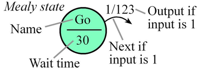

*Figura 7.8: Diagrama de stări a automatului finit Button-LED.*

iar reprezentarea tabelara a autmatului fiid ca in tableulu 7.1 unde fiecare stare este definita prin un rand al tabelului continand descrierea starii curente prin retinerea in stare, valoarea generata la iesireși tranzitiile dependente de intrare.
**Tabelul 7.1:** Tabel de stări pentru automatul Button-LED

| Num | Name | Out | Delay | In = 0 | In = 1 |
|---|---|---|---|---|---|
| 0 | LED_OFF | 0 | 100 ms | LED_OFF | LED_ON |
| 1 | LED_ON | 1 | 100 ms | LED_ON | LED_OFF |
Perntru implemnentare in cod C, se va defini o structura de definire a unei stari, care va sta la baza definirii automatului finit, care va reflecta unu la unu reprezentare tabelara a automatului finit. aceasta definire a automatului pentru aplicatia Button-Led se va prezenta ca in listingul 7.3.

**Listing 7.3: Exemplu de automat finit Button-LED în C**
```c
#define LED_OFF_STATE 0
#define LED_ON_STATE 1

struct State {
  unsigned long Out;   // Led State
  unsigned long Time;   // delay in 10 ms units
  unsigned long Next[2]; // next state for inputs 0,1
};
typedef const struct State STyp;

STyp FSM[2] = {
  {0, 10, {LED_OFF_STATE, LED_ON_STATE}},
  {1, 10, {LED_ON_STATE, LED_OFF_STATE}}
};
```
Pentru a pune in functiune atomatul de contro al aplicatiei Button-LED va fi necesara
initializarea periferiilor, cat și stabilirea starii initiale a automatului, aici - LED OFF.

**Listing 7.4: Inițializare hardware și stare automat finit Button-LED**
```c
int FSM_State = LED_OFF_STATE;

void setup() {
  // Init Button
  pinMode(BUTTON_PIN, INPUT);
  // Init LED
  pinMode(LED_PIN, OUTPUT);
  // Init Initial State
  FSM_State = LED_OFF_STATE;
}
```
Funcția principală loop() va implementa logica de evaluare a automatului finit prezentata mai sus respectand acei 4 pasi, dar și medelul automatului Moore, unde iesirea depinde doar de starea curenta. Astfel implementarea functiei loop() va arata ca in listingul 7.5.

**Listing 7.5: Funcția principală loop() pentru automatul finit Button-LED**
```c
void loop() {
  // 1. Output Based on current state
  int output = FSM[FSM_State].Out;
  digitalWrite(LED_PIN, output);
  
  // 2. wait for time relevant to state
  delay(FSM[FSM_State].Time * 10);
  
  // 3. Get Input
  int input = digitalRead(BUTTON_PIN);
  
  // 4. Change state based on input and current state
  FSM_State = FSM[FSM_State].Next[input];
}
```
## 7.2 Sarcina de laborator
### 7.2.1 Partea 1: Control comportamental cu Automate Finite – ButtonLED
Se cere realizarea unei aplicații embedded care implementează un automat finit pentru controlul unui LED, în funcție de apăsarea unui buton. Sistemul va avea două stări:

LED-ul stins (OFF) și LED-ul aprins (ON). Tranziția între aceste stări se va efectua la fiecare apăsare validă a butonului, cu implementarea logicii de debounce pentru eliminarea fluctuațiilor nedorite. Starea curentă a LED-ului va fi afișată în timp real prin interfața serială (printf) sau pe un LCD (2x16 sau 4x20), utilizând biblioteca STDIO sau LCD.
### 7.2.2 Partea 2: Control comportamental cu Automate Finite – Semafor
Inteligent
Să se proiecteze și să se implementeze o aplicație embedded pentru controlul unui semafor inteligent la o intersecție în cruce cu două direcții de trafic: Est-Vest și Nord-Sud.

Semaforul trebuie să comute prioritatea între direcții pe baza unei cereri active, simulată prin apăsarea unui buton sau activarea unui senzor digital. În lipsa cererii pentru direcția Nord, prioritatea va fi acordată direcției Est, care va rămâne verde. Tranzițiile de semnalizare vor respecta secvența rutieră, trecând de la verde la galben și apoi la roșu.

Durata fiecărei stări (verde, galben, roșu) va fi gestionată cu delayuri folosind funcțiile FreeRTOS, precum vTaskDelay sau vTaskDelayUntil. Controlul semaforului va fi realizat printr-un automat finit (FSM) pentru fiecare direcție. Cererea de traversare va fi generată prin apăsarea unui buton sau activarea unui senzor de proximitate, iar starea curentă a semaforului va fi afișată pe interfața STDIO, fie pe Serial, fie pe LCD.

**Cerințe suplimentare:** Pentru lucrările cu automate finite (FSM) în sisteme electronice incorporate, respectați următoarele recomandări pentru structură și validare:
- Structurați aplicația modular, separând logica FSM într-un modul software dedicat.
- Utilizați diagrame de stare pentru a vizualiza stările și tranzițiile automatului.
- Implementați debouncing software pentru butoane sau senzori digitali.
- Dacă folosiți FreeRTOS, creați taskuri dedicate pentru fiecare componentă majoră (FSM, buton, LED, afișare).
- Pentru comunicarea între taskuri, utilizați semafoare binare sau variabile globale protejate (mutex).
- Reutilizați modulele pentru butoane, LED-uri și interfață de afișare.
- Testați fiecare tranziție de stare conform scenariilor de validare definite.
- Documentați clar arhitectura, diagramele de stare, interfețele HW/SW și scenariile de testare.
- Consultați resursele teoretice despre FSM și proiectare modulară.
- Sistemul trebuie să răspundă la schimbarea semnalului cu o latență sub 100ms.
- Afișați starea curentă și evenimentele relevante catre STDIO prin interfața serială sau LCD.
- utilizati instrumente de analiză și vizualizare a datelor (ex.: Arduino Serial Plotter) pentru a monitoriza performanța sistemului în timp real.

**Materiale și resurse necesare pentru realizarea lucrării:**
- Componente hardware: microcontroler compatibil (ESP32, STM32, Arduino),
LED-uri roșu, galben, verde (semafor), buton cu rezistență pull-up/pull-down, rezistor 220 Ω pentru LED, breadboard, cabluri de conexiune, sursă de alimentare USB/baterie, senzori digitali pentru cerere Nord (opțional).
- Resurse software: Visual Studio Code cu PlatformIO, biblioteci STDIO (Serial),
LiquidCrystal_I2C, FreeRTOS, simulator hardware (Proteuș Wokwi), emulator terminal serial (Monitor Serial PlatformIO, TeraTerm, Putty), instrument de diagrame (draw.io, Lucidchart).

**NOTĂ:** Realizarea sarcinii se va desfășura în două etape distincte, definite ca două probleme în cadrul lucrării de laborator. Aceste probleme vor fi realizate conform metodologiei prezentate în anexa de problemă rezolvată. Fiecare etapă va fi documentată conform cerințelor metodologice, incluzând cerințe, schițe arhitecturale, diagrame de flux, scenarii de testare și rezultatele obținute. Fiecare parte a lucrării (problema) este planificată pentru o ședință de 2 ore academice.

### Mersul lucrării
1. Sa se analizeze și sa se inteleaga Sarcina lucrarii de laboratorși anume Analiza situației în domeniu și Contextul tehnologic al aplicației dezvoltate conform sectiunii
1.1.
2. sa se falmiliarizeze cu problema propusa spre elaborareși sa se identifice obiectivele și sarcina individuala vezi A.1.1.
3. Sa se analizeze componentgele și resursele untilizate in realizarea aplicatiei din cadrul lucrarii de laborator.
4. In urma analizei sarcinii lucrarii și definitiei problemei propuse, sa se defineasca un set de cerinte tehnice acoperind aspectele funcitionale și nefunctionale ale problemei, vezi A.1.2
5. In urma analizei cerintelor tehnice elaborate sa se defineasca scenarii de testare și criteriilor de validare cu minim 1 test per cerinta care sa raspunda la intrebarea cum ma asigur ca cerinta se satidface, vezi A.1.3
6. sa se identifice componentele ce compun sistemul aplicatiei, sa se organizeze intr-o lista cu descrierea rolului acerstora in aplicatie.
7. Sa se realizeze diagrama structurala cu reprezentarea componentelor și interactiunii intre acestea asa cum este prezentat in sectiunea A.1.4
8. Sa se realizeze arhitectura pe nivele pentru interfata hardware-software pentru fiecare dintre interfete vezi A.1.4.
9. Sa se realizeze diagramele de comportament pentru functionalitatile Componentelor cu diagrame de de flux stari sau de secvență, dupa caz, ca in A.1.5
10. sa se elaboreze schita electrica a aplicatiei intr-un mediu de simulare, vezi A.1.6.
11. sa se creeze structura de directoare și fisiere pentru implementarea aplicatiei care va reflecta arhitectura definita de sistemși de interfata hardware Software vezi A.1.7.
12. Sa se implementeze driverele de interfata hardware-software pentru fiecare componenta electronica utilizata in aplicatie acoperind nivelele ECAL și SRV dupa cazA.1.7.
13. Sa se implementeze comportamentul aplicatiei urmand diagrama de flux definita,
A.1.7.
14. Sa se simuleze functionare aplicatia in medii precum Wokwi sau PlatformIO. cu o eventuala rulare pe hardware real.
15. Sa se testeze și valideze aplicatia conform scenariilor de testare și criteriilor de validare definite anterior, vezi exemplu in A.1.8.
16. sa se documenteze rezultatele testarii cu observatii și recomandari pentru imbunatatiri,
A.1.8.
17. Sa se optimizeze aplicatia pe baza rezultatelor testarii și validarii
18. sa se documenteze toate etapele realizate in cadrul lucrarii de laborator conform cerintelor pentru raportul lucrarii de laborator expuse in 1.1.5.

### Întrebări de control
1. Ce este un automat finit și care sunt elementele sale (stări, tranziții, evenimente)?
2. Cum se implementează un FSM în limbaj C/C++ pentru microcontrolere?
3. Ce este debouncing-ul și de ce este necesar în gestionarea unui buton?
4. Cum se poate monitoriza starea automatului în timp real prin interfața serială sau
LCD?
5. Care sunt avantajele separării logicii FSM într-un modul dedicat?
6. Ce beneficii aduce extinderea FSM-ului cu o stare suplimentară în funcționalitatea aplicației?
7. Ce este un automat finit și cum se aplică în controlul semafoarelor?
8. Cum se utilizează FreeRTOS pentru a sincroniza taskuri și a controla temporizările?
9. Ce rol are semaforul binar în comunicarea între taskuri?
10. Cum se gestionează cererile multiple în cadrul automatului finit?
11. Care sunt avantajele controlului bazat pe cerere în intersecțiile inteligente?
12. Ce îmbunătățiri pot fi aduse sistemului pentru creșterea siguranței și eficienței?

## 7.5 Grila de evaluare a lucrării de laborator
1. Analiza sarcinii și contextului tehnologic (12p)
  a. Analiza situației în domeniu și contextul tehnologic (1.1) (4p)
  b. Identificarea resurselor externe și referințe în bibliografie (4p)
  c. Analiza componentelor și resurselor utilizate (4p)
2. Definirea cerințelor tehnice și scenariilor de testare (13p)
  a. Identificarea obiectivelor și sarcinii individuale (A.1.1) (3p)
  b. Formularea cerințelor funcționale și non-funcționale (A.1.2) (5p)
  c. Definirea scenariilor de testare și criteriilor de validare (A.1.3) (5p)
3. Proiectarea arhitecturală și modelare comportamentală (18p)
  a. Listarea componentelor și descrierea rolului fiecăreia (3p)
  b. Diagrama structurală cu componente și interacțiuni (A.1.4) (4p)
  c. Arhitectura pe nivele pentru interfața hardware-software (4p)
  d. Diagrame comportament pentru funcționalități (flux, stări, secvență) (A.1.5) (7p)
4. Proiectarea și simularea schiței electrice (13p)
  a. Elaborarea schiței electrice în mediu de simulare (A.1.6) (4p)
  b. Reprezentarea corectă a conexiunilor și dimensionarea componentelor (2p)
  c. Simularea funcționării aplicației în medii precum Wokwi/PlatformIO (3p)
  d. Rularea aplicației pe HW real (10p)
5. Implementarea software modulară (18p)
  a. Structura de directoare și fișiere conform arhitecturii (A.1.7) (4p)
  b. Implementarea de interfață HW-SW conform proiectării în detaliu (6p)
  c. Implementarea comportamentului aplicației conform proiectării în detaliu (6p)
  d. Comentarii explicative și documentare în cod (2p)
6. Simulare, testare și validare (16p)
  a. Testarea și validarea conform scenariilor definite (A.1.8) (8p)
  b. Documentarea rezultatelor testării, observații și recomandări (5p)
  c. Optimizarea aplicației pe baza rezultatelor testării și validării (3p)
7. Documentare finală (10p)
  a. Documentarea etapelor realizate conform cerințelor raportului (1.1.5) (5p)
  b. Observații, recomandări, concluzii generale (5p)
Total: 100p
ANEXA A
Resurse de referinta pentru realizarea lucrarilor de laborator A.1
Proiect - Aplicatie Buton-LED
Dezvoltarea aplicațiilor cu sisteme electronice incorporate presupune un proces structurat, care implică atât aspecte hardware, cât și software, și necesită o abordare metodică pentru a obține funcționalitate, eficiență și fiabilitate. Acest proces se desfășoară în mai multe etape, fiecare având un rol clar în realizarea unei aplicații robuste. În continuare sunt prezentate aceste etape, cu accent pe importanța lor în dezvoltarea sistemelor electronice incorporate.

A.1.1
Definirea Problemei
Proiectarea unei aplicații bazate pe microcontroler entru controlul unui LED prin intermediul unui buton. Aplicația trebuie să detecteze apăsarea butonului, să schimbe starea LED-ului la fiecare apăsare validă și să implementeze logica de debounce. Sistemul trebuie să răspundă în mai puțin de 100 ms. Realizarea sarcinii va urma procesul de proiectare care va include etapele de,proiectare arhitecturală, dezvoltare hardware și software, simulare, testare și validare

**Materiale și resurse necesare pentru realizarea lucrării:**

- Componente hardware: microcontroler (Arduino Uno, ESP32 sau similar), LED-uri, buton, rezistori (220 Ω pentru LED și 10k Ω pentru buton), placă de prototipare (breadboard), cabluri de conexiune (jumper wires), sursă de alimentare (USB sau baterie, în funcție de microcontroler).
- Resurse software: Visual Studio Code cu extensia PlatformIO instalată, simulator hardware (opțional, ex.: Proteuș Wokwi), emulator terminal serial (ex.: Monitor Serial din PlatformIO, TeraTerm sau Putty), instrument de construire diagramelor (ex.: draw.io, Lucidchart).

### A.1.2 Definierea cerintelor tehnice al aplicației
Primul pas în proiectarea unei aplicații constă în definirea clară a cerințelor. Aceasta presupune identificarea scopului aplicației și a funcțiilor pe care trebuie să le îndeplinească.

Cerințele funcționale descriu comportamentul dorit al sistemului, cum ar fi controlul unui LED prin intermediul unui buton, iar cerințele non-funcționale includ aspecte precum performanța, costul, dimensiunea și fiabilitatea. Se stabilesc resursele hardware și software necesare, precum și constrângerile care pot influența designul.

Cerințele sunt formulate sub forma unei sarcini tehnice pentru dezvoltarea aplicației, incluzând descrierea clară a modului de interacțiune între componentele hardware și soft105ware. Aceste specificații oferă o bază pentru proiectarea arhitecturală și dezvoltarea ulterioară a aplicației.

NOTA: În cadrul lucrărilor de laborator, cerințele sunt formulate ca sarcini de laborator propuse spre realizare.

In conformitate cu sarcina lucrării, se vor extrage un set de cerinte funcționale și nonfuncționale pentru aplicația de control al LED-ului prin intermediul butonului. Aceste cerințe vor ghida proiectarea și implementarea aplicațieiși validarea acesteia în etapele ulterioare. Cerintele pentru aplicatia de control al LED-ului sunt urmatoarele prezentate in tabelul A.1 unde prefixul RF este pentru cerintele functionale iar RNF pentru cele nefunctionale.
**Tabelul A.1:** Cerințele aplicației de control al LED-ului prin intermediul butonului

| ID | Tip Cerință | Cerință |
|---|---|---|
| RF01 | Funcțională | Aplicația trebuie să detecteze apăsarea butonului prin citirea semnalului digital de la pinul de intrare. |
| RF02 | Funcțională | Aplicația trebuie să schimbe starea LED-ului (pornit/oprit) la fiecare apăsare validă a butonului. |
| RF03 | Funcțională | Aplicația trebuie să implementeze o logică de debounce pentru buton, pentru a evita fluctuațiile semnalului. |
| RNF01 | Nefuncțională | Aplicația trebuie să răspundă la apăsarea butonului în mai puțin de 100 ms. |
| RNF02 | Nefuncțională | Sistemul trebuie să fie optimizat pentru consum redus de energie. |
| RNF03 | Nefuncțională | Circuitul hardware trebuie să fie compact și să utilizeze componente cu cost redus. |
| RNF04 | Nefuncțională | Aplicația trebuie să fie ușor de întreținut și extins. |

Pe parcursul dezvoltatorii aplicației, aceste cerințe vor fi utilizate pentru a ghida proiectarea și implementarea sistemului, asigurându-se că toate aspectele funcționale și non-funcționale sunt îndeplinite. Validarea aplicației va fi realizată prin testarea funcționalității și performanței sistemului, conform acestor cerințe, asigurându-se că aplicația funcționează conform așteptărilor și că îndeplineste standardele de calitate stabilite.

Pe parcursul dezvoltării aplicației pot apărea aspecte neprevăzute în cerințele inițiale, necesitând actualizarea acestora pentru a reflecta noile condiții sau constrângeri. Revizuirea și actualizarea cerințelor asigură că aplicația rămâne aliniată contextului și cerințelor reale pe tot parcursul ciclului de dezvoltare. Orice modificare adusă cerințelor trebuie documentată prin completarea setului de cerințe.
### A.1.3 Definirea criteriilor de validare a aplicației
După definirea cerințelor, se stabilesc criteriile de validare a aplicației. Aceste criterii definesc modul de evaluare a funcționalității și performanței sistemului, pentru a verifica dacă sunt îndeplinite cerințele tehnice stabilite anterior. Criteriile de validare acoperă testarea funcționalității, verificarea performanței, evaluarea fiabilității și conformitatea cu standardele de calitate. Prin aplicarea acestor criterii se poate demonstra că aplicația funcționează corect și răspunde cerințelor definite, inclusiv în condiții reale de operare.

Pentru validarea aplicației, se vor defini scenarii de testare care vor fi utilizate pentru a verifica funcționalitatea acesteia conform cerințelor stabilite. Aceste scenarii vor include teste pentru verificarea funcționalității LED-ului și a butonului, precum și teste pentru evaluarea performanței și fiabilității sistemului. De exemplu, un scenariu de testare poate include apăsarea butonului și verificarea dacă LED-ul se aprinde sau se stinge corespunzător.

Testarea și validarea corectă a soluțiilor se realizează pe baza unor criterii de validare definite încă din procesul de definire a cerințelor. Scenariile de testare și criteriile de validare sunt strâns legate de cerințele tehnice, având rolul de a verifica dacă soluțiile implementate îndeplinesc aceste cerințe.

Pentru fiecare cerință funcțională sau nefuncțională, se defineste un set de scenarii de testare (teste) care verifică dacă aplicația funcționează conform așteptărilor. Fiecare cerință trebuie să fie acoperită de cel puțin un test care să valideze îndeplinirea acesteia.

De exemplu, pentru cerințele funcționale și nefuncționale prezentate anterior, testele pot include:

**Tabelul A.2:** Scenarii de testare și criterii de validare

| Test ID | Scenariu Test | Criteriu validare Pass/Fail |
|---|---|---|
| RF01_T01 | Se apasă butonul o singură dată și se verifică dacă aplicația detectează corect tranzitia butonului (apăsat). | LED-ul reacționează imediat la tranzitie de apasarea butonului. |
| RF01_T02 | Se eliberează butonul dupa apasare și se verifică dacă aplicația detectează corect tranzitia butonului (eliberat). | LED-ul nu reactioneaza in nici un fel la eliberarea butonului. |
| RF02_T01 | Cand LED-ul e in stare aprins, Se apasă butonul o singură dată și se verifică dacă LED-ul își schimbă starea in stare stinsă. | LED-ul își schimbă starea de la aprins la stins. |
| RF02_T02 | Cand LED-ul e in stare stins, Se apasă butonul o singură dată și se verifică dacă LED-ul își schimbă starea in stare aprinsă. | LED-ul își schimbă starea de la stins la aprins. |
| RF02_T03 | Se apasă butonul de mai multe ori succesiv și se verifică dacă LED-ul își schimbă starea corespunzător la fiecare apăsare. | LED-ul își schimbă starea corespunzător la fiecare apăsare. |
| RF03_T01 | Se apasă butonul rapid de mai multe ori (3 ori in 30ms) și se verifică dacă aplicația ignoră fluctuațiile semnalului și schimbă starea LED-ului doar o singură dată pentru fiecare apăsare. | LED-ul își schimbă starea o singură dată pentru fiecare apăsare validă. |
| RF03_T02 | Se ține apăsat butonul pentru o perioadă lungă de timp și se verifică dacă aplicația nu schimbă starea LED-ului de mai multe ori în timpul unei singure apăsări. | LED-ul nu își schimbă starea de mai multe ori în timpul unei singure apăsări. |
| RNF01_T01 | Se măsoară timpul de răspuns al aplicației la apăsarea butonului și se verifică dacă acesta este sub 100 ms. | Timpul de răspuns este sub 100 ms. |
| RNF01_T02 | Se apasă butonul în mod repetat și se verifică dacă timpul de răspuns al aplicației rămâne constant sub 100 ms. | Timpul de răspuns rămâne constant sub 100 ms. |
| RNF03_T01 | Se verifică dacă circuitul hardware este compact și toate componentele sunt conectate corect. | Circuitul este compact și componentele sunt conectate corect. |
| RNF03_T02 | Se evaluează costul componentelor hardware utilizate și se verifică dacă acestea sunt eficiente din punct de vedere al costului. | Costul componentelor este sub limita specificată. |
| RNF04_T01 | Se verifică dacă aplicația este modulară și componentele software (driverele de buton și LED) pot fi utilizate în alte proiecte. | Componentele sunt reutilizabile. |
| RNF04_T02 | Se testează aplicația în medii de simulare (de exemplu, Wokwi sau PlatformIO) și se verifică dacă aceasta funcționează corect în condiții simulate. | Aplicația funcționează corect în medii simulate. |

### A.1.4 Proiectarea arhitecturală a sistemului Buton-LED
După definirea cerințelor, se trece la proiectarea arhitecturală a sistemului. Această etapă implică crearea unei structuri generale a aplicației, incluzând schema bloc funcțională, care descrie interacțiunea dintre componentele hardware și software. Diagrama de flux a aplicației software detaliază logica programului, iar schema electrică a circuitului hardware prezintă conexiunile între componentele electronice. Proiectarea arhitecturală este crucială pentru a asigura o integrare eficientă între hardware și software.

Reieșind din cerințele definite, se va realiza o proiectare arhitecturală a aplicației realizând cel puțin cele 3 tipuri de diagrame specifice pentru sistemele incorporate: Structurală de sistem al aplicației, Interfața hardware-software, Diagrama de flux a componentelor aplicației software.

Diagrama structurală de sistem al aplicației va prezenta componentele hardware și software ale sistemului, cum ar fi LED, Buton, și algoritmul de funcționare al aplicației, precum și relațiile dintre acestea. Această diagramă oferă o vedere de ansamblu asupra arhitecturii aplicației și ajută la identificarea componentelor cheie.

De exemplu, în cazul aplicației de control al LED-ului prin intermediul butonului, diagrama structurală de sistem poate include următoarele componente:
- Buton: Componenta hardware care detectează apăsarea utilizatorului.
- LED: Componenta hardware care indică starea aplicației (aprins/oprit).
- Aplicație software: Codul care controlează logica de funcționare a sistemului, inclusiv citirea butonului și controlul LED-ului.

Aceste componente sunt interconectate pentru a forma un sistem funcțional, care poate fi reprezentat grafic printr-o diagramă structurală de sistem, așa cum este prezentat în Figura A.1, reprezentand un exemplu simplificat al aplicației de control al LED-ului prin intermediul butonului. Aici se prezintă fluxul general al sistemului, unde un buton acționează asupra unei aplicații software care controlează un LED.

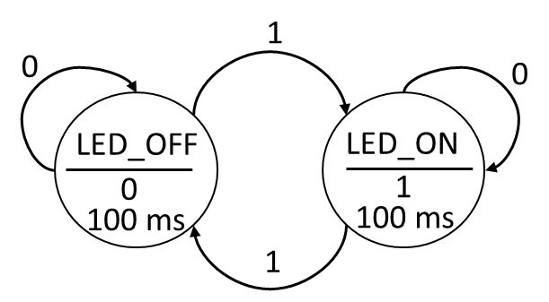

*Figura A.1: Diagrama structurală de sistem al aplicației*

Interfata hardware-software, care defineste modul în care software-ul interacționează cu componentele hardware Aceasta prezintă componentele principale ale sistemului și modul în care acestea interacționează. De exemplu, poate include microcontrolerul, LEDurile, butoanele și alte periferice.

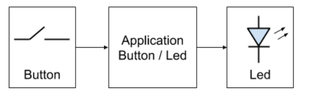

*Figura A.2: Interfata Hardware-Software pe nivele de abstractizare*

### A.1.5 Proiectarea in detaliu a aplicației software

**Componentele de control al LED-ului**

Arhitectura stratificată a aplicației de control al LED-ului permite o separare clară a responsabilităților și facilitează dezvoltarea, testarea și mentenanța aplicației. In Figura A.3 este prezentată o diagramă care ilustrează aceste straturi și modul în care acestea interacționează pentru a controla LED-ul. Această diagramă evidențiază fluxul de date și control între straturi, de la nivelul aplicației până la nivelul hardware-ului.

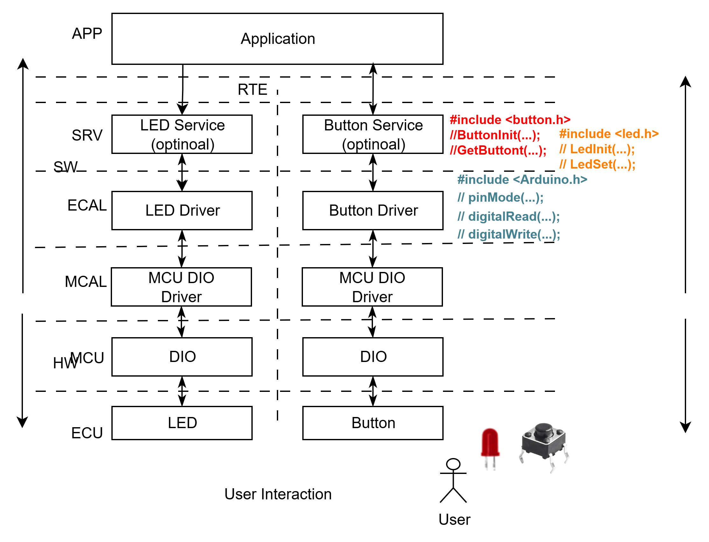

*Figura A.3: Arhitectura stratificată a aplicației de control al LED-ului*

Componentele de control al LED-ului sunt organizate pe mai multe straturi, fiecare având un rol specific în gestionarea interacțiunii cu hardware-ul de iluminare. Această organizare stratificată permite abstractizarea detaliilor de implementare și facilitează portabilitatea aplicației pe diverse platforme hardware. Straturile acestei interacțiuni reprezintă lanțul de componente software și hardware care gestionează controlul LED-ului:
- La nivelul SRV: se pot realiza functionalitati complexe de lucru cu mai multe LEDuri, e.g RGB led, sau matrici, daca e cazul.
- La nivelul ECAL: driverul de control al LED-ului care oferă funcții de abstractizare precum:
  - led_init() - pentru inițializarea LED-ului
  - led_on() - pentru aprinderea LED-ului
  - led_off() - pentru stingerea LED-ului
  - led_status() - pentru verificarea stării LED-ului (opțional)
- La nivelul MCAL: funcțiile de control al pinilor digitali din librăria “Arduino.h”:
  - pinMode() - pentru configurarea pinului ca ieșire
  - digitalWrite() - pentru setarea stării pinului (HIGH/LOW)
  - digitalRead() - pentru citirea stării curente a pinului
- La nivelul MCU: pinul specific al microcontrolerului la care este conectat LED-ul, care poate fi configurat pentru a controla starea LED-ului.
- La nivelul ECU: LED-ul și componentele electronice care asigură conectivitatea fizică între microcontroler și LED, care poate include rezistoare de limitare a curentului și conexiuni pe o placă de prototipare (breadboard) sau direct pe placa de dezvoltare.

Funcționalități din stratul SRV nu sunt necesare în acest caz, deoarece aplicația este simplă și nu necesită funcționalități avansate de control, dar dacă ar fi necesar, s-ar putea implementa funcții de control al mai multor LED-uri sau funcții de control al intensității luminoase pentru LED-uri RGB sau matrici de LED-uri.

Driverul de control al LED-ului din stratul ECAL este responsabil pentru gestionarea comunicației între aplicație și LED, oferind funcții de abstractizare pentru controlul LED-ului. Acesta va include următoarele funcții:
- led_init() - pentru inițializarea LED-ului și configurarea pinului asociat ca ieșire.

    Această funcție va seta pinul LED-ului ca ieșire și va inițializa starea LED-ului la una configurata (de obicei stins). Această funcție va fi apelată la începutul aplicației pentru a asigura funcționarea corectă a LED-ului. Diagrama de flux pentru această funcție este prezentată în figura A.4. led_init()
Setează pinul LED ca ieșire Setează LED stare initiala return

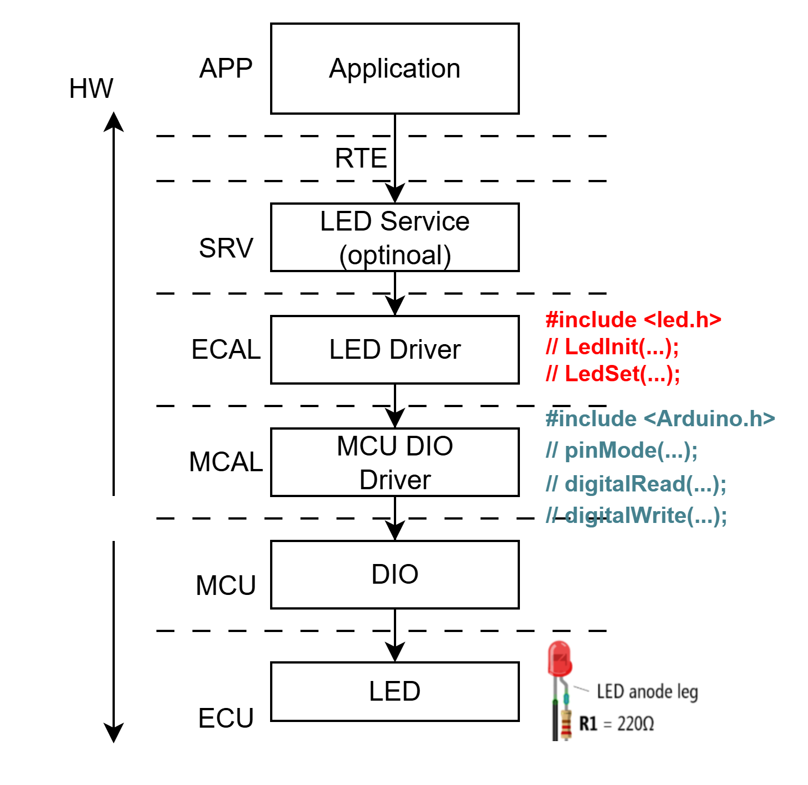

*Figura A.4: Diagrama de flux: inițializarea LED-ului*

- led_on() - pentru aprinderea LED-ului prin setarea pinului la nivelul LED_ON.

    Această funcție va configura pinul LED-ului la nivelul logic corespunzător pentru aprindere. Este important de remarcat că nivelul logic necesar (LED_ON) depinde de configurația de conexiune a LED-ului: pentru un LED cu catod comun se va utiliza nivelul HIGH, iar pentru un LED cu anod comun se va utiliza nivelul LOW.

Schema electronică de conectare determină acest comportament. Diagrama de flux pentru această funcție este prezentată în figura A.5.

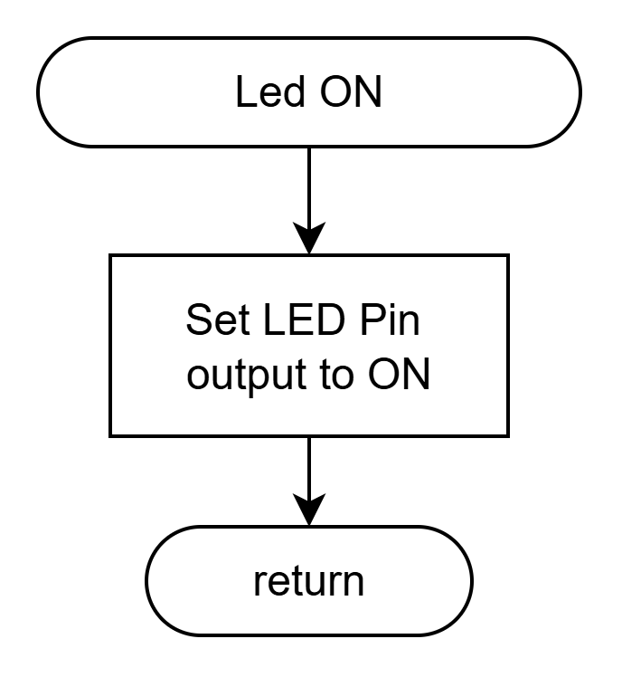

*Figura A.5: Diagrama de flux: aprinderea LED-ului*

- led_off() - pentru stingerea LED-ului prin setarea pinului la nivelul LED_OFF.

    Această funcție va seta pinul LED-ului la nivelul LED_OFF, stingând astfel LEDul. Remarka că valoarea valida pentru stins depinde de tipul de LED utilizat (anod comun sau catod comun), cat și de schema de conectare a LED-ului. Diagrama de flux pentru această funcție este prezentată în figura A.6.

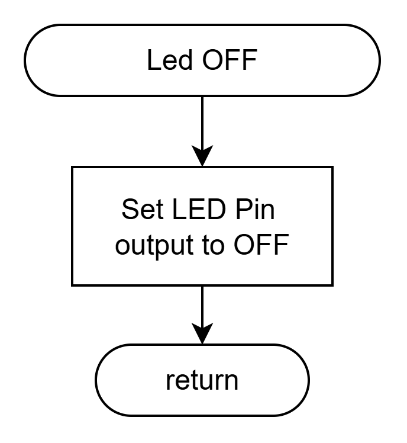

*Figura A.6: Diagrama de flux: stingerea LED-ului*

- led_status() - pentru verificarea stării LED-ului prin citirea stării pinului asociat.

    Această funcție va citi starea pinului LED-ului și va returna valoarea corespunzătoare (LED_ON sau LED_OFF) pentru a indica dacă LED-ul este aprins sau stins.

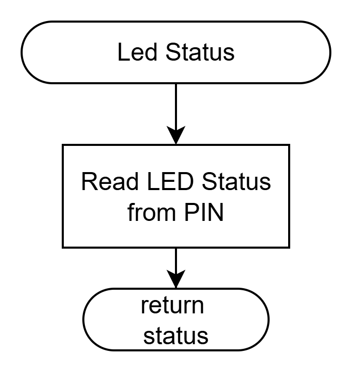

*Figura A.7: Diagrama de flux: verificarea stării LED-ului*

**Componentele de gestionare a butonului**

Componentele de gestionare a butonului sunt organizate pe mai multe straturi, similar cu cele ale LED-ului, fiecare având un rol specific în gestionarea interacțiunii cu hardwareul butonului. Această organizare stratificată permite abstractizarea detaliilor de implementare și facilitează portabilitatea aplicației pe diverse platforme hardware. Straturile acestei interacțiuni reprezintă lanțul de componente software și hardware care gestionază controlul butonului:
- La nivelul SRV: se pot realiza functionalitati complexe de lucru cu mai multe butoane, e.g. butoane multiple pentru controlul diferitelor LED-uri.
- La nivelul ECAL: driverul de control al butonului care oferă funcții de abstractizare precum: pentru inițializarea butonului, pentru citirea stării butonului,pentru verificarea dacă butonul este apăsat etc
- La nivelul MCAL: funcțiile de control al pinilor digitali din librăria “Arduino.h”:
  - pinMode() - pentru configurarea pinului ca intrare
  - digitalRead() - pentru citirea stării curente a pinului
- La nivelul MCU: pinul specific al microcontrolerului la care este conectat butonul, care poate fi configurat pentru a citi starea butonului.
- La nivelul ECU: butonul și componentele electronice care asigură conectivitatea fizică între microcontroler și buton, care poate include rezistoare de pull-up sau pull-down și conexiuni pe o placă de prototipare (breadboard) sau direct pe placa de dezvoltare.

Arhitectura stratificata a aplicației de gestionare a butonului este prezentata in figura A.8, care ilustrează modul în care componentele hardware și software interacționează pentru a gestiona starea butonului și a permite aplicației să reacționeze la acțiunile utilizatorului.

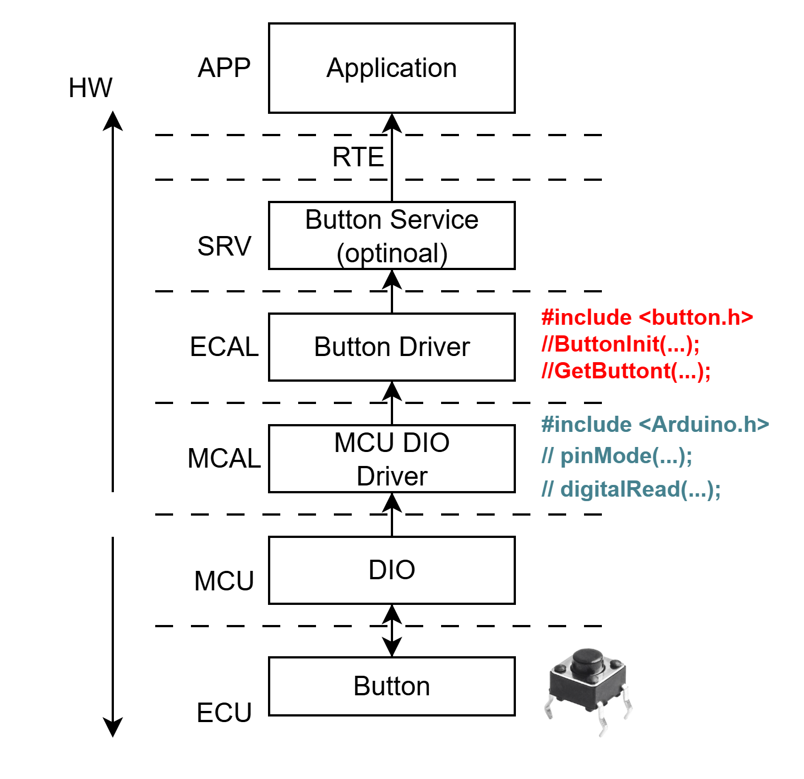

*Figura A.8: Interfata Hardware-Software pe nivele de abstractizare pentru buton*

Funcționalități din stratul SRV nu sunt necesare în acest caz, deoarece aplicația este simplă și nu necesită funcționalități avansate de control, dar dacă ar fi necesar, s-ar putea implementa funcții de gestionare a mai multor butoane sau funcții de gestionare a stărilor butonului (de exemplu, apăsare lungă, apăsare scurtă).

Driverul de control al butonului din stratul ECAL este responsabil pentru gestionarea comunicației între aplicație și buton, oferind funcții de abstractizare precum:
- button_init() - pentru inițializarea butonului prin configurarea pinului asociat ca intrare.

    Această funcție va seta pinul butonului ca intrare și va configura rezistorul de pull-up intern (dacă este disponibil sau nu a fost folosit unul extern) pentru a asigura un nivel logic stabil când butonul nu este apăsat. Această funcție va fi apelată la începutul aplicației pentru a asigura funcționarea corectă a butonului. Diagrama de flux pentru această funcție este prezentată în figura A.9.

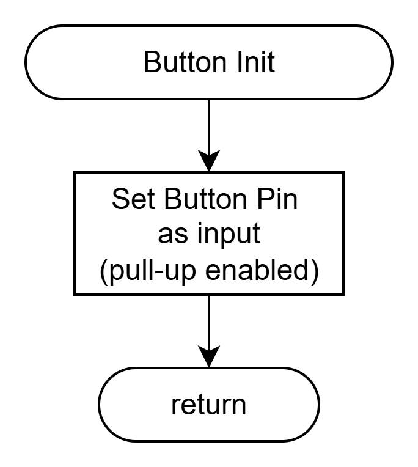

*Figura A.9: Diagrama de flux: inițializarea butonului*

- button_read() - pentru citirea stării butonului prin citirea stării pinului asociat.

    Această funcție va citi starea pinului butonului și va returna valoarea corespunzătoare (apăsat sau nu apăsat) pentru a indica dacă butonul este activat. Valoarea returnatadepinde de tipul de buton utilizat (normal deschis sau normal închis), cat și de schema de conectare a butonului. Diagrama de flux pentru această funcție este prezentată în figura A.10.

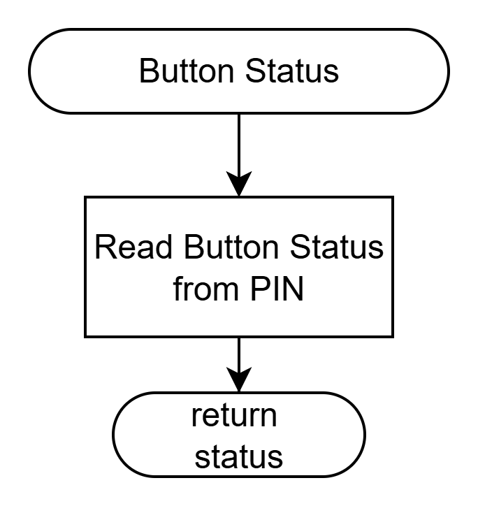

*Figura A.10: Diagrama de flux: citirea stării butonului*

- button_pressed() - pentru verificarea dacă butonul este apăsat prin citirea stării butonului și returnarea unui rezultat boolean (adevărat sau fals).

    Această funcție va apela button_read() și va verifica dacă starea butonului corespunde condiției de apăsare. Diagrama de flux pentru această funcție este prezentată în figura A.11.

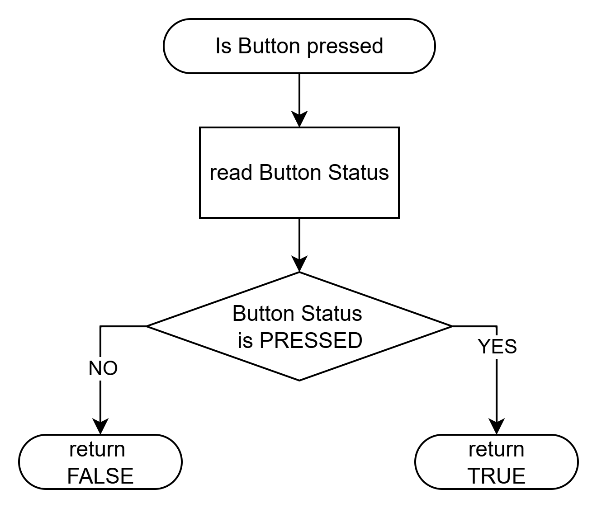

*Figura A.11: Diagrama de flux: verificarea stării butonului*

Aceste funcții vor fi implementate pentru a asigura o interacțiune eficientă cu butonul și pentru a permite aplicației să reacționeze la acțiunile utilizatorului.

**Diagrama de flux a componentelor aplicației software:**

Aceasta detaliază logica programului, inclusiv condițiile și ramificațiile care determină comportamentul aplicației.

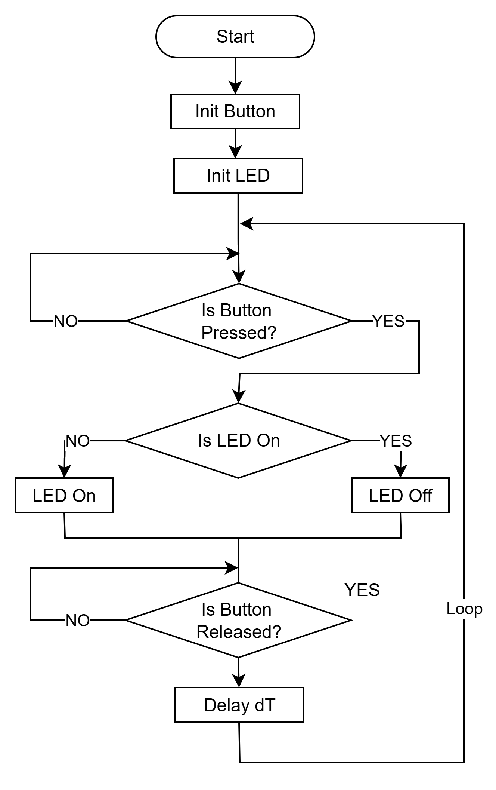

*Figura A.12: Schema bloc funcțională a sistemului și diagrama de flux a aplicației software*

Aceste diagrame facilitează dezvoltarea aplicației și clarifică modul de interacțiune dintre componentele hardware și software. Ele contribuie la organizarea implementării și testării sistemului, ajutând la respectarea cerințelor definite și la obținerea funcționării dorite.

### A.1.6 Elaborarea schitei electrice a circuitului aplicatiei

În această etapă, se selectează componentele hardware adecvate, cum ar fi microcontrolerul, LED-urile, butoanele și rezistorii. Se proiectează circuitul hardware, respectând principiile de proiectare, cum ar fi utilizarea rezistorilor pentru stabilizarea semnalului și protecția componentelor. Alegerea componentelor trebuie să țină cont de cerințele, aplicației și de constrângerile impuse.

Pentru implementarea aplicației, se va realiza o schiță electrică a circuitului utilizând editorul Wokwi. Aceasta va include un microcontroler reprezentat de o placă Arduino, un LED și un buton interconectate între ele, conform cerințelor aplicației. Schița electrică trebuie să fie clară, bine organizată și să respecte modelul arhitectural al sistemului.

În Figura A.13 este prezentată o schiță electrică exemplificativă, care satisface cerințele sarcinii.

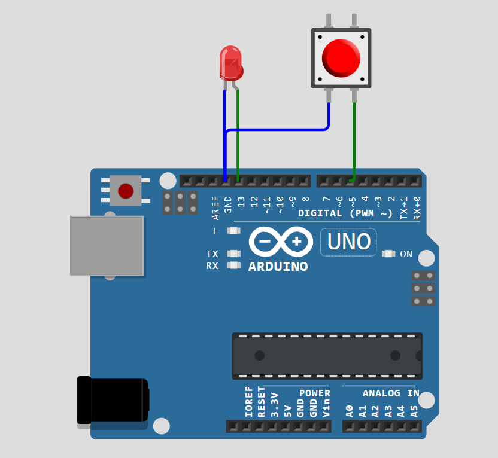

*Figura A.13: Schita electrica in Wokwi pentru aplicatia Button-LED*

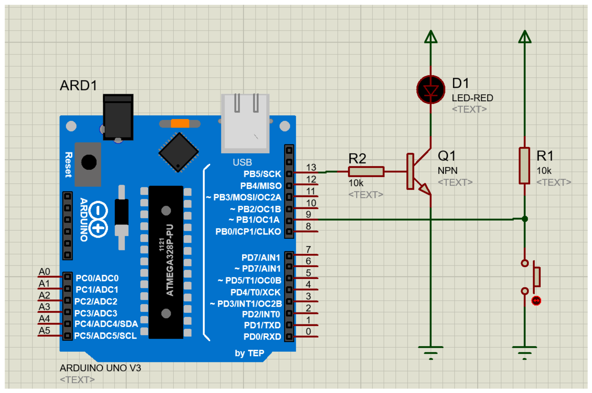

*Figura A.14: Schema electrica reala pentru aplicatia Button-LED*

in cazul in care nu se doreste simularea in Proteușcu componenta Arduino, se poate folosi leibrariile pentru Proteușdisponibile la dupa referinta [22] Schița electrică corespunde configurației listingului A.1. Aceasta include un microcontroler Arduino Uno, un LED roșu și un buton conectate la pinul digital 13 al microcontrolerului. În scop de simulare, au fost omise rezistoarele de limitare a curentului și cele de tip pull-up. Totuși, în realizarea fizică a circuitului, aceste componente trebuie incluse pentru a asigura funcționarea corectă și protecția circuitului, cum e prezentat in Figura A.14.

**Listing A.1: Configurația hardware în Wokwi**
```json
{
 "version": 1,
 "editor": "wokwi",
 "parts": [
  {
   "type": "wokwi-arduino-uno",
   "id": "uno",
   "top": 0,
   "left": 0,
   "attrs": {}
  },
  {
   "type": "wokwi-led",
   "id": "led1",
   "top": -99.6,
   "left": 99.8,
   "attrs": {
    "color": "red"
   }
  },
  {
   "type": "wokwi-pushbutton",
   "id": "btn1",
   "top": -106.2,
   "left": 156.6,
   "rotate": 90,
   "attrs": {}
  }
 ],
 "connections": [
  [ "led1:A", "uno:13", "green", [ "v0" ] ],
  [ "led1:C", "uno:GND.1", "blue", [ "v0" ] ],
  [ "btn1:1.r", "uno:5", "green", [ "v0" ] ],
  [ "btn1:2.r", "uno:GND.1", "blue", [ "v19.4", "h-77" ] ]
 ],
 "dependencies": {}
}
```
Este necesar să se asigure că această configurație este compatibilă și poate fi rulată în PlatformIO. Verificați fișierul platformio.ini pentru a vă asigura că sunt specificate corect placa de dezvoltare și cadrul de lucru. De asemenea, asigurați-vă că fișierul diagram.json este plasat în directorul proiectului și că toate conexiunile hardware sunt definite corect.

A.1.7
Dezvoltarea resurselor software pentru aplicatia buton LED
Dezvoltarea software presupune implementarea aplicației, care include inițializarea componentelor hardware, scrierea funcțiilor pentru controlul LED-ului și citirea stării butonului, precum și logica principală a aplicației. Soluțiile software trebuie să fie organizate în componente pentru a asigura modularitatea și să fie bine structurate, facilitând întreținerea și reutilizarea în proiecte viitoare. In acest context vom identifica doua tipuri de componente software:
- Componente de aplicație care implementează logica de comportament al aplicației conform cerințelor tehnice.
- Componente de interfața hardware-software care implementează suport pentru periferice, fiind numite și drivere de componente electronice.

Proectare componentelor de interfața hardware-software Reieșind din diagramele arhitecturale de sistem, observăm că aplicația va interacționa cu două componente electronice: Buton și LED. Această interacțiune va fi realizată prin intermediul interfețelor hardware-software, implementate sub formă de drivere dedicate.
- Driver de LED pentru controlul stării LED-ului.
- Driver de Buton pentru citirea stării butonului.

De asemenea, aceste drivere de componente electronice vor interacționa la nivelul de jos cu microcontrolerul prin intermediul librăriei Arduino, care oferă funcții pentru manipularea pinilor de intrare/ieșire. Aceasta mai este numită și MCAL (Microcontroller Abstraction Layer) sau Driver de microcontroler. in scopul aplicatiei driverele Button și LED vor utiliza din libraria Arduino funcțiile:
- pinMode() pentru a configura pinul ca intrare sau ieșire,
- digitalWrite() pentru a seta starea pinilor,
- digitalRead() pentru a citi starea pinilor.

Driverele de componente electronice Button și LED vor fi realizate în concordanță cu cerințele tehnice definite anterior, și modelele arhitecturale ale aplicației. Fiecare componentă va fi definită într-un folder care va contține fișiere header *.h pentru definirea interacțiunilor și cod sursă *.cpp. pentru implementarea functionalitatilor, vezi Figura A.15.

Componentele pot fi amplasate în directorul src al proiectului sau în lib, pentru a asigura un acces mai eficient la ele în cadrul proiectului.

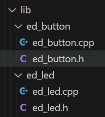

*Figura A.15: Structura de fisiere pentru componente software*

Interfata cu driverul Button va fi definita in fișierul header *.h, care va include declarațiile funcțiilor de interfata care reieșind din modelarea arhitecturală, unde se ob-serva ca că aplicația are nevoie să verifice starea butonului, dacă este apăsat. De asemenea, va fi nevoie de o funcție de inițializare a butonului. Respectiv, fișierul de interfață ed_button.h va trebui să aibă următoarele funcții:
- ed_button_setup() - pentru inițializarea butonului.
- ed_button_read() - pentru citirea stării butonului.

Opțional, putem defini funcții de interogare, cum ar fi:
- ed_button_is_pressed() - pentru a verifica dacă butonul este apăsat.

Aceste funcții oferă comoditate și laconicitate în descrierea implementărilor. deci fișierul ed_button.h va arăta astfel:

**Listing A.2: Interfața pentru driverul de buton**
```c
#ifndef ED_BUTTON_H
#define ED_BUTTON_H

// Definirea ID-urilor pentru butoane
enum {
  BUTTON_ID_1 = 0,
  BUTTON_ID_2,
  BUTTON_ID_NR_OF
};

// Maparea butoanelor la pinii microcontrolerului
// Acest lucru permite schimbarea ușoară a pinilor fără a modifica codul
#define ED_BUTTON_PIN_MAP { \
  2, /* Pinul pentru butonul 1 */ \
  3 /* Pinul pentru butonul 2 */ \
}

void ed_button_setup(void);
int ed_button_read(int button_id);
int ed_button_is_pressed(int button_id);

#endif // ED_BUTTON_H
```
Implementarea Driverului de Buton se va realiza în fișierul sursă ed_button.c.

Acesta va contține implementarea funcțiilor definite în fișierul header și va include logica de inițializare a butonului și citirea stării acestuia. De exemplu, funcția ed_button_setup() va configura pinul ca intrare, iar funcția ed_button_read() va citi starea pinului și va returna valoarea acestuia (0 sau 1). Funcțiile de interogare vor verifica starea butonului și vor returna 1 sau 0 în funcție de starea acestuia. Fișierul ed_button.c va arăta astfel:

**Listing A.3: Implementarea driverului de buton**
```c
#include "ed_button.h"
#include <Arduino.h>

// maparea butoanelor la pinii microcontrolerului
int pin_map[BUTTON_ID_NR_OF] = ED_BUTTON_PIN_MAP;

// Funcția de inițializare a butonului
void ed_button_setup(void) {
  for (int i = 0; i < BUTTON_ID_NR_OF; i++) {
    // Configurăm pinul ca intrare cu rezistor de pull-up
    pinMode(pin_map[i], INPUT_PULLUP);
  }
}

// Funcția de citire a stării butonului
// Returnează 0 dacă butonul este apăsat (LOW), 1 dacă nu este apăsat (HIGH)
// -1 dacă ID-ul butonului este invalid
int ed_button_read(int button_id) {
  // Verificăm dacă ID-ul butonului este valid
  if (button_id < 0 || button_id >= BUTTON_ID_NR_OF) {
    return -1;
  }
  // Citim starea butonului
  return digitalRead(pin_map[button_id]);
}

// Funcția de verificare a stării butonului
// Returnează 1 dacă butonul este apăsat, 0 dacă nu este apăsat
// -1 dacă ID-ul butonului este invalid
int ed_button_is_pressed(int button_id) {
  if (button_id < 0 || button_id >= BUTTON_ID_NR_OF) {
    return -1; // Verificăm dacă ID-ul butonului este valid
  }
  // Verificăm dacă butonul este apăsat (LOW)
  return digitalRead(pin_map[button_id]) == LOW;
}
```
Interfata cu driverul LED va fi definita in fișierul header ed_led.h, care va include declarațiile funcțiilor de interfata care reieșind din modelarea arhitecturală, unde se observa ca că aplicația are nevoie să controleze starea LED-ului, pentru a-l stinger sau aprinde și interogare stare. De asemenea, va fi nevoie de o funcție de inițializare a LED-ului. Respectiv, fișierul de interfață ed_led.h va trebui să aibă următoarele funcții:
- ed_led_setup() - pentru inițializarea LED-ului.
- ed_led_on() - pentru aprinderea LED-ului.
- ed_led_off() - pentru stingerea LED-ului.
- ed_led_is_on() - pentru a verifica dacă LED-ul este aprins.

Deasemenea, putem defini functii suplimentare de control al LED-ului, cum ar fi:
- ed_led_toggle() - pentru a comuta starea LED-ului in opus.
- ed_led_read() - pentru a citi starea LED-ului (0 sau 1).

Aceste funcții oferă comoditate și laconicitate în descrierea implementărilor.

Fișierul ed_led.h va arăta astfel:

**Listing A.4: Interfața pentru driverul de LED**
```c
#ifndef ED_LED_H
#define ED_LED_H

// Definirea ID-ului pentru LED
enum {
  LED_ID_1 = 0,
  LED_ID_2,
  LED_ID_NR_OF
};

// Maparea LED-urilor la pinii microcontrolerului
// Acest lucru permite schimbarea ușoară a pinilor fără a modifica codul
#define ED_LED_PIN_MAP { \
  13, /* Pinul pentru LED */ \
  12 /* Pinul pentru LED 2 (opțional) */ \
}

void ed_led_setup(void);      // inițializarea LED-ului
int ed_led_on(int led_id);     // aprinderea LED-ului
int ed_led_off(int led_id);    // stingerea LED-ului
int ed_led_is_on(int led_id);   // verificarea stării LED-ului
int ed_led_read(int led_id);    // citirea stării LED-ului
int ed_led_toggle(int led_id);   // comutarea stării LED-ului

#endif // ED_LED_H
```
Implementarea Driverul de LED se va realiza în fișierul sursă ed_led.c. Acesta va contține implementarea funcțiilor definite în fișierul header și va include logica de inițializare a LED-ului și controlul stării acestuia. De exemplu, funcția ed_led_setup() va configura pinul ca ieșire, iar funcția ed_led_on() va aprinde LED-ul prin setarea pinului la HIGH, iar funcția ed_led_off() va stinge LED-ul prin setarea pinului la LOW.

Funcțiile de interogare vor verifica starea LED-ului și vor returna 1 sau 0 în funcție de starea acestuia. Fișierul ed_led.c va arăta astfel:

**Listing A.5: Implementarea driverului de LED**
```c
#include "ed_led.h"
#include <Arduino.h>

// maparea LED-urilor la pinii microcontrolerului
int pin_map[LED_ID_NR_OF] = ED_LED_PIN_MAP;

// Funcția de inițializare a LED-ului
void ed_led_setup(void) {
  for (int i = 0; i < LED_ID_NR_OF; i++) {
    // Configurăm pinul ca ieșire
    pinMode(pin_map[i], OUTPUT);
  }
}

// Funcția de aprindere a LED-ului
int ed_led_on(int led_id) {
  // Verificăm dacă ID-ul LED-ului este valid
  if (led_id < 0 || led_id >= LED_ID_NR_OF) {
    return -1;
  }
  // Aprindem LED-ul prin setarea pinului la HIGH
  digitalWrite(pin_map[led_id], HIGH);
  return 0; // Returnăm 0 pentru succes
}

// Funcția de stingere a LED-ului
int ed_led_off(int led_id) {
  // Verificăm dacă ID-ul LED-ului este valid
  if (led_id < 0 || led_id >= LED_ID_NR_OF) {
    return -1;
  }
  // Stingem LED-ul prin setarea pinului la LOW
  digitalWrite(pin_map[led_id], LOW);
  return 0; // Returnăm 0 pentru succes
}

// Funcția de verificare a stării LED-ului
int ed_led_is_on(int led_id) {
  // Verificăm dacă ID-ul LED-ului este valid
  if (led_id < 0 || led_id >= LED_ID_NR_OF) {
    return -1;
  }
  // Verificăm dacă LED-ul este aprins (HIGH)
  return digitalRead(pin_map[led_id]) == HIGH;
}

// Funcția de citire a stării LED-ului
int ed_led_read(int led_id) {
  // Verificăm dacă ID-ul LED-ului este valid
  if (led_id < 0 || led_id >= LED_ID_NR_OF) {
    return -1;
  }
  // Citim starea LED-ului
  return digitalRead(pin_map[led_id]);
}

// Funcția de comutare a stării LED-ului
int ed_led_toggle(int led_id) {
  // Verificăm dacă ID-ul LED-ului este valid
  if (led_id < 0 || led_id >= LED_ID_NR_OF) {
    return -1;
  }
  // Comutăm starea LED-ului
  digitalWrite(pin_map[led_id], !digitalRead(pin_map[led_id]));
  return 0; // Returnăm 0 pentru succes
}
```
Implementarea comportamentului aplicatiei Implementarea comportamentului componentelor urmează conceptele definite în faza de modelare arhitecturală. Ca regulă, comportamentul este modelat cu diagrama de flux (flowchart), care implementează diverse secvențe de comportament și ramuri de decizie.

Pentru realizarea sarcinii lucrării de laborator curente, comportamentul va fi implementat în fișierul main.c. Totuși, pentru aplicații cu funcționalități mai complexe, care implică multiple componente, se vor urma aceleași principii de proiectare modulară ca și în cazul componentelor de interfață hardware-software. in Figura A.16 este prezentata modalitatea de implementare al diagramei de flux convertite in cod sursa in limbajul C. se observa in clar ca in diagrama de flux sunt folosite interfetele definite in componentele de interfață hardware-software pentru a controla LEDul și a citi starea butonului. evitand utilizarea directa a functiilor de gestionare a pinilor microcontrolerului, astfel asigurand o separare clară între logica aplicației și modalitatea de interfatare cu mediul extern.

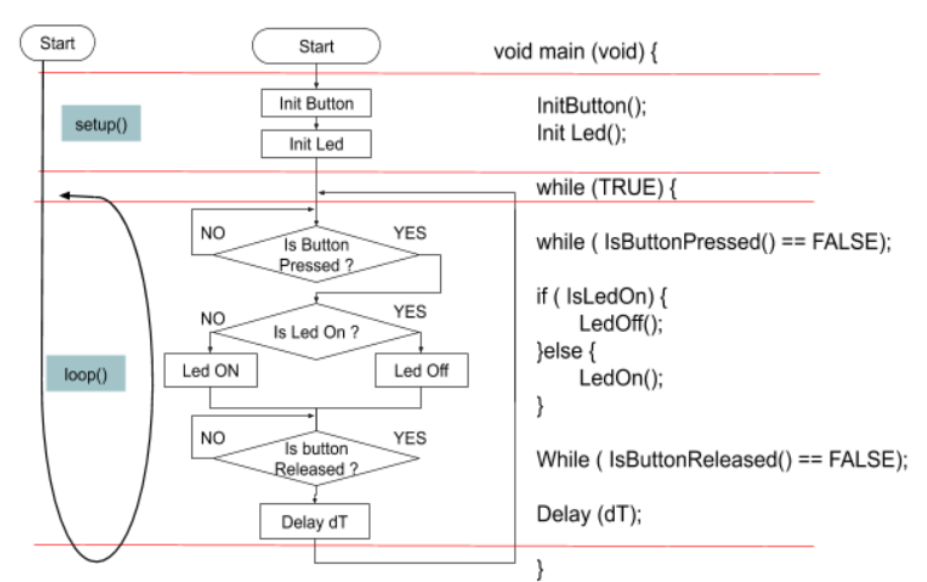

*Figura A.16: Asocierea modelarii arhitecturale cu implementarea codului sursă*

Astfel, fișierul main.c va arăta dupa cum urmează in Listingul A.6:

**Listing A.6: Implementarea aplicației principale**
```c
#include <Arduino.h>
#include "ed_button.h"
#include "ed_led.h"

// Funcția de inițializare a aplicației
void setup() {
  // Inițializăm butonul și LED-ul
  ed_button_setup();
  ed_led_setup();
}

// Funcția principală de rulare a aplicației
void loop() {
  // așteptăm apăsarea butonului
  while (!ed_button_is_pressed(BUTTON_ID_1));
  
  // verificam daca LED-ul este aprins
  if (ed_led_is_on(LED_ID_1)) {
    // dacă LED-ul este aprins, îl stingem
    ed_led_off(LED_ID_1);
  } else {
    // dacă LED-ul este stins, îl aprindem
    ed_led_on(LED_ID_1);
  }
  
  // aşteptam eliberarea butonului
  while (ed_button_is_pressed(BUTTON_ID_1));
  
  // așteptăm o scurtă perioadă pentru a evita bouncing-ul butonului
  delay(50);
}
```
### A.1.8 Testarea și validarea aplicației
Testarea are rolul de a verifica dacă aplicația respectă cerințele definite. Aceasta presupune verificarea conexiunilor hardware, testarea funcțiilor software și validarea comportamentului aplicației în condiții reale de utilizare. Prin testare se pot identifica și corecta eventualele erori, contribuind la funcționarea corectă și fiabilă a sistemului.

Dupa finalizarea fazei de dezvoltare software, se va trece la testarea aplicației pentru a verifica dacă aceasta funcționează conform cerințelor stabilite. Testarea se va realiza în baza scenariilor de testare definite anterior, care acoperă toate cerințele funcționale și nefuncționale ale aplicației. Aceste scenarii de testare vor include verificarea funcționalității butonului și LED-ului, precum și comportamentul aplicației în diferite condiții de utilizare.

De exemplu, se vor testa următoarele scenarii:
- Apăsarea butonului și verificarea dacă LED-ul își schimbă starea corespunzător.
- Verificarea reacției aplicației la apăsări rapide ale butonului.
- Testarea timpului de răspuns al aplicației la interacțiunea cu butonul.
- Verificarea stabilității aplicației în condiții de utilizare prelungită.
- Testarea aplicației în medii simulate pentru a verifica comportamentul acesteia fără a necesita un circuit fizic.

Vezi tabelul A.2 pentru o listă detaliată a scenariilor de testare și criteriile de validare asociate. Aceste teste vor fi realizate și documentate într-un raport de testare, conform tabelului A.3.

**Tabelul A.3: Rezultatele testării aplicației**

| Test ID | Rezultatul | Observații |
|---|---|---|
| RF01_T01 | Pass | LED-ul reacționează imediat la apăsarea butonului. |
| RF01_T02 | Fail | LED-ul reacționează la eliberarea butonului. |
| RF02_T01 | Pass | LED-ul se stinge când este apăsat butonul. |
| RF02_T02 | Pass | LED-ul se aprinde când este apăsat butonul. |
| RF02_T03 | Pass | LED-ul își schimbă starea corespunzător la fiecare apăsare. |
| RF03_T01 | Fail | LED-ul își schimbă starea de mai multe ori pentru o singură apăsare validă. |
| RF03_T02 | Pass | LED-ul nu își schimbă starea de mai multe ori în timpul unei singure apăsări. |
| RNF01_T01 | Pass | Timpul de răspuns este sub 100 ms. |
| RNF01_T02 | Pass | Timpul de răspuns rămâne constant sub 100 ms. |
| RNF03_T01 | Pass | Circuitul este compact și componentele sunt conectate corect. |
| RNF03_T02 | Pass | Costul componentelor este sub limita specificată. |
| RNF04_T01 | Fail | Componentele software nu sunt complet reutilizabile. |
| RNF04_T02 | Pass | Aplicația funcționează corect în medii simulate. |

Testarea poate fi realizată prin simulare în medii precum Wokwi sau PlatformIO, unde se pot simula comportamentul aplicației și interacțiunea cu componentele hardware.

Aceste medii permit verificarea funcționalității aplicației fără a necesita un circuit fizic, facilitând identificarea și corectarea erorilor înainte de implementarea fizică a circuitului.

În cazul identificării unor erori sau neconformități în timpul testării, este important să se consulte tabelul A.4 pentru observații și recomandări specifice fiecărui test. Acestea oferă indicații clare pentru corectarea problemelor și îmbunătățirea aplicației.

**Tabelul A.4: Observații și recomandări pentru testele FAIL**

| Test ID | Observații | Recomandări |
|---|---|---|
| RF01_T02 | LED-ul reacționează la eliberarea butonului. | Verificați implementarea funcției de citire a stării butonului și asigurați-vă că logica de schimbare a stării LED-ului este declanșată doar la apăsare, nu și la eliberare. |
| RF03_T01 | LED-ul își schimbă starea de mai multe ori pentru o singură apăsare validă. | Implementați o logică de debounce mai robustă și utilizați un temporizator sau un algoritm software pentru a ignora fluctuațiile semnalului. |
| RNF04_T01 | Componentele software nu sunt complet reutilizabile. | Refactorizați codul pentru a asigura modularitatea și reutilizarea componentelor software în alte proiecte. |

Dacă sunt identificate probleme, este necesar să se revină la etapele anterioare pentru a le corecta. Acest proces poate implica revizuirea cerințelor, ajustarea designului hardware sau software și reimplementarea componentelor afectate.

Testarea trebuie să fie un proces iterativ, asigurându-se că toate cerințele sunt îndeplinite și că aplicația funcționează conform așteptărilor.

Dupa Validarea testelor, se poate trece la implementarea fizică a circuitului, unde se vor utiliza componentele hardware corespunzătoare (buton, LED, rezistoare de limitare a curentului și rezistoare pull-down) pentru a construi circuitul conform specificațiilor.

Este important să se asigure că toate conexiunile sunt realizate corect și că circuitul funcționează conform așteptărilor în condiții reale de utilizare. Testarea fizică a circuitului poate include verificarea conexiunilor, măsurarea tensiunii și curentului, precum și testarea funcționalității aplicației prin interacțiunea cu butonul și LED-ul prin scenariile de testare definite anterior.
## ANEXA A. Resurse de referință pentru realizarea lucrărilor de laborator
### Bibliografie
[1] Arduino. Arduino Serial Reference. https://www.arduino.cc/reference/en/language/functions/communication/serial/. Accessed: 2023-10-01.

[2] G Mostofa BD. 8051 Push Button Interfacing. https://gmostofabd.github.io/8051-PushButton/. Accessed: 2023-10-01.

[3] Andrei Bragarenco. “Sensor-Actuator Software Component Stack for Industrial Internet of Things Applications”. In: 2020 24th International Conference on System Theory, Control and Computing (ICSTCC). 2020, pp. 540–545. doi: 10.1109/ICSTCC50638.2020.9259710.

[4] Andrei Bragarenco, Galina Marusic, and Calin Ciufudean. “Communication Chain in the Internet of Things with Spread-out Electronic Device System Abstraction”. In: 2021 IEEE International IOT, Electronics and Mechatronics Conference (IEMTRONICS). 2021, pp. 1–5. doi: 10.1109/IEMTRONICS52119.2021.9422565.

[5] Andrei Bragarenco, Galina Marusic, and Calin Ciufudean. “Layered architecture approach of the sensor software component stack for the Internet of Things applications”. In: WSEAS Transactions on Computer Research 7 (2019), pp. 124–135.

[6] Thomas Bräunl. Embedded Robotics: Mobile Robot Design and Applications with Embedded Systems. Second. Berlin, Heidelberg, New York: Springer, 2006. isbn: 978-3-540-34318-9.

[7] Calangorobo. Calangorobo Blog. https://calangorobo.blogspot.com/2018/. Accessed: 2025-06-08.

[8] IQS Directory. Electric Motor. https://www.iqsdirectory.com/articles/electric- motor. html. Accessed: 2025-06-07.

[9] EnergyPurse. Types of Room Heaters. https : / / www . energypurse . com / types - of - room heaters/. Accessed: 2025-06-07.

[10] Tech Explorations. DC Motor with Transistor. https://techexplorations.com/guides/arduino/ motors/dc-motor-with-transistor/. Accessed: 2025-06-07.

[11] FreeRTOS. FreeRTOS - Binary Semaphore. https://www.freertos.org/Documentation/02Kernel/02-Kernel-features/02-Queues-mutexes-and-semaphores/02-Binary-semaphores. Accessed: 2023-10-01.

[12] FreeRTOS. FreeRTOS - Message Queue. https : / / www . freertos . org / Documentation / 02 Kernel / 02 - Kernel - features / 02 - Queues - mutexes - and - semaphores / 01 - Queues. Accessed: 2023-10-01.

[13] FreeRTOS. FreeRTOS - Mutex. https://www.freertos.org/Documentation/02- Kernel/02Kernel-features/02-Queues-mutexes-and-semaphores/04-Mutexes. Accessed: 2024-03-24.

[14] Electronics Hub. LED Interfacing with 8051 Microcontroller. https://www.electronicshub.org/ led-interfacing-8051/. Accessed: 2023-10-01.

[15] Ikalogic. 8-bit Digital to Analog Converter (DAC). http://www.ikalogic.com/8-bit-digitalto-analog-converter-dac/. Accessed: 2025-04-10.

[16] Texas Instruments. LM20 Precision Analog Temperature Sensor Datasheet. https://www.ti.com/ lit/ds/symlink/lm20.pdf. Accessed: 2025-06-08.

[17] AVR Libc. AVR STDIO Library. https://www.nongnu.org/avr- libc/user- manual/group_ _avr__stdio.html. Accessed: 2023-10-01.

[18] How To Mechatronics. Arduino DC Motor Control Tutorial – L298N | PWM | H-Bridge. https: / / howtomechatronics . com / tutorials / arduino / arduino - dc - motor - control - tutorial l298n-pwm-h-bridge/. Accessed: 2025-11-12.

[19] How To Mechatronics. Control High Voltage Devices – Arduino Relay Tutorial. https://howtomechatronics. com/tutorials/arduino/control- high- voltage- devices- arduino- relay- tutorial/. Accessed: 2025-06-07.

[20] Microsoft. Visual Studio Code. https://code.visualstudio.com/download. Accessed: 2023-1001.

[21] OSEK-VDX. OSEK-VDX. http://www.openosek.org/. Accessed: 2023-10-01.

[22] The Engineering Projects. Proteus Library. https://www.theengineeringprojects.com/2018/ 04/how-to-add-new-library-in-proteus-8.html. Accessed: 2023-10-01.

[23] SparkFun. Serial Communication. https://learn.sparkfun.com/tutorials/serial-communication. Accessed: 2023-10-01.

[24] TechTarget. Embedded System Definition. https://internetofthingsagenda.techtarget.com/ definition/embedded-system. Accessed: 2023-10-01.

[25] University of Texas at Austin. Embedded Systems - Shape the World: Designing a FSM. https: //learning.edx.org/course/course-v1:UTAustinX+UT.6.03x+1T2016. Accessed: 2025-06-08.

[26] Electronics Tutorials. H-Bridge Motor Control Circuit. https://www.electronics- tutorials. ws/io/h-bridge-circuit.html. Accessed: 2025-11-12.

[27] Bristol Watch. L298N Motor Controller Theory Projects. https : / / www . bristolwatch . com / L298N/index.htm. Accessed: 2025-11-12.

[28] Wikipedia. Automat finit. https://ro.wikipedia.org/wiki/Automat_finit. Accessed: 2025-0608.

[29] Wikipedia. Electric light. https://en.wikipedia.org/wiki/Electric_light. Accessed: 2025-0607.

[30] Wokwi. Wokwi Documentation. https://docs.wokwi.com/. Accessed: 2023-10-01.

[31] Wokwi. Wokwi Simulator. https://wokwi.com/. Accessed: 2023-10-01.

